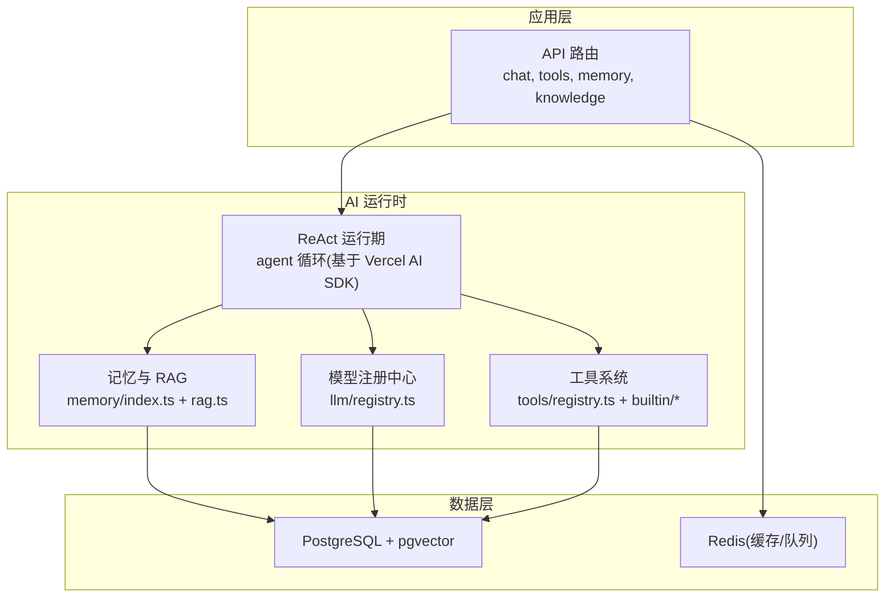
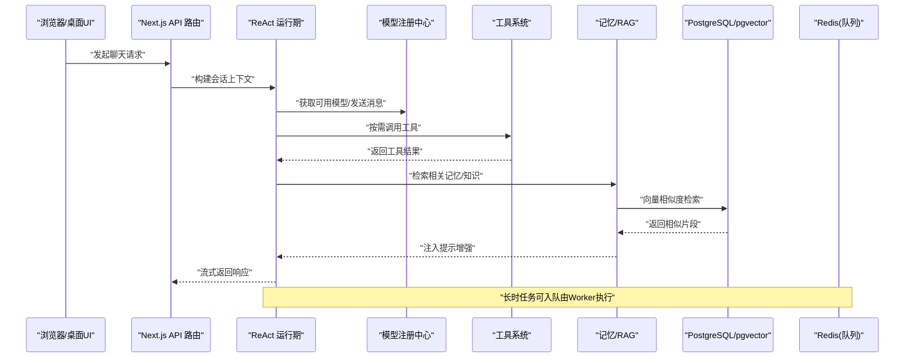
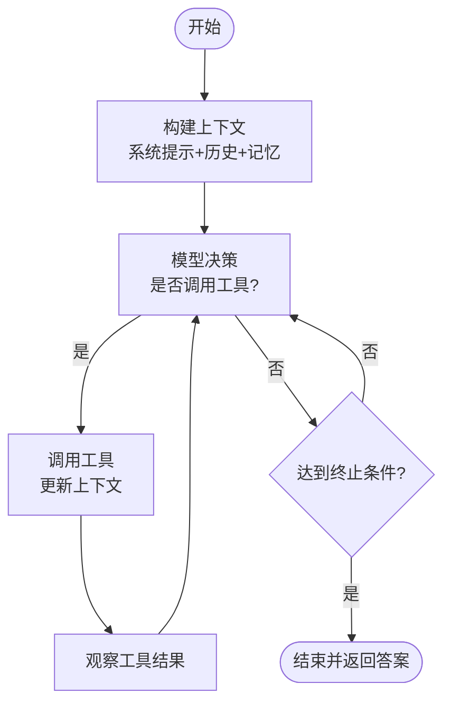
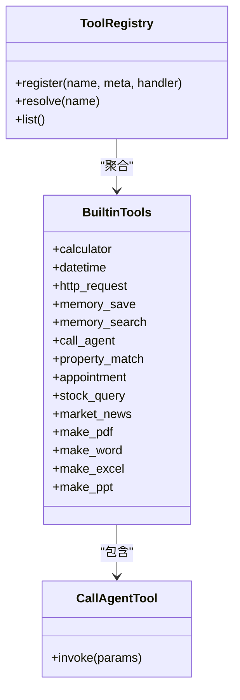
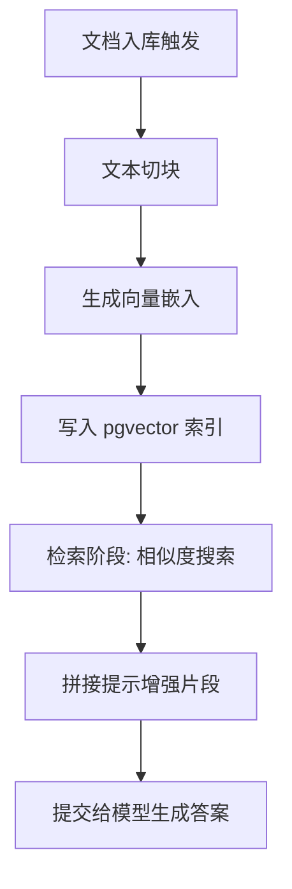
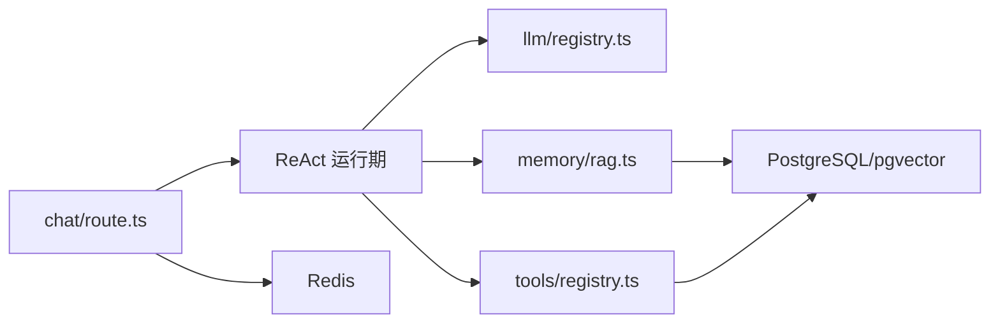

# AI 运行时系统

<cite>
**本文引用的文件**   
- [README.md](file://README.md)
- [src/lib/llm/index.ts](file://src/lib/llm/index.ts)
- [src/lib/llm/registry.ts](file://src/lib/llm/registry.ts)
- [src/lib/llm/types.ts](file://src/lib/llm/types.ts)
- [src/lib/memory/index.ts](file://src/lib/memory/index.ts)
- [src/lib/memory/rag.ts](file://src/lib/memory/rag.ts)
- [src/lib/tools/index.ts](file://src/lib/tools/index.ts)
- [src/lib/tools/registry.ts](file://src/lib/tools/registry.ts)
- [src/lib/tools/types.ts](file://src/lib/tools/types.ts)
- [src/lib/tools/builtin/index.ts](file://src/lib/tools/builtin/index.ts)
- [src/lib/tools/builtin/call-agent.ts](file://src/lib/tools/builtin/call-agent.ts)
- [src/app/api/chat/route.ts](file://src/app/api/chat/route.ts)
- [worker/internal/executor/rag_ingest.go](file://worker/internal/executor/rag_ingest.go)
- [prisma/schema.prisma](file://prisma/schema.prisma)
</cite>

## 目录
1. [简介](#简介)
2. [项目结构](#项目结构)
3. [核心组件](#核心组件)
4. [架构总览](#架构总览)
5. [详细组件分析](#详细组件分析)
6. [依赖关系分析](#依赖关系分析)
7. [性能考量](#性能考量)
8. [故障排查指南](#故障排查指南)
9. [结论](#结论)
10. [附录](#附录)

## 简介
本文件面向 OpenCat 的 AI 运行时系统，聚焦以下目标：
- 深入解析 ReAct 推理引擎的实现原理与执行流程（思考-行动-观察循环）
- 说明工具调用的上下文管理与子智能体编排机制
- 阐述多模型注册中心的设计与统一接口抽象（OpenAI、Anthropic、Google 等）
- 解释记忆系统的语义检索实现（文本分块、向量嵌入生成、pgvector 相似度搜索）
- 描述 RAG（检索增强生成）的工作流与提示词增强策略
- 提供自定义工具与模型的集成指南

## 项目结构
OpenCat 的 AI 运行时位于应用层与数据层之间，围绕“模型注册中心 + ReAct 运行期 + 工具系统 + 记忆/RAG”组织。关键目录与职责如下：
- src/lib/llm：多模型注册中心与类型定义
- src/lib/memory：记忆检索与 RAG 处理
- src/lib/tools：工具注册表与内置工具集
- src/app/api：API 路由，承载聊天、任务、知识、记忆等入口
- worker：Go 侧后台任务（RAG 入库、图像生成等）
- prisma/schema.prisma：数据库模型（含 pgvector 支持）

图表来源
- [README.md:159-180](file://README.md#L159-L180)
- [src/lib/llm/registry.ts](file://src/lib/llm/registry.ts)
- [src/lib/memory/rag.ts](file://src/lib/memory/rag.ts)
- [src/lib/tools/registry.ts](file://src/lib/tools/registry.ts)
- [prisma/schema.prisma](file://prisma/schema.prisma)

章节来源
- [README.md:159-180](file://README.md#L159-L180)

## 核心组件
本节从系统视角概述各核心组件的职责与交互方式，为后续深入分析奠定基础。

- 多模型注册中心
  - 负责按用户配置的 API Key 动态发现可用模型，并提供统一的调用抽象
  - 对外暴露一致的模型列表与消息发送接口，屏蔽不同提供商差异
- ReAct 推理引擎
  - 基于 Vercel AI SDK 的工具感知 Agent 运行期，驱动“思考-行动-观察”循环
  - 在每步中根据当前上下文选择并调用工具，将结果反馈给模型继续推理
- 工具系统
  - 集中注册与分发工具，包含内置计算器、HTTP 请求、记忆操作、文档生成、金融查询、以及跨智能体调用等
  - 支持扩展自定义工具，并在 Agent 上下文中注入工具元信息
- 记忆与 RAG
  - 记忆记录带分类与重要性元数据，可在回答前检索相关片段注入系统提示
  - RAG 流程包括文档切块、向量化、pgvector 相似度检索，以及可选的异步入库
- 后台任务
  - Go Worker 负责 RAG 入库、图像生成等耗时任务的执行与状态上报

章节来源
- [README.md:78-136](file://README.md#L78-L136)
- [README.md:159-180](file://README.md#L159-L180)

## 架构总览
下图展示从前端到后端再到数据层的端到端调用路径，突出 AI 运行时在其中的位置。

图表来源
- [src/app/api/chat/route.ts](file://src/app/api/chat/route.ts)
- [src/lib/llm/registry.ts](file://src/lib/llm/registry.ts)
- [src/lib/tools/registry.ts](file://src/lib/tools/registry.ts)
- [src/lib/memory/rag.ts](file://src/lib/memory/rag.ts)
- [prisma/schema.prisma](file://prisma/schema.prisma)

## 详细组件分析

### 多模型注册中心（统一接口抽象）
- 设计要点
  - 通过用户管理的 API Key 动态注册模型，避免硬编码提供商
  - 对外暴露统一的模型清单与消息发送接口，屏蔽不同厂商差异
  - 支持按用户/项目维度隔离配置
- 关键文件
  - 类型定义：[src/lib/llm/types.ts](file://src/lib/llm/types.ts)
  - 注册中心实现：[src/lib/llm/registry.ts](file://src/lib/llm/registry.ts)
  - 模块入口：[src/lib/llm/index.ts](file://src/lib/llm/index.ts)
- 使用建议
  - 新增提供商时，遵循现有类型契约，在注册中心内完成适配
  - 对模型能力进行最小化声明，便于工具系统与提示工程协同

章节来源
- [src/lib/llm/types.ts](file://src/lib/llm/types.ts)
- [src/lib/llm/registry.ts](file://src/lib/llm/registry.ts)
- [src/lib/llm/index.ts](file://src/lib/llm/index.ts)

### ReAct 推理引擎（思考-行动-观察循环）
- 执行流程
  - 初始化：加载系统提示、历史对话、记忆与知识片段
  - 思考：模型决定是否需要调用工具或继续生成
  - 行动：若需工具，则通过工具系统调用并收集结果
  - 观察：将工具结果回灌上下文，进入下一轮推理
  - 终止：达到最大步数或模型输出最终答案
- 上下文管理
  - 会话级上下文包含用户输入、历史消息、工具结果、记忆注入片段
  - 工具调用具备幂等性与错误恢复，失败时可重试或降级
- 子智能体编排
  - 通过专用工具 call_agent 实现主智能体委派子智能体执行复杂任务
  - 子智能体拥有独立提示、模型与工具集，结果回传至父智能体继续推理

图表来源
- [src/app/api/chat/route.ts](file://src/app/api/chat/route.ts)
- [src/lib/tools/builtin/call-agent.ts](file://src/lib/tools/builtin/call-agent.ts)

章节来源
- [src/app/api/chat/route.ts](file://src/app/api/chat/route.ts)
- [src/lib/tools/builtin/call-agent.ts](file://src/lib/tools/builtin/call-agent.ts)

### 工具系统（上下文管理与扩展点）
- 注册与分发
  - 集中注册表维护工具元信息与实现，供 ReAct 运行期按需调用
  - 内置工具涵盖计算、时间、HTTP、记忆、文档生成、金融查询、跨智能体调用等
- 上下文注入
  - 工具调用时携带会话 ID、用户/项目标识、权限与配额信息
  - 工具返回结构化结果，便于模型理解与下一步推理
- 扩展指南
  - 新增工具需在注册表中登记，并遵循类型约束
  - 对于外部依赖，建议在工具内部做超时与错误封装

图表来源
- [src/lib/tools/registry.ts](file://src/lib/tools/registry.ts)
- [src/lib/tools/builtin/index.ts](file://src/lib/tools/builtin/index.ts)
- [src/lib/tools/builtin/call-agent.ts](file://src/lib/tools/builtin/call-agent.ts)

章节来源
- [src/lib/tools/index.ts](file://src/lib/tools/index.ts)
- [src/lib/tools/registry.ts](file://src/lib/tools/registry.ts)
- [src/lib/tools/types.ts](file://src/lib/tools/types.ts)
- [src/lib/tools/builtin/index.ts](file://src/lib/tools/builtin/index.ts)
- [src/lib/tools/builtin/call-agent.ts](file://src/lib/tools/builtin/call-agent.ts)

### 记忆系统与 RAG（语义检索与提示增强）
- 记忆检索
  - 记忆记录带有分类与重要性元数据，用于在回答前检索相关片段注入系统提示
  - 当嵌入不可用时，提供降级策略以保证可用性
- RAG 工作流
  - 文档切块：将长文档拆分为适合嵌入的片段
  - 向量化：生成片段向量并持久化
  - 相似度检索：使用 pgvector 进行近似最近邻搜索
  - 提示增强：将检索到的片段以结构化方式注入提示词
- 后台入库
  - Go Worker 负责 RAG 入库任务，提升吞吐与稳定性

图表来源
- [src/lib/memory/index.ts](file://src/lib/memory/index.ts)
- [src/lib/memory/rag.ts](file://src/lib/memory/rag.ts)
- [worker/internal/executor/rag_ingest.go](file://worker/internal/executor/rag_ingest.go)
- [prisma/schema.prisma](file://prisma/schema.prisma)

章节来源
- [README.md:95-101](file://README.md#L95-L101)
- [src/lib/memory/index.ts](file://src/lib/memory/index.ts)
- [src/lib/memory/rag.ts](file://src/lib/memory/rag.ts)
- [worker/internal/executor/rag_ingest.go](file://worker/internal/executor/rag_ingest.go)
- [prisma/schema.prisma](file://prisma/schema.prisma)

### API 路由与运行期集成
- 聊天路由
  - 接收前端请求，构建会话上下文，驱动 ReAct 运行期
  - 流式返回模型响应，同时持久化对话历史
- 工具与记忆
  - 路由层不直接实现业务逻辑，而是委托给工具系统与记忆/RAG 模块
- 后台任务
  - 长时任务（如图像生成、RAG 入库）通过队列交由 Worker 执行

章节来源
- [src/app/api/chat/route.ts](file://src/app/api/chat/route.ts)
- [README.md:159-180](file://README.md#L159-L180)

## 依赖关系分析
- 组件耦合
  - ReAct 运行期依赖模型注册中心、工具系统与记忆/RAG
  - 记忆/RAG 依赖数据库（pgvector），并可借助 Redis 做缓存
  - 工具系统依赖数据库与外部服务（HTTP、第三方 API）
- 外部依赖
  - PostgreSQL + pgvector：存储与向量检索
  - Redis：缓存与未来队列化工作流
  - Vercel AI SDK：作为 ReAct 运行期的基础框架

图表来源
- [src/app/api/chat/route.ts](file://src/app/api/chat/route.ts)
- [src/lib/llm/registry.ts](file://src/lib/llm/registry.ts)
- [src/lib/tools/registry.ts](file://src/lib/tools/registry.ts)
- [src/lib/memory/rag.ts](file://src/lib/memory/rag.ts)
- [prisma/schema.prisma](file://prisma/schema.prisma)

章节来源
- [README.md:159-180](file://README.md#L159-L180)

## 性能考量
- 向量检索
  - 合理设置分块大小与嵌入维度，平衡检索精度与延迟
  - 利用 pgvector 的索引与近似搜索参数优化查询
- 流式响应
  - 采用 SSE 流式返回，降低首字节延迟
- 并发与限流
  - 对工具调用与外部 API 请求增加超时与重试上限
  - 结合 Redis 做速率限制与去重
- 后台任务
  - 将耗时任务（RAG 入库、图像生成）放入队列，避免阻塞主线程

## 故障排查指南
- 模型不可用
  - 检查用户 API Key 配置与网络连通性
  - 确认注册中心是否正确发现模型
- 工具调用失败
  - 查看工具日志与返回码，确认外部依赖可达
  - 对幂等工具启用重试，非幂等工具需谨慎
- 记忆检索为空
  - 确认嵌入生成是否成功，pgvector 索引是否建立
  - 调整相似度阈值与检索数量
- 长时任务卡住
  - 检查 Worker 状态与队列积压情况
  - 核对任务状态上报与清理策略

章节来源
- [README.md:78-136](file://README.md#L78-L136)

## 结论
OpenCat 的 AI 运行时以“模型注册中心 + ReAct 运行期 + 工具系统 + 记忆/RAG”为核心，提供了可扩展、可观测且透明的智能体工作流。通过统一的模型抽象、灵活的工具编排与强大的语义检索能力，开发者可以快速构建面向实际场景的智能体应用。

## 附录

### 自定义工具集成指南
- 步骤
  - 在工具注册表中登记新工具（名称、元信息、处理器）
  - 在 ReAct 运行期确保工具元信息被正确注入到模型提示
  - 编写工具处理器，封装外部依赖与错误处理
  - 在测试中验证工具行为与边界情况
- 参考文件
  - 注册表与类型：[src/lib/tools/registry.ts](file://src/lib/tools/registry.ts)、[src/lib/tools/types.ts](file://src/lib/tools/types.ts)
  - 内置工具示例：[src/lib/tools/builtin/index.ts](file://src/lib/tools/builtin/index.ts)

章节来源
- [src/lib/tools/registry.ts](file://src/lib/tools/registry.ts)
- [src/lib/tools/types.ts](file://src/lib/tools/types.ts)
- [src/lib/tools/builtin/index.ts](file://src/lib/tools/builtin/index.ts)

### 自定义模型集成指南
- 步骤
  - 在模型注册中心新增提供商适配器，遵循统一类型契约
  - 从用户 API Key 中读取凭据并动态注册模型
  - 在聊天路由中选择合适模型进行推理
- 参考文件
  - 类型定义与注册中心：[src/lib/llm/types.ts](file://src/lib/llm/types.ts)、[src/lib/llm/registry.ts](file://src/lib/llm/registry.ts)

章节来源
- [src/lib/llm/types.ts](file://src/lib/llm/types.ts)
- [src/lib/llm/registry.ts](file://src/lib/llm/registry.ts)