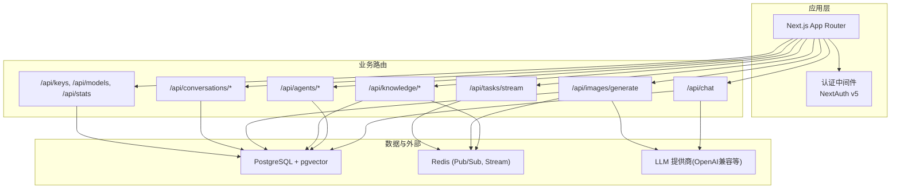
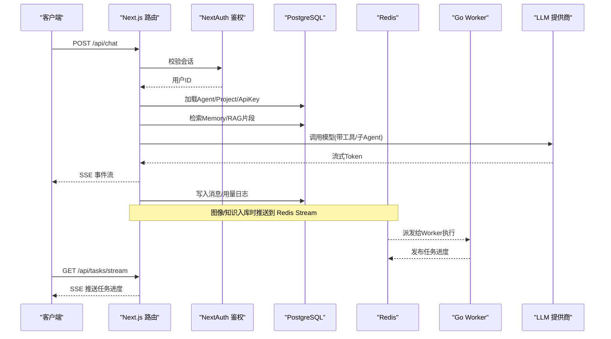
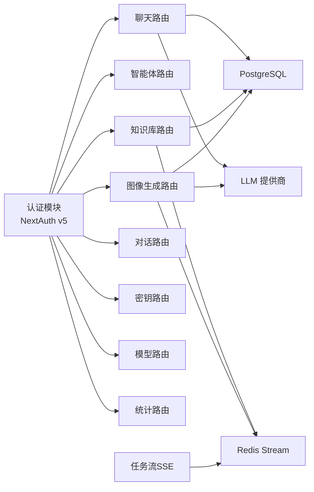

# API 接口文档

<cite>
**本文引用的文件**   
- [README.md](file://README.md)
- [src/app/api/chat/route.ts](file://src/app/api/chat/route.ts)
- [src/app/api/auth/[...nextauth]/route.ts](file://src/app/api/auth/[...nextauth]/route.ts)
- [src/app/api/auth/register/route.ts](file://src/app/api/auth/register/route.ts)
- [src/lib/auth.ts](file://src/lib/auth.ts)
- [src/app/api/agents/route.ts](file://src/app/api/agents/route.ts)
- [src/app/api/agents/[id]/route.ts](file://src/app/api/agents/[id]/route.ts)
- [src/app/api/knowledge/route.ts](file://src/app/api/knowledge/route.ts)
- [src/app/api/knowledge/[id]/documents/route.ts](file://src/app/api/knowledge/[id]/documents/route.ts)
- [src/app/api/images/generate/route.ts](file://src/app/api/images/generate/route.ts)
- [src/app/api/conversations/route.ts](file://src/app/api/conversations/route.ts)
- [src/app/api/conversations/[id]/messages/route.ts](file://src/app/api/conversations/[id]/messages/route.ts)
- [src/app/api/tasks/stream/route.ts](file://src/app/api/tasks/stream/route.ts)
- [src/app/api/keys/route.ts](file://src/app/api/keys/route.ts)
- [src/app/api/models/route.ts](file://src/app/api/models/route.ts)
- [src/app/api/stats/route.ts](file://src/app/api/stats/route.ts)
</cite>

## 目录
1. [简介](#简介)
2. [项目结构](#项目结构)
3. [核心组件](#核心组件)
4. [架构总览](#架构总览)
5. [详细接口参考](#详细接口参考)
6. [依赖关系分析](#依赖关系分析)
7. [性能与扩展性](#性能与扩展性)
8. [故障排查指南](#故障排查指南)
9. [结论](#结论)
10. [附录](#附录)

## 简介
本文件为 OpenCat 项目的完整 API 接口参考，覆盖认证、聊天对话、智能体管理、知识库、图像生成、任务流式进度、模型与密钥管理等核心能力。所有接口均基于 Next.js App Router 的 Serverless Route 实现，统一通过 NextAuth v5 进行会话鉴权，并采用 Zod 进行请求体验证。

## 项目结构
API 路由位于 src/app/api 下，按功能域组织：
- 认证：/api/auth/*（NextAuth 入口与注册）
- 聊天：/api/chat（SSE 流式对话）
- 对话：/api/conversations/*（列表、消息历史）
- 智能体：/api/agents/*（CRUD）
- 知识库：/api/knowledge/*（CRUD 与文档上传）
- 图像生成：/api/images/generate（异步任务）
- 任务流：/api/tasks/stream（SSE 推送任务进度）
- 密钥与模型：/api/keys、/api/models
- 统计：/api/stats

图表来源
- [src/app/api/chat/route.ts:1-529](file://src/app/api/chat/route.ts#L1-L529)
- [src/app/api/agents/route.ts:1-151](file://src/app/api/agents/route.ts#L1-L151)
- [src/app/api/knowledge/route.ts:1-107](file://src/app/api/knowledge/route.ts#L1-L107)
- [src/app/api/images/generate/route.ts:1-251](file://src/app/api/images/generate/route.ts#L1-L251)
- [src/app/api/conversations/route.ts:1-107](file://src/app/api/conversations/route.ts#L1-L107)
- [src/app/api/tasks/stream/route.ts:1-78](file://src/app/api/tasks/stream/route.ts#L1-L78)
- [src/app/api/keys/route.ts:1-154](file://src/app/api/keys/route.ts#L1-L154)
- [src/app/api/models/route.ts:1-63](file://src/app/api/models/route.ts#L1-L63)
- [src/app/api/stats/route.ts:1-193](file://src/app/api/stats/route.ts#L1-L193)

章节来源
- [README.md:1-356](file://README.md#L1-L356)

## 核心组件
- 认证与会话：NextAuth v5，支持 GitHub OAuth 与邮箱密码登录；JWT 策略，Session 中携带用户 ID。
- 聊天引擎：基于 Vercel AI SDK 的 Agent 流式响应，自动注入 Memory 与 RAG 片段到系统提示词，持久化对话与用量日志。
- 知识库与文档：支持文本/Markdown 上传，后台分块与向量化，Redis Stream 派发至 Go Worker 处理。
- 图像生成：创建后台任务，返回任务 ID，前端轮询或 SSE 订阅进度。
- 密钥与模型：用户可配置多 Provider 的 API Key，加密存储，动态选择模型与 Base URL。
- 统计大盘：聚合 Token 用量、费用、模型分布与近 14 天趋势。

章节来源
- [src/lib/auth.ts:1-101](file://src/lib/auth.ts#L1-L101)
- [src/app/api/chat/route.ts:1-529](file://src/app/api/chat/route.ts#L1-L529)
- [src/app/api/knowledge/[id]/documents/route.ts:1-147](file://src/app/api/knowledge/[id]/documents/route.ts#L1-L147)
- [src/app/api/images/generate/route.ts:1-251](file://src/app/api/images/generate/route.ts#L1-L251)
- [src/app/api/keys/route.ts:1-154](file://src/app/api/keys/route.ts#L1-L154)
- [src/app/api/models/route.ts:1-63](file://src/app/api/models/route.ts#L1-L63)
- [src/app/api/stats/route.ts:1-193](file://src/app/api/stats/route.ts#L1-L193)

## 架构总览

图表来源
- [src/app/api/chat/route.ts:1-529](file://src/app/api/chat/route.ts#L1-L529)
- [src/app/api/tasks/stream/route.ts:1-78](file://src/app/api/tasks/stream/route.ts#L1-L78)
- [src/app/api/knowledge/[id]/documents/route.ts:1-147](file://src/app/api/knowledge/[id]/documents/route.ts#L1-L147)
- [src/app/api/images/generate/route.ts:1-251](file://src/app/api/images/generate/route.ts#L1-L251)

## 详细接口参考

### 认证相关
- 通用说明
  - 所有受保护接口均需有效会话。未登录将返回 401。
  - 认证入口：/api/auth/*（NextAuth 捕获路由）。
  - 注册：POST /api/auth/register。

- 注册
  - 方法：POST
  - 路径：/api/auth/register
  - 请求体
    - email: 字符串，邮箱格式
    - password: 字符串，长度≥8
    - name: 可选，字符串
  - 成功响应：201，包含用户基本信息
  - 错误码
    - 400：参数校验失败
    - 409：邮箱已注册
    - 500：服务器内部错误

- NextAuth 入口
  - 方法：GET/POST
  - 路径：/api/auth/*（含回调、登出等）
  - 行为：由 NextAuth 处理 OAuth 回调、会话签发与销毁

章节来源
- [src/app/api/auth/register/route.ts:1-79](file://src/app/api/auth/register/route.ts#L1-L79)
- [src/app/api/auth/[...nextauth]/route.ts:1-15](file://src/app/api/auth/[...nextauth]/route.ts#L1-L15)
- [src/lib/auth.ts:1-101](file://src/lib/auth.ts#L1-L101)

### 聊天对话
- 方法：POST
- 路径：/api/chat
- 请求体
  - messages: 数组，遵循 AI SDK 的 UIMessage 结构
  - conversationId: 可选，字符串，指定已有对话
  - modelId: 可选，字符串，指定模型
  - agentId: 可选，字符串，指定智能体
  - enableTools: 可选，布尔，是否启用工具
  - toolNames: 可选，字符串数组，工具名列表
  - knowledgeBaseId: 可选，字符串，关联知识库以启用 RAG
- 响应
  - 200：SSE 流式响应，包含增量消息片段
  - 响应头：X-Conversation-Id（新创建的对话ID）
- 错误码
  - 400：缺少必要字段（如 messages）
  - 401：未授权
  - 404：对话不存在（当传入无效 conversationId）
  - 500：服务端异常（含数据库/加密配置错误）
- 备注
  - 自动检索 Memory 与知识库片段注入系统提示词
  - 流结束后持久化助手消息与用量日志

章节来源
- [src/app/api/chat/route.ts:1-529](file://src/app/api/chat/route.ts#L1-L529)

### 对话管理
- 获取对话列表
  - 方法：GET
  - 路径：/api/conversations
  - 响应：当前用户的所有对话（标题、时间、消息计数）
- 删除对话
  - 方法：DELETE
  - 路径：/api/conversations
  - 请求体：conversationId
  - 响应：成功标志
- 更新对话元信息
  - 方法：PATCH
  - 路径：/api/conversations
  - 请求体：conversationId, metadata
  - 响应：更新后的 metadata

章节来源
- [src/app/api/conversations/route.ts:1-107](file://src/app/api/conversations/route.ts#L1-L107)

### 对话消息历史
- 获取消息历史与元信息
  - 方法：GET
  - 路径：/api/conversations/:id/messages
  - 响应：messages 数组、agentId、lastModel、metadata

章节来源
- [src/app/api/conversations/[id]/messages/route.ts:1-64](file://src/app/api/conversations/[id]/messages/route.ts#L1-L64)

### 智能体管理
- 列表与创建
  - 方法：GET/POST
  - 路径：/api/agents
  - 查询参数：projectId（可选）
  - 创建请求体（Zod 校验）
    - projectId: 必填
    - name: 必填，≤50
    - description: 可选，≤200
    - systemPrompt: 必填
    - model: 可选，默认 gpt-5.4-mini
    - temperature: 可选，0~2，默认 0.7
    - maxSteps: 可选，1~50，默认 10
    - tools: 可选，字符串数组
    - isOrchestrator: 可选，布尔
- 单个操作
  - 方法：GET/PUT/DELETE
  - 路径：/api/agents/:id
  - 更新请求体：各字段可选（部分更新）

章节来源
- [src/app/api/agents/route.ts:1-151](file://src/app/api/agents/route.ts#L1-L151)
- [src/app/api/agents/[id]/route.ts:1-120](file://src/app/api/agents/[id]/route.ts#L1-L120)

### 知识库管理
- 列表与创建
  - 方法：GET/POST
  - 路径：/api/knowledge
  - 创建请求体：name, projectId（可选，默认使用 Default 项目）
- 删除知识库
  - 方法：DELETE
  - 路径：/api/knowledge
  - 请求体：id
- 文档上传与列表
  - 方法：POST/GET
  - 路径：/api/knowledge/:id/documents
  - 上传支持 JSON 或 multipart/form-data
  - 上传成功后创建 BackgroundTask 并推入 Redis Stream 交由 Worker 处理

章节来源
- [src/app/api/knowledge/route.ts:1-107](file://src/app/api/knowledge/route.ts#L1-L107)
- [src/app/api/knowledge/[id]/documents/route.ts:1-147](file://src/app/api/knowledge/[id]/documents/route.ts#L1-L147)

### 图像生成
- 提交任务
  - 方法：POST
  - 路径：/api/images/generate
  - 请求体（JSON 或表单）
    - apiKeyId: 必填
    - model: 必填
    - prompt: 必填，≤8000
    - mode: text-to-image 或 image-to-image
    - size: 枚举尺寸
    - quality/style: 可选
    - referenceImage: 仅在 image-to-image 模式必填
  - 响应：202，包含序列化后的任务对象
- 查询任务列表
  - 方法：GET
  - 路径：/api/images/generate
  - 响应：当前用户的图像生成任务列表（脱敏 details）

章节来源
- [src/app/api/images/generate/route.ts:1-251](file://src/app/api/images/generate/route.ts#L1-L251)

### 任务进度流（SSE）
- 订阅任务进度
  - 方法：GET
  - 路径：/api/tasks/stream
  - 行为：建立 SSE 连接，订阅 Redis 通道，仅推送当前用户任务进度，定期心跳保活
  - 事件类型：task-progress、heartbeat

章节来源
- [src/app/api/tasks/stream/route.ts:1-78](file://src/app/api/tasks/stream/route.ts#L1-L78)

### 密钥与模型
- 密钥管理
  - 方法：GET/POST
  - 路径：/api/keys
  - 列出：返回脱敏 key、provider、format、baseUrl、models 等
  - 新增：加密存储，支持 label、baseUrl、models 配置
- 模型列表
  - 方法：GET
  - 路径：/api/models
  - 行为：聚合用户所有 Provider 下的 models，扁平返回

章节来源
- [src/app/api/keys/route.ts:1-154](file://src/app/api/keys/route.ts#L1-L154)
- [src/app/api/models/route.ts:1-63](file://src/app/api/models/route.ts#L1-L63)

### 统计大盘
- 获取统计
  - 方法：GET
  - 路径：/api/stats
  - 内容：用户配额、基础计数、累计用量、模型分布、近 14 天趋势、最近活动记录

章节来源
- [src/app/api/stats/route.ts:1-193](file://src/app/api/stats/route.ts#L1-L193)

## 依赖关系分析

图表来源
- [src/lib/auth.ts:1-101](file://src/lib/auth.ts#L1-L101)
- [src/app/api/chat/route.ts:1-529](file://src/app/api/chat/route.ts#L1-L529)
- [src/app/api/knowledge/[id]/documents/route.ts:1-147](file://src/app/api/knowledge/[id]/documents/route.ts#L1-L147)
- [src/app/api/images/generate/route.ts:1-251](file://src/app/api/images/generate/route.ts#L1-L251)
- [src/app/api/tasks/stream/route.ts:1-78](file://src/app/api/tasks/stream/route.ts#L1-L78)

## 性能与扩展性
- 并发聚合：统计接口使用 Promise.all 并行拉取多表数据，降低整体延迟。
- 流式输出：聊天与任务进度均采用 SSE，减少首字节延迟，提升交互体验。
- 异步任务：图像生成与知识库文档处理通过 Redis Stream 派发至 Go Worker，避免阻塞主进程。
- 可扩展点
  - 限流策略：可在 Next.js 网关或反向代理层实现 IP/用户维度限流。
  - 缓存层：对热点数据（如模型列表、知识库概览）引入 Redis 缓存。
  - 重试与幂等：对关键写操作增加幂等键与重试机制。

[本节为通用建议，不直接分析具体文件]

## 故障排查指南
- 常见错误码
  - 400：参数校验失败（Zod 校验）、缺少必要字段
  - 401：未登录或会话失效
  - 404：资源不存在（对话、Agent、知识库、密钥等）
  - 500：服务端异常（数据库错误、加密配置缺失等）
- 加密配置错误
  - 现象：返回 ENCRYPTION_CONFIG_ERROR
  - 处理：设置环境变量 ENCRYPTION_KEY 为 64 位十六进制字符串后重启服务
- 数据库错误
  - 现象：返回结构化 databaseError（message、code、status）
  - 处理：检查数据库连接、索引与约束
- SSE 断连
  - 现象：长时间无数据导致连接断开
  - 处理：确保服务端发送心跳事件；客户端实现重连逻辑

章节来源
- [src/app/api/chat/route.ts:1-529](file://src/app/api/chat/route.ts#L1-L529)
- [src/app/api/images/generate/route.ts:1-251](file://src/app/api/images/generate/route.ts#L1-L251)
- [src/app/api/tasks/stream/route.ts:1-78](file://src/app/api/tasks/stream/route.ts#L1-L78)

## 结论
OpenCat 的 API 体系围绕“认证—对话—智能体—知识—任务—统计”的主线构建，采用统一的鉴权与验证策略，结合 SSE 与异步任务队列提供高交互性与可扩展性。建议在部署环境完善限流、缓存与监控，进一步提升稳定性与可观测性。

[本节为总结，不直接分析具体文件]

## 附录

### SSE 流式响应集成指南
- 聊天对话
  - 客户端使用 EventSource 或 fetch 读取流，解析增量消息片段，渲染 UI。
  - 关注响应头 X-Conversation-Id，用于后续消息历史加载。
- 任务进度
  - 客户端订阅 /api/tasks/stream，监听 task-progress 事件，过滤 userId 匹配的消息。
  - 实现心跳检测与断线重连，保证长连接稳定。

章节来源
- [src/app/api/chat/route.ts:1-529](file://src/app/api/chat/route.ts#L1-L529)
- [src/app/api/tasks/stream/route.ts:1-78](file://src/app/api/tasks/stream/route.ts#L1-L78)

### 安全与访问控制
- 会话鉴权：所有受保护接口通过 NextAuth 校验会话，未登录返回 401。
- 资源隔离：所有数据查询均基于用户 ID 与项目归属进行过滤。
- 敏感数据：API Key 加密存储，列表接口仅返回脱敏信息。

章节来源
- [src/lib/auth.ts:1-101](file://src/lib/auth.ts#L1-L101)
- [src/app/api/keys/route.ts:1-154](file://src/app/api/keys/route.ts#L1-L154)

### 版本管理与兼容性
- 当前未显式在路由中包含版本号，建议未来在路由前缀加入版本（如 /v1）以便演进。
- 统计接口保留向后兼容字段，避免前端意外崩溃。

章节来源
- [src/app/api/stats/route.ts:1-193](file://src/app/api/stats/route.ts#L1-L193)