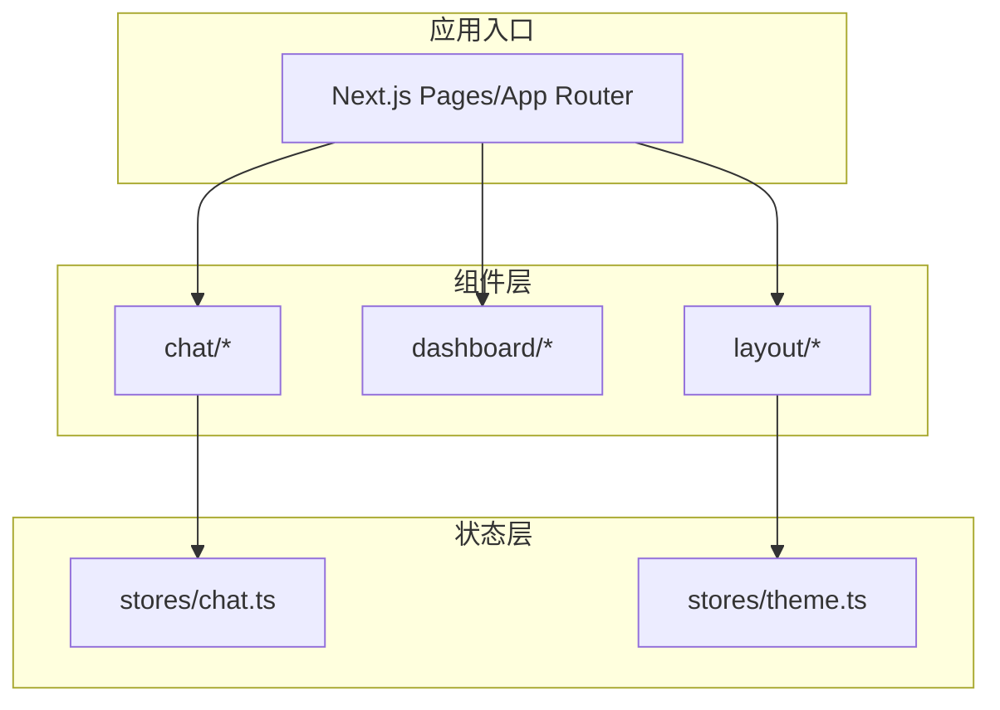
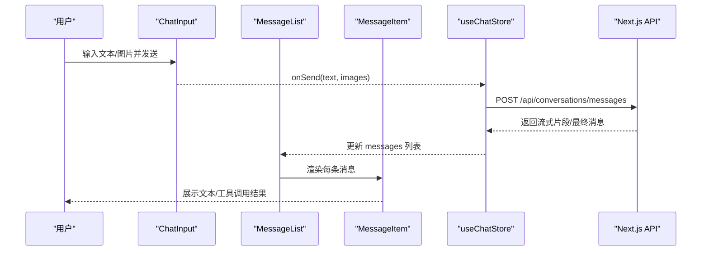
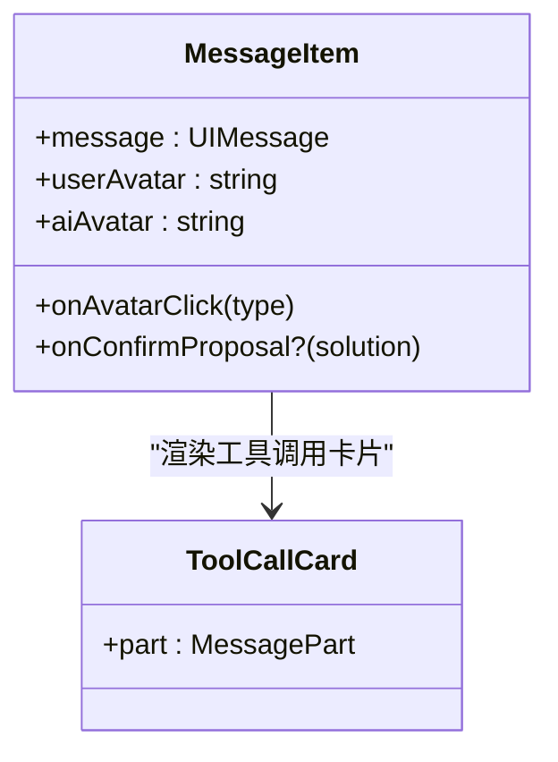
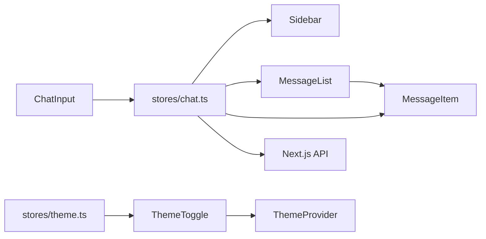

# 前端组件库

<cite>
**本文引用的文件**   
- [README.md](file://README.md)
- [package.json](file://package.json)
- [src/components/chat/message-list.tsx](file://src/components/chat/message-list.tsx)
- [src/components/chat/message-item.tsx](file://src/components/chat/message-item.tsx)
- [src/components/chat/chat-input.tsx](file://src/components/chat/chat-input.tsx)
- [src/components/chat/model-selector.tsx](file://src/components/chat/model-selector.tsx)
- [src/components/chat/agent-selector.tsx](file://src/components/chat/agent-selector.tsx)
- [src/components/dashboard/stat-card.tsx](file://src/components/dashboard/stat-card.tsx)
- [src/components/dashboard/line-chart.tsx](file://src/components/dashboard/line-chart.tsx)
- [src/components/dashboard/donut-chart.tsx](file://src/components/dashboard/donut-chart.tsx)
- [src/components/layout/sidebar.tsx](file://src/components/layout/sidebar.tsx)
- [src/components/layout/theme-toggle.tsx](file://src/components/layout/theme-toggle.tsx)
- [src/components/layout/theme-provider.tsx](file://src/components/layout/theme-provider.tsx)
- [src/stores/chat.ts](file://src/stores/chat.ts)
- [src/stores/theme.ts](file://src/stores/theme.ts)
</cite>

## 目录
1. [简介](#简介)
2. [项目结构](#项目结构)
3. [核心组件](#核心组件)
4. [架构总览](#架构总览)
5. [详细组件分析](#详细组件分析)
6. [依赖分析](#依赖分析)
7. [性能考虑](#性能考虑)
8. [故障排查指南](#故障排查指南)
9. [结论](#结论)
10. [附录](#附录)

## 简介
本技术文档聚焦 OpenCat 前端组件库，基于 React 19 与 Tailwind CSS 4 构建，覆盖聊天、仪表板与布局三大类可复用 UI 组件。文档面向不同层次读者，既提供高层架构说明，也深入到每个组件的属性接口、事件处理、状态管理与样式定制选项，并给出组合模式、最佳实践（响应式、无障碍、性能优化）、测试策略与开发调试指南。

## 项目结构
OpenCat 的前端组件按功能域组织在 src/components 下：
- chat：消息列表、消息项、输入框、模型选择器、Agent 选择器等
- dashboard：统计卡片、折线图、环形图等
- layout：侧边栏、主题切换、主题初始化 Provider
- stores：Zustand 全局状态（聊天工作线程、主题）

图表来源
- [src/components/chat/message-list.tsx:1-59](file://src/components/chat/message-list.tsx#L1-L59)
- [src/components/dashboard/stat-card.tsx:1-46](file://src/components/dashboard/stat-card.tsx#L1-L46)
- [src/components/layout/sidebar.tsx:1-270](file://src/components/layout/sidebar.tsx#L1-L270)
- [src/stores/chat.ts:1-189](file://src/stores/chat.ts#L1-L189)
- [src/stores/theme.ts:1-40](file://src/stores/theme.ts#L1-L40)

章节来源
- [README.md:271-300](file://README.md#L271-L300)

## 核心组件
本节概述三类核心组件的职责与协作关系：
- 聊天组件：消息列表、消息项、输入框、模型选择器、Agent 选择器
- 仪表板组件：统计卡片、折线图、环形图
- 布局组件：侧边栏、主题切换、主题初始化 Provider

这些组件通过 Zustand store 管理跨页面状态（如对话列表、活跃影子工作线程、主题），并通过 Next.js API 路由与后端交互。

章节来源
- [src/components/chat/message-list.tsx:11-18](file://src/components/chat/message-list.tsx#L11-L18)
- [src/components/chat/message-item.tsx:234-246](file://src/components/chat/message-item.tsx#L234-L246)
- [src/components/chat/chat-input.tsx:13-17](file://src/components/chat/chat-input.tsx#L13-L17)
- [src/components/chat/model-selector.tsx:14-17](file://src/components/chat/model-selector.tsx#L14-L17)
- [src/components/chat/agent-selector.tsx:30-35](file://src/components/chat/agent-selector.tsx#L30-L35)
- [src/components/dashboard/stat-card.tsx:11-17](file://src/components/dashboard/stat-card.tsx#L11-L17)
- [src/components/dashboard/line-chart.tsx:26-32](file://src/components/dashboard/line-chart.tsx#L26-L32)
- [src/components/dashboard/donut-chart.tsx:24-29](file://src/components/dashboard/donut-chart.tsx#L24-L29)
- [src/components/layout/sidebar.tsx:24-30](file://src/components/layout/sidebar.tsx#L24-L30)
- [src/components/layout/theme-toggle.tsx:11-12](file://src/components/layout/theme-toggle.tsx#L11-L12)
- [src/stores/chat.ts:43-69](file://src/stores/chat.ts#L43-L69)
- [src/stores/theme.ts:11-15](file://src/stores/theme.ts#L11-L15)

## 架构总览
组件与状态、API 的交互关系如下：

图表来源
- [src/components/chat/chat-input.tsx:80-91](file://src/components/chat/chat-input.tsx#L80-L91)
- [src/components/chat/message-list.tsx:20-56](file://src/components/chat/message-list.tsx#L20-L56)
- [src/components/chat/message-item.tsx:234-365](file://src/components/chat/message-item.tsx#L234-L365)
- [src/stores/chat.ts:81-116](file://src/stores/chat.ts#L81-L116)

## 详细组件分析

### 聊天组件族

#### 消息列表 MessageList
- 职责：渲染消息数组，自动滚动到底部，显示“思考中”指示器
- 关键属性
  - messages: UIMessage[]
  - isStreaming: boolean
  - userAvatar: string
  - aiAvatar: string
  - onAvatarClick(type): void
  - onConfirmProposal?(solution): void
- 行为
  - 监听 messages 与 isStreaming 变化，平滑滚动到底部
  - 当最后一条非 assistant 且处于流式时，显示“Thinking...”动画
- 样式
  - 使用 Tailwind 容器与间距控制，适配最大宽度与内边距
- 无障碍
  - 建议为加载指示器添加 aria-live="polite" 提示

章节来源
- [src/components/chat/message-list.tsx:11-18](file://src/components/chat/message-list.tsx#L11-L18)
- [src/components/chat/message-list.tsx:20-56](file://src/components/chat/message-list.tsx#L20-L56)

#### 消息项 MessageItem
- 职责：渲染单条消息，支持用户/AI 角色、时间戳、图片附件、工具调用卡片
- 关键属性
  - message: UIMessage
  - userAvatar: string
  - aiAvatar: string
  - onAvatarClick(type): void
  - onConfirmProposal?(solution): void
- 行为
  - 解析 parts：分离 text 与 tool-* 类型，顺序渲染
  - 工具调用状态：input-streaming/input-available/output-available/output-error
  - 头像点击触发回调，用于修改头像 Emoji
  - 时间格式化采用 UTC+8
- 样式
  - 用户消息气泡右对齐，AI 消息左对齐；工具卡片折叠展开
- 无障碍
  - 工具卡片按钮具备标题与键盘可操作
  - 错误信息区域建议使用语义化标签

图表来源
- [src/components/chat/message-item.tsx:234-365](file://src/components/chat/message-item.tsx#L234-L365)
- [src/components/chat/message-item.tsx:107-205](file://src/components/chat/message-item.tsx#L107-L205)

章节来源
- [src/components/chat/message-item.tsx:234-365](file://src/components/chat/message-item.tsx#L234-L365)

#### 输入框 ChatInput
- 职责：文本输入、图片上传预览、发送/停止生成
- 关键属性
  - isLoading: boolean
  - onSend(text, images?): void
  - onStop(): void
- 行为
  - Enter 发送，Shift+Enter 换行
  - 最多同时上传 5 张图片，超出部分忽略
  - 动态调整 textarea 高度
- 样式
  - 圆角容器、阴影、焦点边框高亮
- 无障碍
  - 按钮具备 title 与禁用态
  - 图片删除按钮可键盘操作

章节来源
- [src/components/chat/chat-input.tsx:13-17](file://src/components/chat/chat-input.tsx#L13-L17)
- [src/components/chat/chat-input.tsx:80-98](file://src/components/chat/chat-input.tsx#L80-L98)
- [src/components/chat/chat-input.tsx:100-186](file://src/components/chat/chat-input.tsx#L100-L186)

#### 模型选择器 ModelSelector
- 职责：下拉选择模型，支持自定义输入 Model ID，按 Provider 分组
- 关键属性
  - value: string
  - onChange(modelId): void
- 行为
  - 从 /api/models 拉取模型列表
  - 无可用模型时引导至设置页配置密钥
  - 支持自定义输入并提交
- 样式
  - 下拉面板带阴影与动画，选中项高亮

章节来源
- [src/components/chat/model-selector.tsx:14-17](file://src/components/chat/model-selector.tsx#L14-L17)
- [src/components/chat/model-selector.tsx:36-50](file://src/components/chat/model-selector.tsx#L36-L50)
- [src/components/chat/model-selector.tsx:93-204](file://src/components/chat/model-selector.tsx#L93-L204)

#### Agent 选择器 AgentSelector
- 职责：选择当前对话使用的 Agent，或回退到普通聊天
- 关键属性
  - value: string | null
  - onChange(agentId | null): void
- 行为
  - 从 /api/agents 获取 Agent 列表
  - 支持“不使用 Agent”选项
- 样式
  - 与 ModelSelector 一致的下拉风格

章节来源
- [src/components/chat/agent-selector.tsx:30-35](file://src/components/chat/agent-selector.tsx#L30-L35)
- [src/components/chat/agent-selector.tsx:56-72](file://src/components/chat/agent-selector.tsx#L56-L72)
- [src/components/chat/agent-selector.tsx:77-158](file://src/components/chat/agent-selector.tsx#L77-L158)

### 仪表板组件族

#### 统计卡片 StatCard
- 职责：展示数值、标签、副标题与图标
- 关键属性
  - label: string
  - value: string | number
  - subtitle?: string
  - icon: LucideIcon
  - accentColor?: string
- 样式
  - 卡片边框、背景、悬停阴影，图标背景色与前景色由 accentColor 控制

章节来源
- [src/components/dashboard/stat-card.tsx:11-17](file://src/components/dashboard/stat-card.tsx#L11-L17)
- [src/components/dashboard/stat-card.tsx:19-45](file://src/components/dashboard/stat-card.tsx#L19-L45)

#### 折线图 LineChart
- 职责：纯 SVG 绘制 14 天趋势图，支持多指标切换与 Tooltip
- 关键属性
  - data: DataPoint[]
  - dataKey?: "tokens" | "messages" | "cost" | "value" | "hours"
  - title?: string
  - color?: string
  - emptyText?: string
- 行为
  - 计算 Y 轴刻度、X 轴日期标签
  - 鼠标悬停显示竖线与值
- 样式
  - 面积渐变填充、网格线、点大小随悬停变化

章节来源
- [src/components/dashboard/line-chart.tsx:26-32](file://src/components/dashboard/line-chart.tsx#L26-L32)
- [src/components/dashboard/line-chart.tsx:43-230](file://src/components/dashboard/line-chart.tsx#L43-L230)

#### 环形图 DonutChart
- 职责：展示模型使用占比，中心显示总量
- 关键属性
  - data: ModelData[]
  - title?: string
  - emptyText?: string
  - totalLabel?: string
- 行为
  - 使用 stroke-dasharray 技巧分段绘制弧形
  - 悬停高亮对应段与图例项

章节来源
- [src/components/dashboard/donut-chart.tsx:24-29](file://src/components/dashboard/donut-chart.tsx#L24-L29)
- [src/components/dashboard/donut-chart.tsx:50-177](file://src/components/dashboard/donut-chart.tsx#L50-L177)

### 布局组件族

#### 侧边栏 Sidebar
- 职责：新建对话、导航到各功能页、对话列表、底部工具栏（主题、语言、Agents、Knowledge、API Keys）、用户信息与登出
- 关键属性
  - user: { name?, email?, image? }
- 行为
  - 根据路径同步 activeConversationId
  - 新增/选择/删除对话，删除后清理关联影子工作线程
  - 语言切换持久化
- 样式
  - 侧边栏固定宽度，hover/active 状态清晰

章节来源
- [src/components/layout/sidebar.tsx:24-30](file://src/components/layout/sidebar.tsx#L24-L30)
- [src/components/layout/sidebar.tsx:47-76](file://src/components/layout/sidebar.tsx#L47-L76)
- [src/components/layout/sidebar.tsx:82-269](file://src/components/layout/sidebar.tsx#L82-L269)

#### 主题切换 ThemeToggle
- 职责：切换亮/暗主题
- 行为
  - 读取 useThemeStore 的 theme 与 toggleTheme
- 样式
  - 图标随主题变化

章节来源
- [src/components/layout/theme-toggle.tsx:11-26](file://src/components/layout/theme-toggle.tsx#L11-L26)

#### 主题初始化 ThemeProvider
- 职责：客户端挂载时从 localStorage 恢复主题，避免闪屏
- 行为
  - useLayoutEffect 同步设置 <html> 的 dark class

章节来源
- [src/components/layout/theme-provider.tsx:12-23](file://src/components/layout/theme-provider.tsx#L12-L23)

## 依赖分析
- 运行时依赖
  - React 19、Next.js 16、Tailwind CSS 4、Zustand、Lucide 图标等
- 组件间耦合
  - chat 组件依赖 useChatStore 管理对话与影子工作线程
  - layout 组件依赖 useThemeStore 管理主题
  - dashboard 组件为纯展示型，低耦合
- 外部集成点
  - /api/models、/api/agents、/api/conversations 等 Next.js API 路由

图表来源
- [src/stores/chat.ts:43-69](file://src/stores/chat.ts#L43-L69)
- [src/stores/theme.ts:11-15](file://src/stores/theme.ts#L11-L15)
- [src/components/layout/sidebar.tsx:32-45](file://src/components/layout/sidebar.tsx#L32-L45)
- [src/components/chat/message-list.tsx:20-56](file://src/components/chat/message-list.tsx#L20-L56)
- [src/components/chat/message-item.tsx:234-365](file://src/components/chat/message-item.tsx#L234-L365)
- [src/components/chat/chat-input.tsx:80-91](file://src/components/chat/chat-input.tsx#L80-L91)

章节来源
- [package.json:17-46](file://package.json#L17-L46)
- [README.md:139-156](file://README.md#L139-L156)

## 性能考虑
- 列表渲染
  - 消息列表使用 key 稳定标识，减少重排；必要时可对长列表进行虚拟滚动扩展
- 图片处理
  - 输入框限制最多 5 张，避免过大内存占用；建议后续增加压缩与懒加载
- 图表渲染
  - 纯 SVG 实现，数据量较大时可分页或采样；Tooltip 仅在悬停时计算
- 状态更新
  - 使用 Zustand 细粒度订阅，避免不必要重渲染
- 主题切换
  - 使用 useLayoutEffect 同步设置 class，避免首屏闪烁

[本节为通用指导，不直接分析具体文件]

## 故障排查指南
- 模型列表为空
  - 检查 /api/models 是否返回数据；确认已配置并激活 API Key
  - 参考 ModelSelector 的错误引导逻辑
- 无法发送消息
  - 检查 ChatInput 的 disabled 状态与 onSend 回调
  - 查看 useChatStore 的网络请求与错误日志
- 主题未生效
  - 确认 ThemeProvider 已在根节点包裹
  - 检查 documentElement 的 .dark class 是否正确设置
- 对话删除后仍显示旧状态
  - 确认 removeConversation 后调用了 unregisterWorker 并更新了 activeConversationId

章节来源
- [src/components/chat/model-selector.tsx:36-50](file://src/components/chat/model-selector.tsx#L36-L50)
- [src/components/chat/chat-input.tsx:80-91](file://src/components/chat/chat-input.tsx#L80-L91)
- [src/stores/chat.ts:96-116](file://src/stores/chat.ts#L96-L116)
- [src/components/layout/theme-provider.tsx:15-20](file://src/components/layout/theme-provider.tsx#L15-L20)
- [src/stores/theme.ts:21-33](file://src/stores/theme.ts#L21-L33)

## 结论
OpenCat 前端组件库以清晰的职责划分与低耦合设计，提供了可扩展的聊天、仪表板与布局能力。借助 Zustand 集中管理状态，结合 Next.js API 与 AI SDK 的流式能力，实现了高性能、可维护的用户体验。建议在后续迭代中补充更完善的单元测试与端到端测试，持续优化无障碍与国际化细节。

[本节为总结性内容，不直接分析具体文件]

## 附录

### 组件属性与事件速查表
- ChatInput
  - 属性：isLoading, onSend, onStop
  - 事件：提交文本/图片、停止生成
- MessageList
  - 属性：messages, isStreaming, userAvatar, aiAvatar, onAvatarClick, onConfirmProposal
- MessageItem
  - 属性：message, userAvatar, aiAvatar, onAvatarClick, onConfirmProposal
- ModelSelector
  - 属性：value, onChange
- AgentSelector
  - 属性：value, onChange
- StatCard
  - 属性：label, value, subtitle, icon, accentColor
- LineChart
  - 属性：data, dataKey, title, color, emptyText
- DonutChart
  - 属性：data, title, emptyText, totalLabel
- Sidebar
  - 属性：user
- ThemeToggle
  - 行为：toggleTheme
- ThemeProvider
  - 行为：初始化主题

章节来源
- [src/components/chat/chat-input.tsx:13-17](file://src/components/chat/chat-input.tsx#L13-L17)
- [src/components/chat/message-list.tsx:11-18](file://src/components/chat/message-list.tsx#L11-L18)
- [src/components/chat/message-item.tsx:234-246](file://src/components/chat/message-item.tsx#L234-L246)
- [src/components/chat/model-selector.tsx:14-17](file://src/components/chat/model-selector.tsx#L14-L17)
- [src/components/chat/agent-selector.tsx:30-35](file://src/components/chat/agent-selector.tsx#L30-L35)
- [src/components/dashboard/stat-card.tsx:11-17](file://src/components/dashboard/stat-card.tsx#L11-L17)
- [src/components/dashboard/line-chart.tsx:26-32](file://src/components/dashboard/line-chart.tsx#L26-L32)
- [src/components/dashboard/donut-chart.tsx:24-29](file://src/components/dashboard/donut-chart.tsx#L24-L29)
- [src/components/layout/sidebar.tsx:24-30](file://src/components/layout/sidebar.tsx#L24-L30)
- [src/components/layout/theme-toggle.tsx:11-12](file://src/components/layout/theme-toggle.tsx#L11-L12)
- [src/components/layout/theme-provider.tsx:12-23](file://src/components/layout/theme-provider.tsx#L12-L23)

### 组合模式与最佳实践
- 组合模式
  - ChatPanel = Sidebar + MessageList + ChatInput + ModelSelector + AgentSelector
  - Dashboard = StatCard + LineChart + DonutChart
- 响应式设计
  - 使用 Tailwind 断点与 max-w 容器，确保在小屏设备可读
- 无障碍访问
  - 为交互元素提供 title/aria-label，对动态内容使用 aria-live
- 性能优化
  - 列表虚拟化、图片压缩、按需加载图表数据、最小化状态更新范围

[本节为通用指导，不直接分析具体文件]

### 测试策略
- 单元测试
  - 对纯展示组件（StatCard、LineChart、DonutChart）进行快照与交互测试
  - 对工具函数（时间格式化、数据处理）进行边界用例测试
- 集成测试
  - 模拟 API 响应，验证 ChatInput 发送流程与 MessageList 渲染
- 端到端测试
  - 使用浏览器自动化验证登录、创建对话、发送消息、切换主题等主流程

[本节为通用指导，不直接分析具体文件]

### 开发调试指南
- 本地启动
  - 安装依赖、启动数据库与 Redis、配置环境变量、运行 dev 服务
- 常见问题
  - 模型不可用：检查 API Key 配置与 /api/models 返回
  - 主题闪烁：确认 ThemeProvider 包裹与 useLayoutEffect 执行顺序
  - 对话状态不一致：检查 useChatStore 的 worker 注册与迁移逻辑

章节来源
- [README.md:200-268](file://README.md#L200-L268)
- [src/components/layout/theme-provider.tsx:15-20](file://src/components/layout/theme-provider.tsx#L15-L20)
- [src/stores/chat.ts:124-187](file://src/stores/chat.ts#L124-L187)