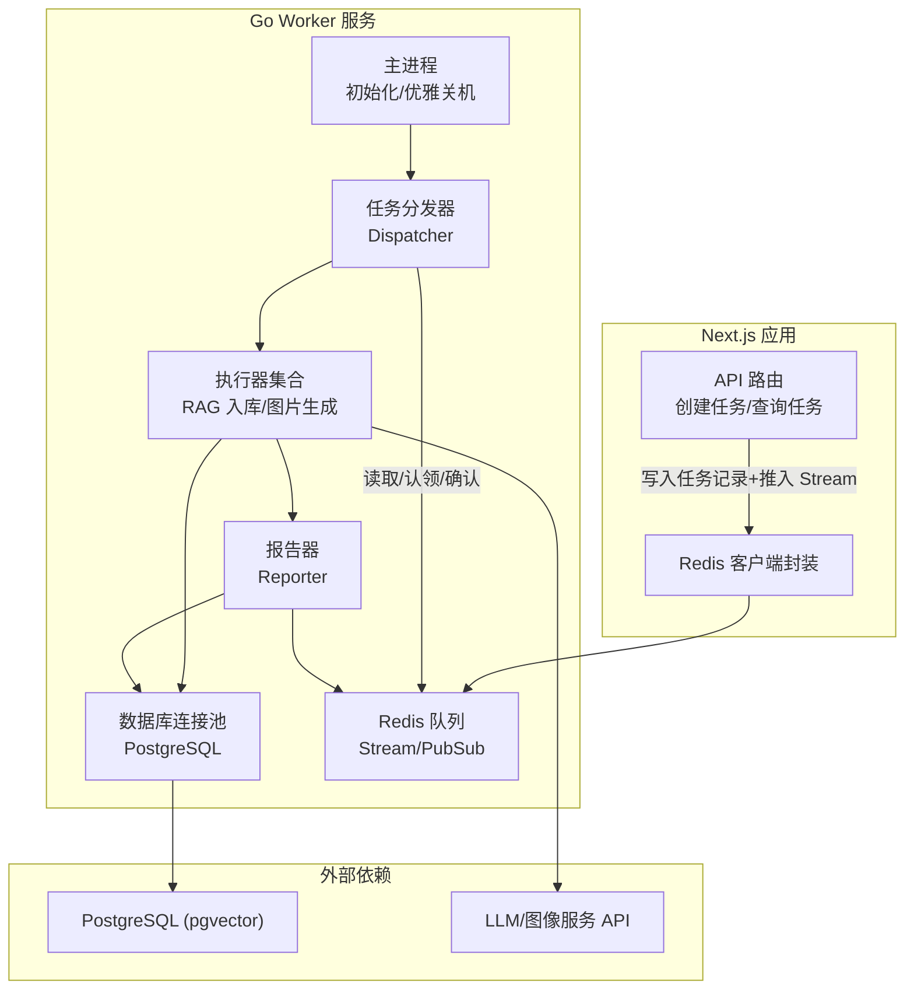
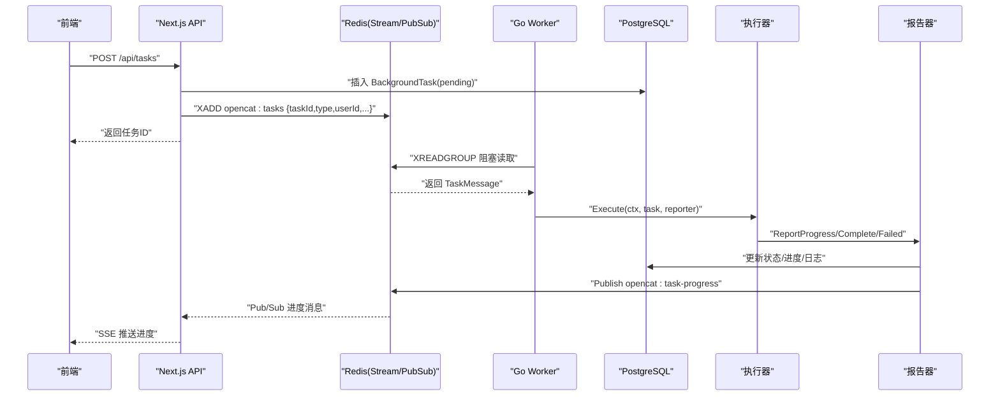
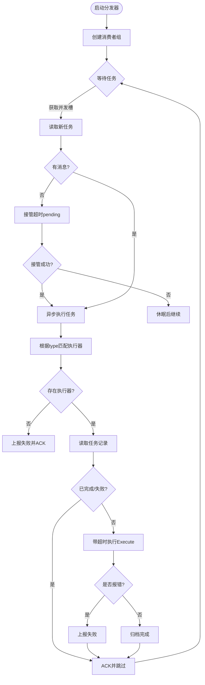
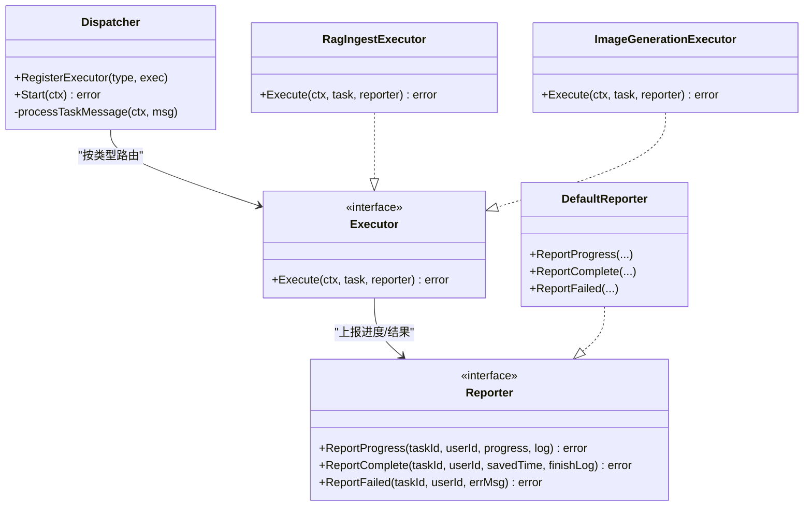
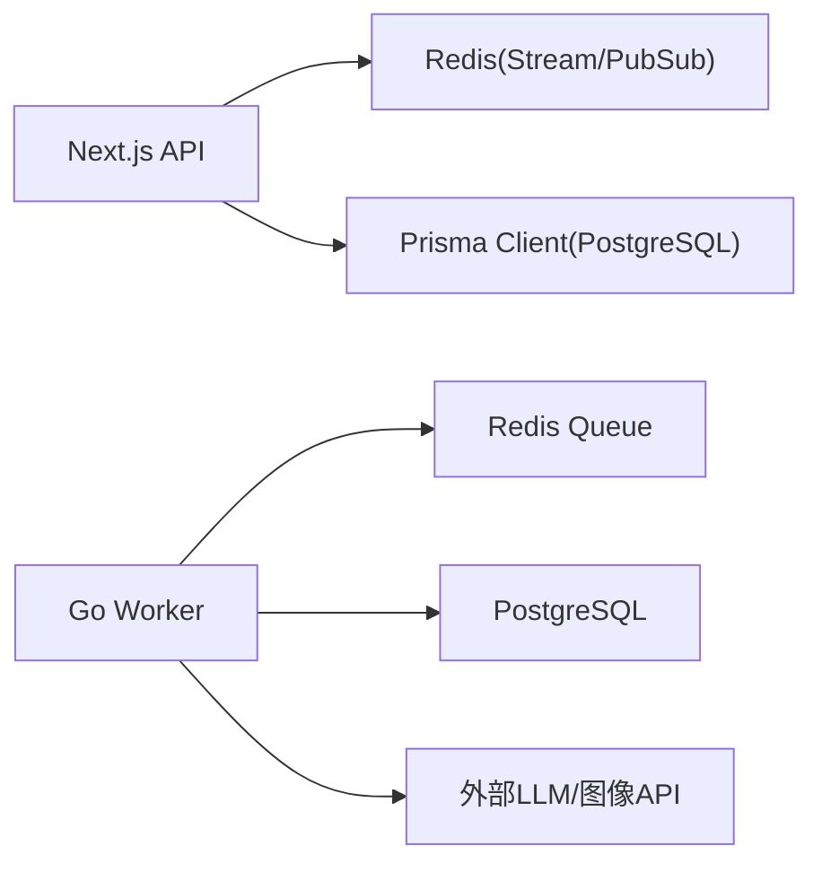

# 后端服务架构

<cite>
**本文引用的文件**   
- [worker/cmd/worker/main.go](file://worker/cmd/worker/main.go)
- [worker/internal/dispatcher/dispatcher.go](file://worker/internal/dispatcher/dispatcher.go)
- [worker/internal/executor/executor.go](file://worker/internal/executor/executor.go)
- [worker/internal/executor/image_generation.go](file://worker/internal/executor/image_generation.go)
- [worker/internal/executor/rag_ingest.go](file://worker/internal/executor/rag_ingest.go)
- [worker/internal/queue/redis.go](file://worker/internal/queue/redis.go)
- [worker/internal/reporter/reporter.go](file://worker/internal/reporter/reporter.go)
- [worker/internal/db/postgres.go](file://worker/internal/db/postgres.go)
- [worker/pkg/models/task.go](file://worker/pkg/models/task.go)
- [src/app/api/tasks/route.ts](file://src/app/api/tasks/route.ts)
- [src/lib/redis.ts](file://src/lib/redis.ts)
- [prisma/schema.prisma](file://prisma/schema.prisma)
</cite>

## 目录
1. [简介](#简介)
2. [项目结构](#项目结构)
3. [核心组件](#核心组件)
4. [架构总览](#架构总览)
5. [详细组件分析](#详细组件分析)
6. [依赖关系分析](#依赖关系分析)
7. [性能考量](#性能考量)
8. [故障排除指南](#故障排除指南)
9. [结论](#结论)
10. [附录](#附录)

## 简介
本技术文档面向 OpenCat 后端服务，聚焦于 Next.js API Routes 与 Go Worker 服务的协同工作机制。重点阐述后台任务处理系统：Redis 消息队列、任务分发器、执行器与报告器的设计与实现；说明工具注册中心的动态加载机制、智能体编排引擎的 ReAct 推理循环、记忆系统的向量检索实现；并覆盖异步任务生命周期管理、错误处理与重试机制、服务间通信协议、数据序列化格式以及监控日志方案。最后提供性能调优与故障排除指南。

## 项目结构
OpenCat 采用前后端分离与多语言协作的架构：
- Next.js（TypeScript）负责 Web 应用、API 路由、鉴权、前端交互与 Redis 客户端封装。
- Go Worker 作为独立进程，负责从 Redis Stream 消费长任务、调度执行器、持久化状态并通过 Redis Pub/Sub 推送进度。
- PostgreSQL（含 pgvector 扩展）用于结构化数据与向量存储。
- Redis 用作任务队列（Stream）、消费者组、进度广播（Pub/Sub）。

图表来源
- [worker/cmd/worker/main.go:1-95](file://worker/cmd/worker/main.go#L1-L95)
- [worker/internal/dispatcher/dispatcher.go:1-195](file://worker/internal/dispatcher/dispatcher.go#L1-L195)
- [worker/internal/queue/redis.go:1-158](file://worker/internal/queue/redis.go#L1-L158)
- [worker/internal/reporter/reporter.go:1-119](file://worker/internal/reporter/reporter.go#L1-L119)
- [worker/internal/db/postgres.go:1-293](file://worker/internal/db/postgres.go#L1-L293)
- [src/app/api/tasks/route.ts:1-89](file://src/app/api/tasks/route.ts#L1-L89)
- [src/lib/redis.ts:1-20](file://src/lib/redis.ts#L1-L20)

章节来源
- [worker/cmd/worker/main.go:1-95](file://worker/cmd/worker/main.go#L1-L95)
- [src/app/api/tasks/route.ts:1-89](file://src/app/api/tasks/route.ts#L1-L89)
- [src/lib/redis.ts:1-20](file://src/lib/redis.ts#L1-L20)

## 核心组件
- 任务模型与持久化
  - BackgroundTask 定义任务元数据、状态、进度、详情与日志等字段，贯穿 Next.js 写入与 Go Worker 消费流程。
- 任务队列与消费者组
  - Redis Stream 作为任务通道，使用消费者组保证至少一次投递与失败重试能力。
- 任务分发器
  - 控制并发、拉取任务、匹配执行器、超时保护、异常恢复与消息确认。
- 执行器接口与实现
  - 统一 Execute 接口，支持 RAG 文档向量化入库与图片生成两类典型长任务。
- 报告器
  - 将进度、完成与失败事件同步到数据库，并通过 Redis Pub/Sub 广播给 Next.js 转发至前端 SSE。
- 数据库访问层
  - 基于 pgxpool 的连接池与常用 SQL 操作封装。

章节来源
- [worker/pkg/models/task.go:1-25](file://worker/pkg/models/task.go#L1-L25)
- [worker/internal/queue/redis.go:1-158](file://worker/internal/queue/redis.go#L1-L158)
- [worker/internal/dispatcher/dispatcher.go:1-195](file://worker/internal/dispatcher/dispatcher.go#L1-L195)
- [worker/internal/executor/executor.go:1-17](file://worker/internal/executor/executor.go#L1-L17)
- [worker/internal/reporter/reporter.go:1-119](file://worker/internal/reporter/reporter.go#L1-L119)
- [worker/internal/db/postgres.go:1-293](file://worker/internal/db/postgres.go#L1-L293)

## 架构总览
整体调用链如下：
- Next.js 接收请求，校验会话后写入 BackgroundTask 表，并将任务消息推送到 Redis Stream。
- Go Worker 启动后建立数据库与 Redis 连接，初始化分发器并进入监听循环。
- 分发器从 Redis 拉取任务，按类型分派到对应执行器，执行器通过报告器更新进度与结果。
- 报告器同时写库与广播进度，Next.js 订阅进度频道，以 SSE 推送给前端。

图表来源
- [src/app/api/tasks/route.ts:1-89](file://src/app/api/tasks/route.ts#L1-L89)
- [worker/internal/dispatcher/dispatcher.go:1-195](file://worker/internal/dispatcher/dispatcher.go#L1-L195)
- [worker/internal/queue/redis.go:1-158](file://worker/internal/queue/redis.go#L1-L158)
- [worker/internal/reporter/reporter.go:1-119](file://worker/internal/reporter/reporter.go#L1-L119)
- [worker/internal/db/postgres.go:1-293](file://worker/internal/db/postgres.go#L1-L293)

## 详细组件分析

### 任务分发器（Dispatcher）
职责
- 维护执行器注册表，按任务类型路由到具体执行器。
- 控制并发度，防止过载。
- 拉取新任务与接管超时 pending 消息，保障可靠性。
- 为每个任务设置上下文超时，捕获 panic 并上报失败。
- 最终确认消息消费完成。

关键设计点
- 并发控制：信号量 channel 限制最大并行任务数。
- 健壮性：panic 恢复、任务级超时、重复消费幂等检查（已完成的跳过）。
- 可观测性：结构化日志、主机名标识、错误上报。

图表来源
- [worker/internal/dispatcher/dispatcher.go:1-195](file://worker/internal/dispatcher/dispatcher.go#L1-L195)
- [worker/internal/queue/redis.go:1-158](file://worker/internal/queue/redis.go#L1-L158)

章节来源
- [worker/internal/dispatcher/dispatcher.go:1-195](file://worker/internal/dispatcher/dispatcher.go#L1-L195)

### 执行器接口与实现
接口定义
- Executor.Execute(ctx, task, reporter) 统一执行入口，支持取消与超时。

RAG 文档入库执行器
- 文本分块策略：中文语义断句与重叠窗口，避免切分过碎。
- 向量化配置解析：环境变量优先，其次用户默认 Project 配置，再回退到系统 Key。
- 降级策略：当向量化不可用时，仅保存纯文本分块。
- 批量写入：使用原生 SQL 插入 DocumentChunk，支持 pgvector 向量列。

图片生成执行器
- 模式支持：文生图与图生图（multipart 或 JSON 两种请求构造方式）。
- 响应归一化：兼容 JSON 与流式事件（text/event-stream），提取最终 data。
- 下载与落盘：支持远程 URL 下载与 base64 解码，统一保存到本地目录。
- 重试策略：针对上游临时错误的有限次重试与指数退避。

图表来源
- [worker/internal/executor/executor.go:1-17](file://worker/internal/executor/executor.go#L1-L17)
- [worker/internal/executor/rag_ingest.go:1-375](file://worker/internal/executor/rag_ingest.go#L1-L375)
- [worker/internal/executor/image_generation.go:1-731](file://worker/internal/executor/image_generation.go#L1-L731)
- [worker/internal/reporter/reporter.go:1-119](file://worker/internal/reporter/reporter.go#L1-L119)

章节来源
- [worker/internal/executor/executor.go:1-17](file://worker/internal/executor/executor.go#L1-L17)
- [worker/internal/executor/rag_ingest.go:1-375](file://worker/internal/executor/rag_ingest.go#L1-L375)
- [worker/internal/executor/image_generation.go:1-731](file://worker/internal/executor/image_generation.go#L1-L731)

### 报告器（Reporter）
职责
- 将任务进度、完成与失败信息写入数据库，并追加时间戳日志。
- 通过 Redis Pub/Sub 广播标准化 JSON 消息，供 Next.js 转发至前端。

数据结构
- TaskProgressMessage：包含 taskId、userId、status、progress、log、timestamp。

章节来源
- [worker/internal/reporter/reporter.go:1-119](file://worker/internal/reporter/reporter.go#L1-L119)

### 数据库访问层（PostgreSQL）
职责
- 连接池管理与健康检查。
- 任务查询、进度更新、完成/失败标记、详情更新等常用操作。
- 清理任务辅助方法（用于过期文件清理等）。

注意
- 日志字段 logs 以 JSON 数组形式存储，更新时先读后写合并。
- 失败路径会将错误信息写入 details.error 字段，便于排查。

章节来源
- [worker/internal/db/postgres.go:1-293](file://worker/internal/db/postgres.go#L1-L293)
- [prisma/schema.prisma:571-595](file://prisma/schema.prisma#L571-L595)

### 队列与消费者组（Redis）
职责
- 创建消费者组，确保任务不丢失。
- 阻塞读取新任务，无消息时短睡眠避免忙轮询。
- 自动认领长时间未 ACK 的 pending 任务，提升容错。
- 广播任务进度到指定频道。

章节来源
- [worker/internal/queue/redis.go:1-158](file://worker/internal/queue/redis.go#L1-L158)

### Next.js 集成与 SSE 推送
- 创建任务：写入 BackgroundTask 表，并向 Redis Stream 推送消息。
- 查询任务：按当前用户的项目维度返回任务列表。
- 进度订阅：建议通过 SSE 订阅 Redis Pub/Sub 频道，实时推送进度。

章节来源
- [src/app/api/tasks/route.ts:1-89](file://src/app/api/tasks/route.ts#L1-L89)
- [src/lib/redis.ts:1-20](file://src/lib/redis.ts#L1-L20)

### 工具注册中心与动态加载
- 工具定义：Tool 模型支持内置、HTTP、MCP 三种类型，包含输入参数 Schema 与配置。
- 动态加载：通过 API 暴露 getAvailableTools，按项目/全局维度聚合可用工具。
- 编排器 Agent：isOrchestrator 标志位支持编排其他 Agent。

章节来源
- [prisma/schema.prisma:209-232](file://prisma/schema.prisma#L209-L232)
- [prisma/schema.prisma:145-164](file://prisma/schema.prisma#L145-L164)
- [src/app/api/tools/route.ts:1-26](file://src/app/api/tools/route.ts#L1-L26)

### 智能体编排引擎与 ReAct 推理循环
- ReAct 循环：Agent 在对话中反复进行“思考-行动-观察”，直至满足终止条件或达到最大步数。
- 编排器：isOrchestrator=true 的 Agent 可调度子 Agent 完成任务分解与汇总。
- 工具调用：tool_calls/tool_results 字段承载 LLM 的工具调用与结果。

章节来源
- [prisma/schema.prisma:145-164](file://prisma/schema.prisma#L145-L164)
- [prisma/schema.prisma:186-207](file://prisma/schema.prisma#L186-L207)

### 记忆系统与向量检索
- Memory 模型支持向量字段 embedding(vector(1536))，用于长期记忆检索。
- 知识库与文档分块：Document/DocumentChunk 配合 pgvector 实现 RAG 检索。
- 向量化流程：由 RAG 入库执行器完成分块与向量生成，失败时降级为纯文本存储。

章节来源
- [prisma/schema.prisma:234-266](file://prisma/schema.prisma#L234-L266)
- [prisma/schema.prisma:268-307](file://prisma/schema.prisma#L268-L307)
- [worker/internal/executor/rag_ingest.go:1-375](file://worker/internal/executor/rag_ingest.go#L1-L375)

## 依赖关系分析
- Next.js 依赖 Redis 客户端与 Prisma 生成的数据库客户端。
- Go Worker 依赖 pgxpool 与 go-redis，内部模块耦合清晰：dispatcher -> executor/reporter -> db/queue。
- 外部依赖：LLM/图像服务 API、PostgreSQL(pgvector)、Redis。

图表来源
- [src/lib/redis.ts:1-20](file://src/lib/redis.ts#L1-L20)
- [worker/internal/queue/redis.go:1-158](file://worker/internal/queue/redis.go#L1-L158)
- [worker/internal/db/postgres.go:1-293](file://worker/internal/db/postgres.go#L1-L293)

章节来源
- [src/lib/redis.ts:1-20](file://src/lib/redis.ts#L1-L20)
- [worker/internal/queue/redis.go:1-158](file://worker/internal/queue/redis.go#L1-L158)
- [worker/internal/db/postgres.go:1-293](file://worker/internal/db/postgres.go#L1-L293)

## 性能考量
- 并发控制
  - 合理设置 Worker 并发度，避免资源争用与下游限流。
- 超时与重试
  - 任务级超时防止挂起；对外部 API 的错误分类与有限重试，避免雪崩。
- 数据库写入
  - 批量写入与最小化往返；日志合并减少频繁更新。
- 内存与网络
  - 图片生成时限制响应大小；复用 HTTP 客户端与连接池。
- 缓存与预热
  - 对热点配置（如 Embedding 模型、BaseURL）做缓存以减少数据库查询。

[本节为通用指导，无需源码引用]

## 故障排除指南
常见问题与定位要点
- 任务未消费
  - 检查 Redis 消费者组是否存在；确认 XREADGROUP 与 XAUTOCLAIM 是否正常。
- 任务卡住或超时
  - 查看任务日志与 details.error；核对外部 API 可用性与时延。
- 进度未推送
  - 确认 Redis Pub/Sub 频道名称一致；Next.js 是否正确订阅与转发 SSE。
- 图片生成失败
  - 检查 multipart/JSON 请求构建、Content-Type、授权头与远端状态码。
- 向量化失败
  - 验证 EMBEDDING_* 环境变量或用户 ApiKey 配置；关注降级日志。

章节来源
- [worker/internal/dispatcher/dispatcher.go:1-195](file://worker/internal/dispatcher/dispatcher.go#L1-L195)
- [worker/internal/executor/image_generation.go:1-731](file://worker/internal/executor/image_generation.go#L1-L731)
- [worker/internal/executor/rag_ingest.go:1-375](file://worker/internal/executor/rag_ingest.go#L1-L375)
- [worker/internal/reporter/reporter.go:1-119](file://worker/internal/reporter/reporter.go#L1-L119)

## 结论
OpenCat 的后端通过 Next.js 与 Go Worker 的职责分离，实现了高可靠、可扩展的异步任务处理体系。Redis Stream 与消费者组保障了任务投递的可靠性，执行器接口化使新增任务类型易于扩展，报告器统一了进度与结果的传播方式。结合 ReAct 编排与向量记忆，系统在智能体工作流与知识增强方面具备良好基础。生产部署时应重点关注并发、超时、重试与可观测性配置，以确保稳定运行。

[本节为总结性内容，无需源码引用]

## 附录

### 服务间通信协议与数据格式
- 任务消息（Redis Stream）
  - 字段示例：taskId、type、userId、payload(JSON)。
- 进度广播（Redis Pub/Sub）
  - 消息体：TaskProgressMessage{taskId, userId, status, progress, log, timestamp}。
- 数据库模型
  - BackgroundTask、ApiKey、Project、Memory、Document、DocumentChunk 等。

章节来源
- [src/app/api/tasks/route.ts:1-89](file://src/app/api/tasks/route.ts#L1-L89)
- [worker/internal/reporter/reporter.go:1-119](file://worker/internal/reporter/reporter.go#L1-L119)
- [prisma/schema.prisma:96-115](file://prisma/schema.prisma#L96-L115)
- [prisma/schema.prisma:117-140](file://prisma/schema.prisma#L117-L140)
- [prisma/schema.prisma:234-266](file://prisma/schema.prisma#L234-L266)
- [prisma/schema.prisma:268-307](file://prisma/schema.prisma#L268-L307)
- [prisma/schema.prisma:571-595](file://prisma/schema.prisma#L571-L595)