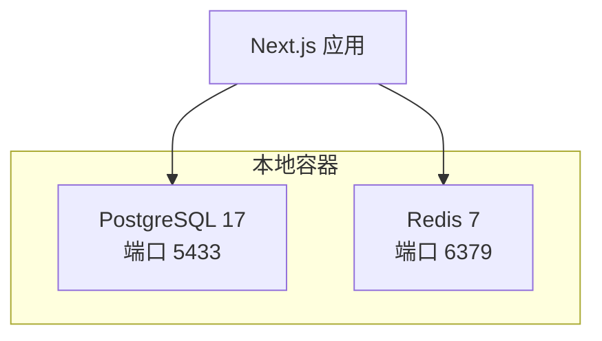
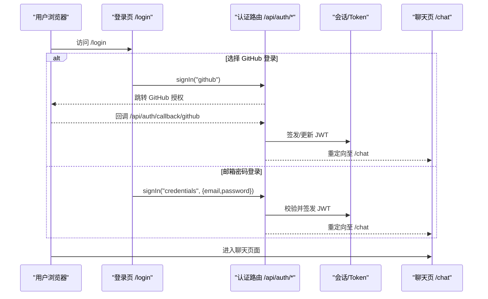
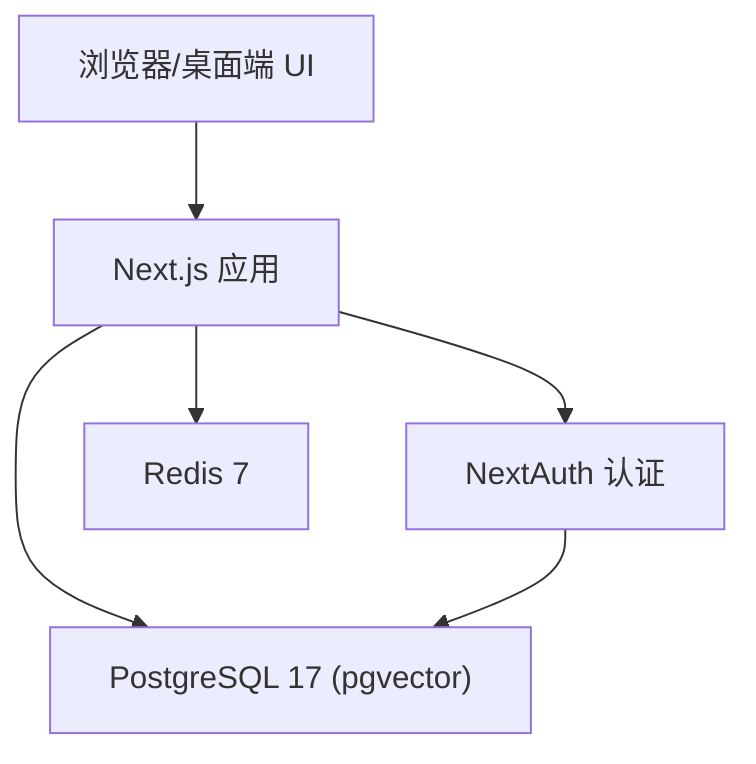

# 快速开始

<cite>
**本文引用的文件**
- [README_CN.md](file://README_CN.md)
- [docker-compose.yml](file://docker-compose.yml)
- [package.json](file://package.json)
- [prisma.config.ts](file://prisma.config.ts)
- [src/server/db/index.ts](file://src/server/db/index.ts)
- [src/lib/redis.ts](file://src/lib/redis.ts)
- [src/lib/auth.ts](file://src/lib/auth.ts)
- [src/app/api/auth/[...nextauth]/route.ts](file://src/app/api/auth/[...nextauth]/route.ts)
- [src/app/(auth)/login/page.tsx](file://src/app/(auth)/login/page.tsx)
- [src/app/(auth)/register/page.tsx](file://src/app/(auth)/register/page.tsx)
</cite>

## 目录
1. [简介](#简介)
2. [环境准备](#环境准备)
3. [项目克隆与依赖安装](#项目克隆与依赖安装)
4. [启动本地服务（PostgreSQL + Redis）](#启动本地服务postgresql--redis)
5. [环境变量配置](#环境变量配置)
6. [数据库初始化](#数据库初始化)
7. [启动开发服务器](#启动开发服务器)
8. [基本使用流程](#基本使用流程)
9. [常见问题排查](#常见问题排查)
10. [架构概览](#架构概览)
11. [附录：核心配置项说明](#附录核心配置项说明)

## 简介
OpenCat 是一个可自托管的 AI 工作台，提供多模型对话、ReAct 智能体、Memory 与 RAG、图像生成任务以及用量分析等能力。本指南面向新用户，帮助你在 15 分钟内完成环境准备、依赖安装、服务启动、环境变量配置、数据库初始化并成功运行项目，体验核心功能。

## 环境准备
- Node.js 22+
- pnpm 10+
- Docker（用于一键启动 PostgreSQL 17 + pgvector 与 Redis 7）

章节来源
- [README_CN.md:200-206](file://README_CN.md#L200-L206)

## 项目克隆与依赖安装
- 克隆仓库并进入项目目录
- 使用 pnpm 安装依赖（包含 Prisma 客户端生成脚本）

章节来源
- [README_CN.md:208-214](file://README_CN.md#L208-L214)
- [package.json:14-15](file://package.json#L14-L15)

## 启动本地服务（PostgreSQL + Redis）
- 使用 docker compose 启动依赖服务：
  - PostgreSQL 17（pgvector 扩展），端口映射到 5433
  - Redis 7，端口映射到 6379
- 数据持久化通过 volumes 挂载

图表来源
- [docker-compose.yml:1-33](file://docker-compose.yml#L1-L33)

章节来源
- [README_CN.md:216-226](file://README_CN.md#L216-L226)
- [docker-compose.yml:1-33](file://docker-compose.yml#L1-L33)

## 环境变量配置
- 复制示例配置文件为 .env
- 至少需要配置以下关键变量：
  - DATABASE_URL：指向本地 PostgreSQL（默认端口 5433）
  - AUTH_SECRET：认证密钥
  - AUTH_URL：应用访问地址（如 http://localhost:3000）
  - ENCRYPTION_KEY：用于 API Key 加密的 64 位十六进制字符串
  - OPENAI_API_KEY / ANTHROPIC_API_KEY：可选，用于调用对应模型
  - REDIS_URL：Redis 连接串（默认 redis://localhost:6379）
- 如需 GitHub OAuth 登录，补充：
  - AUTH_GITHUB_ID
  - AUTH_GITHUB_SECRET

注意
- 数据库 URL 中的端口需与 docker-compose 映射一致（5433）
- REDIS_URL 未设置时，代码会回退到本地默认地址

章节来源
- [README_CN.md:227-250](file://README_CN.md#L227-L250)
- [src/lib/redis.ts:8-15](file://src/lib/redis.ts#L8-L15)

## 数据库初始化
- 生成 Prisma Client
- 将 schema 同步到数据库（开发阶段常用 db push）

步骤
- 执行 prisma generate
- 执行 prisma db push

说明
- Prisma 7 的连接 URL 从独立配置文件读取，确保 .env 中已正确设置 DATABASE_URL

章节来源
- [README_CN.md:252-257](file://README_CN.md#L252-L257)
- [prisma.config.ts:15-22](file://prisma.config.ts#L15-L22)
- [package.json:14-15](file://package.json#L14-L15)

## 启动开发服务器
- 使用 pnpm dev 启动 Next.js 开发服务器
- 打开浏览器访问 http://localhost:3000
- 未登录时会跳转到登录页；登录后首页重定向至工作区主界面

章节来源
- [README_CN.md:259-267](file://README_CN.md#L259-L267)
- [package.json:5-6](file://package.json#L5-L6)

## 基本使用流程
- 首次访问：自动跳转至 /login
- 登录方式：
  - GitHub OAuth：点击“用 GitHub 登录”，授权后回调至应用
  - 邮箱密码：输入邮箱与密码进行登录
- 注册账号：在登录页底部点击“注册”，填写信息后自动登录并进入聊天页面
- 进入聊天：登录后默认进入聊天页面，可进行多模型对话

图表来源
- [src/app/(auth)/login/page.tsx:62-66](file://src/app/(auth)/login/page.tsx#L62-L66)
- [src/app/(auth)/login/page.tsx:40-59](file://src/app/(auth)/login/page.tsx#L40-L59)
- [src/app/api/auth/[...nextauth]/route.ts:12-14](file://src/app/api/auth/[...nextauth]/route.ts#L12-L14)
- [src/lib/auth.ts:32-79](file://src/lib/auth.ts#L32-L79)

章节来源
- [src/app/(auth)/login/page.tsx:26-66](file://src/app/(auth)/login/page.tsx#L26-L66)
- [src/app/(auth)/register/page.tsx:20-58](file://src/app/(auth)/register/page.tsx#L20-L58)
- [src/app/api/auth/[...nextauth]/route.ts:12-14](file://src/app/api/auth/[...nextauth]/route.ts#L12-L14)
- [src/lib/auth.ts:18-99](file://src/lib/auth.ts#L18-L99)

## 常见问题排查
- 无法连接数据库
  - 检查 docker-compose 是否正常运行，确认端口映射为 5433
  - 核对 .env 中 DATABASE_URL 的 host/port/db/user/password 是否与容器一致
- Redis 连接失败
  - 检查 REDIS_URL 是否正确，或确认未设置时默认回退到本地 6379
- 登录失败
  - 若使用 GitHub OAuth，确认 AUTH_GITHUB_ID 和 AUTH_GITHUB_SECRET 已配置
  - 若使用邮箱密码，确认用户存在且设置了密码
- 模型不可用
  - 确认已在设置中配置 OPENAI_API_KEY 或 ANTHROPIC_API_KEY 等

章节来源
- [docker-compose.yml:1-33](file://docker-compose.yml#L1-L33)
- [src/lib/redis.ts:8-15](file://src/lib/redis.ts#L8-L15)
- [src/lib/auth.ts:32-79](file://src/lib/auth.ts#L32-L79)

## 架构概览
- 前端：Next.js App Router 页面（登录、注册、聊天、工作台、设置等）
- 认证：NextAuth v5，支持 GitHub OAuth 与 Credentials（邮箱密码）
- 数据层：PostgreSQL 17（含 pgvector）、Prisma ORM
- 缓存/队列支撑：Redis 7
- 运行时：Vercel AI SDK 6.x，Agent 工具链与 Memory/RAG 集成

图表来源
- [src/lib/auth.ts:18-99](file://src/lib/auth.ts#L18-L99)
- [src/server/db/index.ts:13-41](file://src/server/db/index.ts#L13-L41)
- [src/lib/redis.ts:1-19](file://src/lib/redis.ts#L1-L19)

## 附录：核心配置项说明
- 必需
  - DATABASE_URL：数据库连接串（端口 5433）
  - AUTH_SECRET：认证密钥
  - AUTH_URL：应用访问地址（如 http://localhost:3000）
  - ENCRYPTION_KEY：API Key 加密密钥（64 位十六进制）
  - OPENAI_API_KEY / ANTHROPIC_API_KEY：可选，启用对应模型
  - REDIS_URL：Redis 连接串（默认 redis://localhost:6379）
- 可选（GitHub OAuth）
  - AUTH_GITHUB_ID
  - AUTH_GITHUB_SECRET

章节来源
- [README_CN.md:227-250](file://README_CN.md#L227-L250)
- [src/lib/redis.ts:8-15](file://src/lib/redis.ts#L8-L15)
- [src/lib/auth.ts:32-37](file://src/lib/auth.ts#L32-L37)