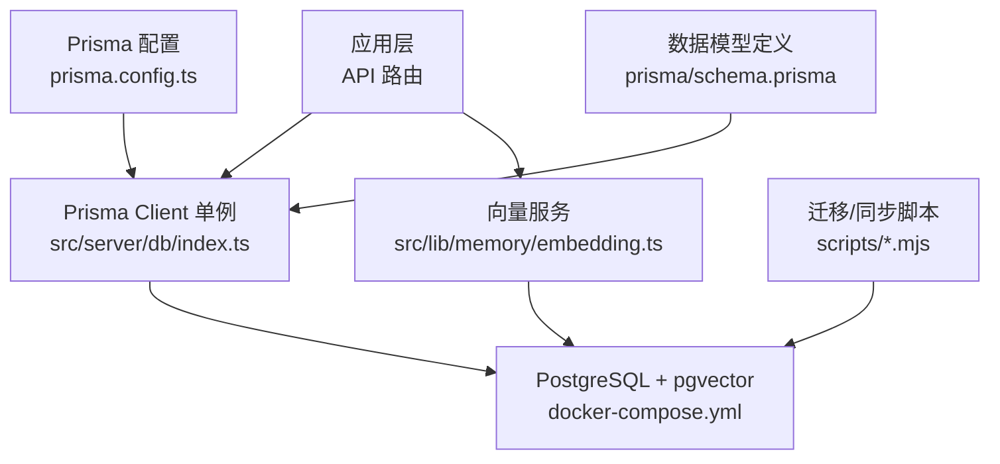
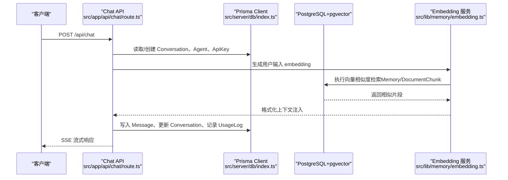
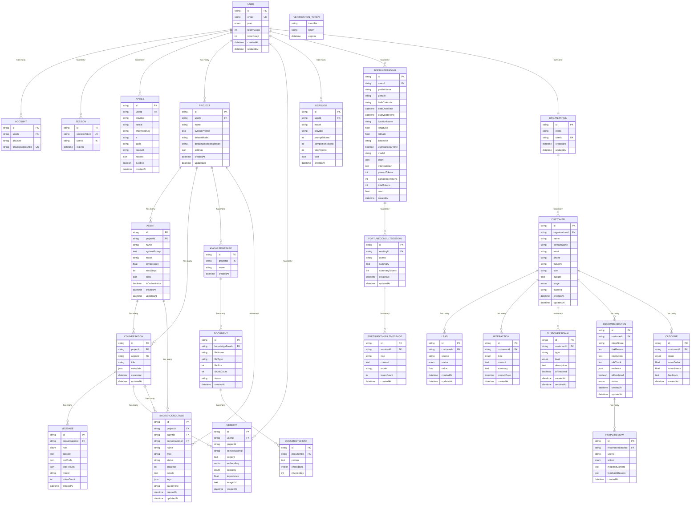
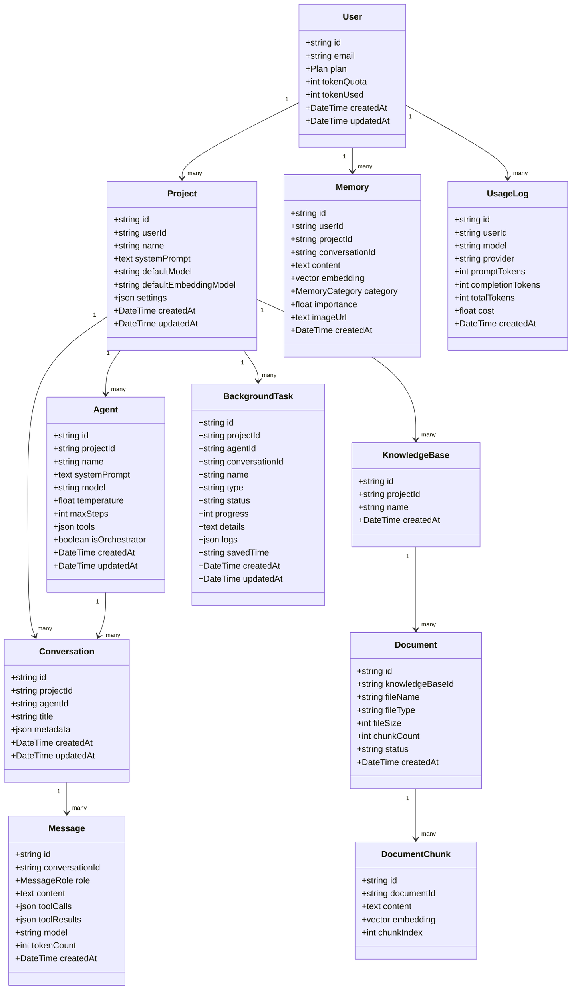
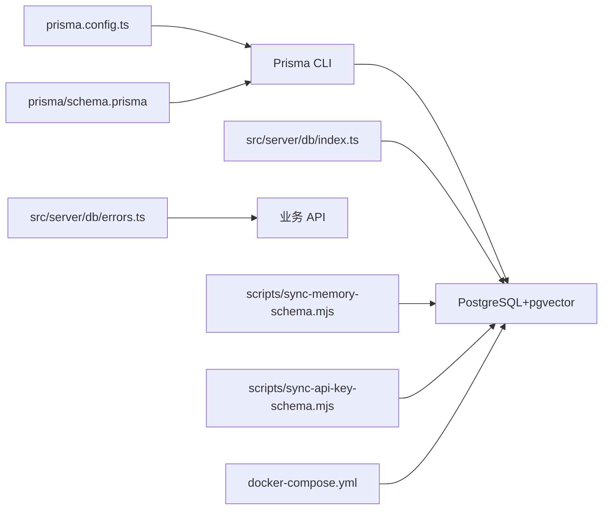
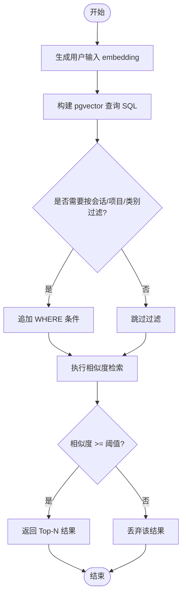

# 数据库设计

<cite>
**本文引用的文件列表**
- [prisma/schema.prisma](file://prisma/schema.prisma)
- [prisma.config.ts](file://prisma.config.ts)
- [src/server/db/index.ts](file://src/server/db/index.ts)
- [src/server/db/errors.ts](file://src/server/db/errors.ts)
- [scripts/sync-memory-schema.mjs](file://scripts/sync-memory-schema.mjs)
- [scripts/sync-api-key-schema.mjs](file://scripts/sync-api-key-schema.mjs)
- [docker-compose.yml](file://docker-compose.yml)
- [src/app/api/chat/route.ts](file://src/app/api/chat/route.ts)
- [src/lib/memory/embedding.ts](file://src/lib/memory/embedding.ts)
</cite>

## 目录
1. [引言](#引言)
2. [项目结构](#项目结构)
3. [核心组件](#核心组件)
4. [架构总览](#架构总览)
5. [详细组件分析](#详细组件分析)
6. [依赖关系分析](#依赖关系分析)
7. [性能与索引优化](#性能与索引优化)
8. [向量数据库 pgvector 使用指南](#向量数据库-pgvector-使用指南)
9. [数据迁移管理](#数据迁移管理)
10. [备份恢复策略](#备份恢复策略)
11. [数据生命周期管理](#数据生命周期管理)
12. [故障排查指南](#故障排查指南)
13. [结论](#结论)

## 引言
本文件面向 OpenCat 项目的数据库设计与运维，基于 Prisma schema.prisma 定义的系统化梳理所有数据模型、字段类型、约束与关系映射。重点解释核心实体：User、Project、Agent、Conversation、Message、Memory、KnowledgeBase、Document、BackgroundTask、UsageLog 等业务模型的设计思路；阐述 pgvector 的嵌入向量存储与相似度检索优化；提供索引策略、查询优化建议与性能调优指南；并给出数据迁移管理、备份恢复策略和数据生命周期管理的实践方案。

## 项目结构
OpenCat 的数据库相关代码主要分布在以下位置：
- 数据模型定义：prisma/schema.prisma
- Prisma 配置（连接 URL）：prisma.config.ts
- Prisma Client 单例与驱动适配器：src/server/db/index.ts
- 数据库错误分类处理：src/server/db/errors.ts
- 向量扩展与增量迁移脚本：scripts/*.mjs
- 开发环境容器编排（含 pgvector 镜像）：docker-compose.yml
- 典型业务 API 调用示例：src/app/api/chat/route.ts
- 向量嵌入与相似度检索实现：src/lib/memory/embedding.ts

图表来源
- [prisma/config.ts:1-23](file://prisma.config.ts#L1-L23)
- [src/server/db/index.ts:1-48](file://src/server/db/index.ts#L1-L48)
- [docker-compose.yml:1-33](file://docker-compose.yml#L1-L33)
- [prisma/schema.prisma:1-595](file://prisma/schema.prisma#L1-L595)
- [src/lib/memory/embedding.ts:1-409](file://src/lib/memory/embedding.ts#L1-L409)

章节来源
- [prisma/schema.prisma:1-595](file://prisma/schema.prisma#L1-L595)
- [prisma.config.ts:1-23](file://prisma.config.ts#L1-L23)
- [src/server/db/index.ts:1-48](file://src/server/db/index.ts#L1-L48)
- [docker-compose.yml:1-33](file://docker-compose.yml#L1-L33)

## 核心组件
本节概述核心实体的职责与关键设计要点：
- User：用户主表，包含认证、配额、套餐等字段，关联 NextAuth 标准表与业务表。
- Project：项目级组织单位，承载系统提示词、默认模型、默认嵌入模型、扩展设置等。
- Agent：项目下的智能体配置，支持工具集、最大步数、是否编排器等。
- Conversation：会话，关联项目与可选 Agent，承载消息序列。
- Message：对话消息，支持角色、工具调用与结果、模型与 Token 计数。
- Memory：长期记忆，支持向量化（pgvector），按类别、重要性、图片等多维信息存储。
- KnowledgeBase / Document / DocumentChunk：RAG 知识库体系，文档分块与向量存储。
- BackgroundTask：异步任务监控，记录进度、日志与保存时间等。
- UsageLog：用量追踪，记录模型、提供商、Token 用量与费用。

章节来源
- [prisma/schema.prisma:22-595](file://prisma/schema.prisma#L22-L595)

## 架构总览
下图展示从 API 到数据库的整体数据流，包括向量检索与 RAG 注入的关键路径。

图表来源
- [src/app/api/chat/route.ts:1-529](file://src/app/api/chat/route.ts#L1-L529)
- [src/server/db/index.ts:1-48](file://src/server/db/index.ts#L1-L48)
- [src/lib/memory/embedding.ts:1-409](file://src/lib/memory/embedding.ts#L1-L409)

## 详细组件分析

### 实体关系图（ERD）

图表来源
- [prisma/schema.prisma:22-595](file://prisma/schema.prisma#L22-L595)

章节来源
- [prisma/schema.prisma:22-595](file://prisma/schema.prisma#L22-L595)

### 核心实体设计说明
- User
  - 主键采用 cuid，URL 友好且短小。
  - 包含认证字段（email、password、image）、套餐与 Token 配额控制。
  - 与 NextAuth 标准表 Account、Session、VerificationToken 关联。
  - 关联业务表：ApiKey、Project、Memory、UsageLog、FortuneReading、FortuneConsultSession、Organization。
- Project
  - 项目级配置：systemPrompt、defaultModel、defaultEmbeddingModel、settings。
  - 作为上层组织单位，聚合 Agent、Conversation、Tool、KnowledgeBase、BackgroundTask。
- Agent
  - 支持多 Agent 在同一项目中运行，具备独立 systemPrompt、模型、温度、最大步数、工具集、编排器标记。
- Conversation
  - 会话可绑定 Agent，便于切换不同智能体进行对话。
  - 维护标题、元数据与时间戳。
- Message
  - 支持 user/assistant/system/tool 角色，记录工具调用与结果、模型与 Token 计数。
- Memory
  - 支持用户级或项目级记忆，新增会话级记忆（conversationId）。
  - 支持图片记忆（imageUrl），类别枚举丰富，重要性权重用于排序与筛选。
  - 使用 Unsupported("vector(1536)") 占位，配合 pgvector 原生 SQL 进行相似度检索。
- KnowledgeBase / Document / DocumentChunk
  - 文档入库后分块存储，每个分块带向量，用于 RAG 检索。
  - 状态机：processing → ready / error。
- BackgroundTask
  - 长任务跟踪：名称、类型、状态、进度、详情、日志、节省时间等。
  - 可关联 Project、Agent、Conversation。
- UsageLog
  - 记录每次 LLM 调用的模型、提供商、Token 用量与折算费用。

章节来源
- [prisma/schema.prisma:22-595](file://prisma/schema.prisma#L22-L595)

### 类图（面向对象视角）

图表来源
- [prisma/schema.prisma:22-595](file://prisma/schema.prisma#L22-L595)

## 依赖关系分析
- Prisma 配置与连接
  - prisma.config.ts 集中管理 DATABASE_URL，schema 文件不再包含敏感连接字符串。
  - src/server/db/index.ts 使用 @prisma/adapter-pg 包装 pg.Pool，避免热更新导致连接池泄漏。
- 错误分类
  - src/server/db/errors.ts 将常见数据库模式不一致错误归类为“DATABASE_SCHEMA_OUT_OF_SYNC”，返回 503 提示迁移。
- 向量扩展与迁移
  - scripts/sync-memory-schema.mjs 确保 vector 扩展存在，并为 Memory 表添加新列与索引。
  - scripts/sync-api-key-schema.mjs 为 ApiKey 表增加 format、baseUrl、models 字段与复合索引。
- 容器编排
  - docker-compose.yml 使用 pgvector/pgvector:pg17 镜像，内置 pgvector 扩展，端口映射至 5433。

图表来源
- [prisma.config.ts:1-23](file://prisma.config.ts#L1-L23)
- [prisma/schema.prisma:1-21](file://prisma/schema.prisma#L1-L21)
- [src/server/db/index.ts:1-48](file://src/server/db/index.ts#L1-L48)
- [src/server/db/errors.ts:1-41](file://src/server/db/errors.ts#L1-L41)
- [scripts/sync-memory-schema.mjs:1-74](file://scripts/sync-memory-schema.mjs#L1-L74)
- [scripts/sync-api-key-schema.mjs:1-47](file://scripts/sync-api-key-schema.mjs#L1-L47)
- [docker-compose.yml:1-33](file://docker-compose.yml#L1-L33)

章节来源
- [prisma.config.ts:1-23](file://prisma.config.ts#L1-L23)
- [src/server/db/index.ts:1-48](file://src/server/db/index.ts#L1-L48)
- [src/server/db/errors.ts:1-41](file://src/server/db/errors.ts#L1-L41)
- [scripts/sync-memory-schema.mjs:1-74](file://scripts/sync-memory-schema.mjs#L1-L74)
- [scripts/sync-api-key-schema.mjs:1-47](file://scripts/sync-api-key-schema.mjs#L1-L47)
- [docker-compose.yml:1-33](file://docker-compose.yml#L1-L33)

## 性能与索引优化
- 现有索引
  - ApiKey(userId, provider)：加速按用户与提供商查找 Key。
  - Project(userId)、Agent(projectId)、Conversation(projectId)、Tool(projectId)、KnowledgeBase(projectId)。
  - Message(conversationId)：加速会话消息分页与加载。
  - Memory(userId)、Memory(projectId)、Memory(conversationId)：加速记忆检索过滤。
  - DocumentChunk(documentId)：加速按文档定位分块。
  - UsageLog(userId, createdAt)：加速按用户的时间范围统计。
  - Customer(stage)、Customer(organizationId)、Lead(customerId)、Interaction(customerId)、CustomerSignal(customerId)、Recommendation(customerId)、Outcome(customerId)。
  - FortuneReading(userId, createdAt)、FortuneConsultSession(userId, updatedAt)、FortuneConsultMessage(sessionId, createdAt)。
  - BackgroundTask(projectId)、BackgroundTask(conversationId)。
- 建议补充索引
  - 高频查询组合：如 Memory(category, importance)、DocumentChunk(embedding) 的向量索引（见下文 pgvector 部分）。
  - 大表分区：对 UsageLog、Message、BackgroundTask 按时间分区，提升历史数据查询性能。
  - 覆盖索引：针对常用投影字段建立覆盖索引，减少回表开销。
- 查询优化建议
  - 优先使用 Prisma 的 select/include 限制返回字段，避免全量 JSON 传输。
  - 对大文本字段（content、details、interpretation）谨慎参与 WHERE 条件，必要时使用全文检索或外部搜索引擎。
  - 合理使用事务：批量写入（如 RAG 分块插入）使用事务保证一致性。
  - 分页与游标：对消息、任务、用量日志使用基于 ID 或时间的分页，避免 OFFSET 深翻页。

章节来源
- [prisma/schema.prisma:96-595](file://prisma/schema.prisma#L96-L595)

## 向量数据库 pgvector 使用指南
- 扩展安装
  - 通过脚本确保 vector 扩展已启用：CREATE EXTENSION IF NOT EXISTS vector。
- 向量字段定义
  - Memory.embedding 与 DocumentChunk.embedding 使用 Unsupported("vector(1536)") 占位，维度需与 EMBEDDING_DIMENSION 一致。
- 嵌入生成
  - 支持环境变量与用户 Key 动态解析，默认模型 text-embedding-3-small，维度 1536。
  - 支持自定义 baseURL（代理平台或私有部署），兼容 OpenAI 格式。
- 相似度检索
  - 使用 <=> 操作符计算余弦距离，1 - distance 得到相似度。
  - 支持最小相似度阈值过滤，避免低质量匹配。
- 性能优化
  - 为 embedding 字段创建 IVFFlat 或 HNSW 索引（根据数据规模选择），显著提升大规模向量检索性能。
  - 合理设置 limit 与 minSimilarity，减少不必要的扫描。
  - 批量生成嵌入时使用 embedMany，降低网络与 API 调用开销。

图表来源
- [src/lib/memory/embedding.ts:288-409](file://src/lib/memory/embedding.ts#L288-L409)

章节来源
- [scripts/sync-memory-schema.mjs:1-74](file://scripts/sync-memory-schema.mjs#L1-L74)
- [src/lib/memory/embedding.ts:1-409](file://src/lib/memory/embedding.ts#L1-L409)
- [prisma/schema.prisma:234-307](file://prisma/schema.prisma#L234-L307)

## 数据迁移管理
- 迁移流程
  - 修改 prisma/schema.prisma 后，运行 prisma migrate dev 生成并应用迁移。
  - 生产环境建议使用版本化的迁移脚本，避免 db push。
- 增量同步脚本
  - sync-memory-schema.mjs：确保 vector 扩展存在，为 Memory 表添加 conversationId、imageUrl 列，并创建相应索引。
  - sync-api-key-schema.mjs：为 ApiKey 表增加 format、baseUrl、models 字段，并创建复合索引。
- 注意事项
  - 向量维度变更属于“大动作”，需要同步 schema 与已有数据重新生成。
  - 在 CI/CD 中集成迁移校验，失败时阻断发布。

章节来源
- [scripts/sync-memory-schema.mjs:1-74](file://scripts/sync-memory-schema.mjs#L1-L74)
- [scripts/sync-api-key-schema.mjs:1-47](file://scripts/sync-api-key-schema.mjs#L1-L47)
- [prisma/schema.prisma:1-21](file://prisma/schema.prisma#L1-L21)

## 备份恢复策略
- 物理备份
  - 使用 pg_dump 定期导出数据库快照，保留多份历史副本。
  - 结合对象存储（S3/OSS）进行异地容灾。
- 逻辑备份
  - 对大表（Message、UsageLog、BackgroundTask）考虑按时间分区导出，缩短恢复窗口。
- 恢复演练
  - 定期在测试环境验证恢复流程，确保 RPO/RTO 达标。
- 在线扩容
  - 利用 PostgreSQL 主从复制与只读副本分担查询压力，备份从库进行离线分析。

[本节为通用指导，不直接分析具体文件]

## 数据生命周期管理
- 会话与消息
  - 设定归档策略：超过一定时间的旧会话消息移至冷存储或归档表。
  - 清理空会话与无引用消息，释放空间。
- 记忆与知识库
  - 定期评估 Memory 的重要性权重，合并或删除冗余条目。
  - 知识库文档过期或版本更新时，重建分块与向量。
- 用量日志
  - 按月或季度汇总 UsageLog，保留短期明细，长期以聚合视图为主。
- 任务日志
  - BackgroundTask 的 logs 字段可能较大，建议仅保留最近 N 条或转存对象存储。

[本节为通用指导，不直接分析具体文件]

## 故障排查指南
- 数据库模式不同步
  - 错误码 P2021/P2022/42703/22P02/42704/42883/0A000 被归类为“DATABASE_SCHEMA_OUT_OF_SYNC”，返回 503。
  - 处理步骤：在生产执行 Prisma 迁移或 db push，然后重启应用。
- 连接池问题
  - 确认 Prisma Client 单例与 pg.Pool 配置，避免热更新导致连接泄漏。
- 向量检索异常
  - 检查 vector 扩展是否启用，embedding 字段是否为 NULL。
  - 核对 EMBEDDING_DIMENSION 与 schema 的 vector(N) 一致。
- 鉴权与 Key 配置
  - 确认 ApiKey.isActive、provider 与 baseUrl 配置正确，加密解密链路正常。

章节来源
- [src/server/db/errors.ts:1-41](file://src/server/db/errors.ts#L1-L41)
- [src/server/db/index.ts:1-48](file://src/server/db/index.ts#L1-L48)
- [src/lib/memory/embedding.ts:1-409](file://src/lib/memory/embedding.ts#L1-L409)
- [prisma/schema.prisma:96-116](file://prisma/schema.prisma#L96-L116)

## 结论
OpenCat 的数据库设计围绕用户、项目、智能体、会话与消息展开，辅以长期记忆与 RAG 知识库，形成完整的 AI 助手能力底座。通过 pgvector 实现语义检索，结合合理的索引与查询优化，可在大规模数据下保持良好性能。完善的迁移脚本与错误分类机制提升了系统的可维护性与稳定性。建议在后续迭代中引入向量索引优化、大表分区与冷热数据分层，进一步提升整体性能与成本效益。