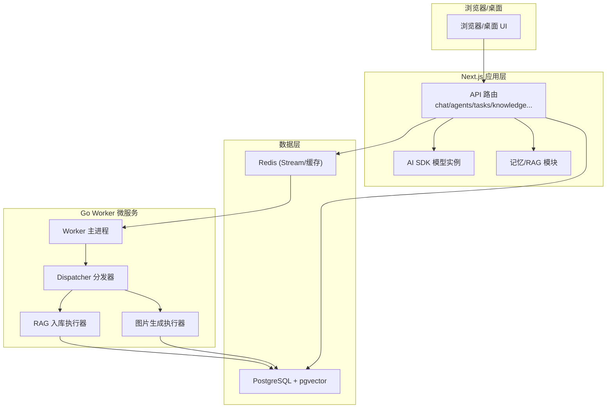
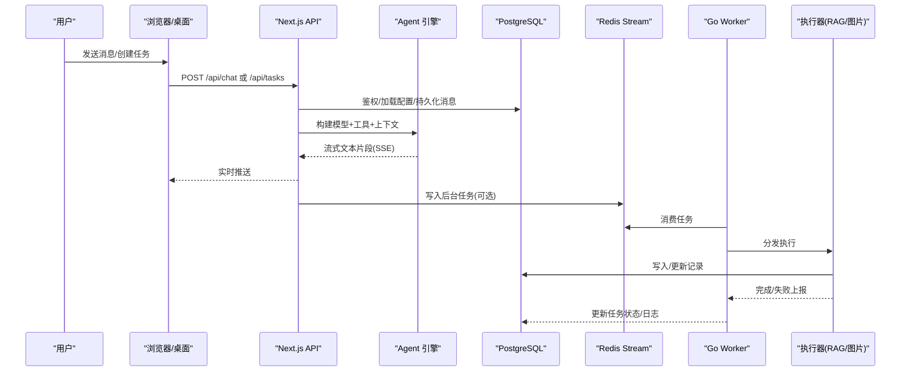
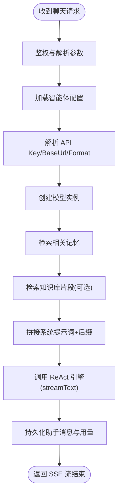
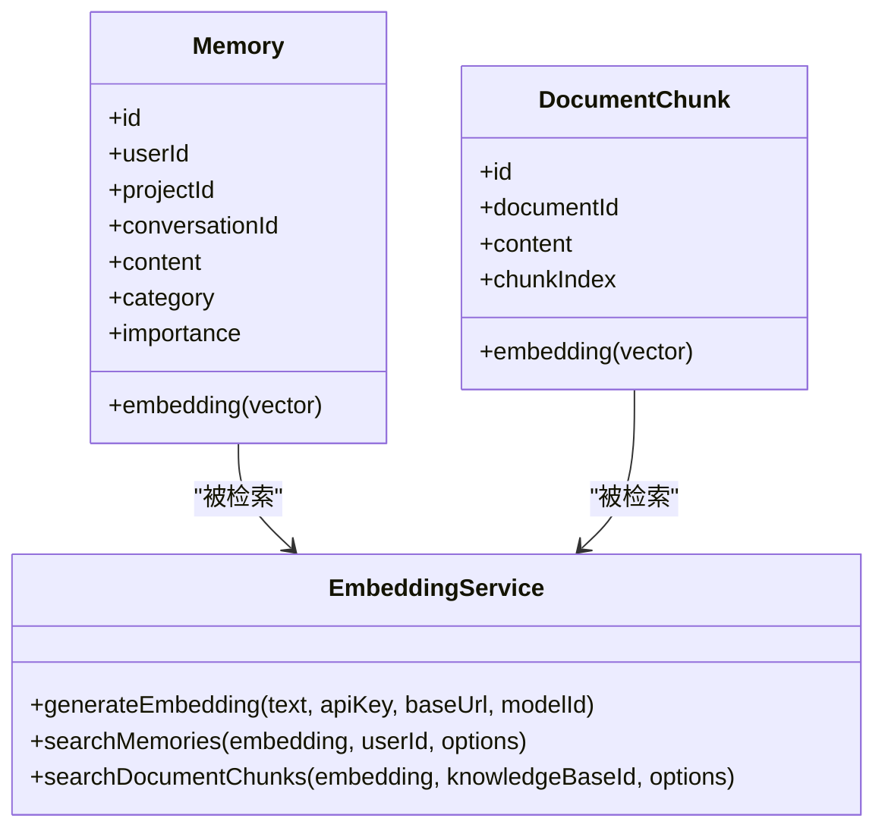
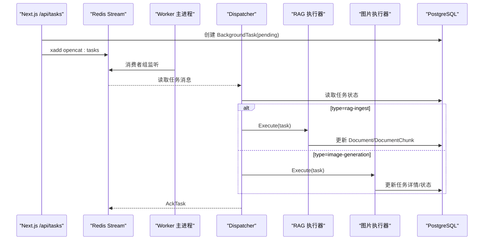
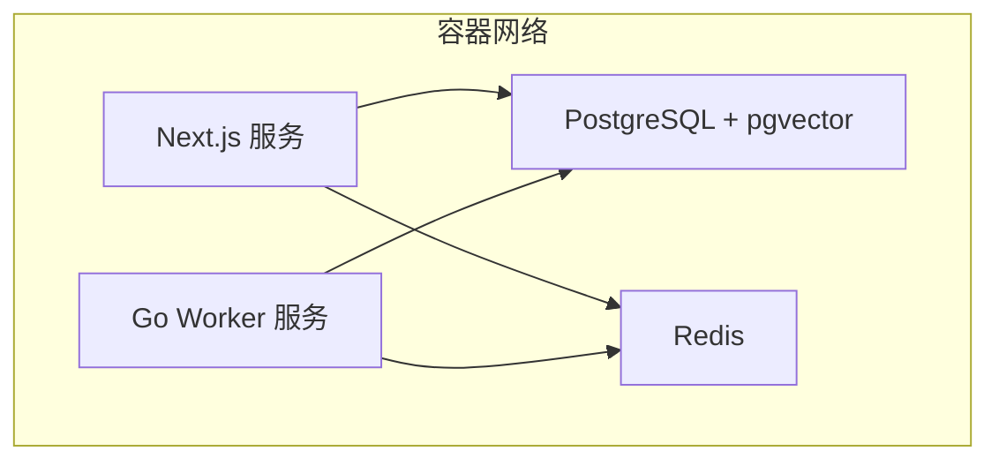
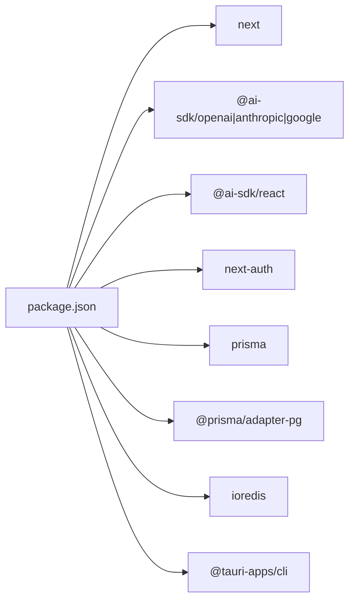

# 架构设计

<cite>
**本文引用的文件**   
- [README.md](file://README.md)
- [package.json](file://package.json)
- [docker-compose.yml](file://docker-compose.yml)
- [prisma/schema.prisma](file://prisma/schema.prisma)
- [src/app/api/chat/route.ts](file://src/app/api/chat/route.ts)
- [src/app/api/agents/route.ts](file://src/app/api/agents/route.ts)
- [src/lib/agent/index.ts](file://src/lib/agent/index.ts)
- [src/lib/agent/react-engine.ts](file://src/lib/agent/react-engine.ts)
- [src/lib/memory/index.ts](file://src/lib/memory/index.ts)
- [src/lib/memory/embedding.ts](file://src/lib/memory/embedding.ts)
- [worker/cmd/worker/main.go](file://worker/cmd/worker/main.go)
- [worker/internal/dispatcher/dispatcher.go](file://worker/internal/dispatcher/dispatcher.go)
- [worker/internal/executor/image_generation.go](file://worker/internal/executor/image_generation.go)
- [worker/internal/executor/rag_ingest.go](file://worker/internal/executor/rag_ingest.go)
- [src/app/api/tasks/route.ts](file://src/app/api/tasks/route.ts)
</cite>

## 目录
1. [简介](#简介)
2. [项目结构](#项目结构)
3. [核心组件](#核心组件)
4. [架构总览](#架构总览)
5. [详细组件分析](#详细组件分析)
6. [依赖关系分析](#依赖关系分析)
7. [性能与可扩展性](#性能与可扩展性)
8. [故障排查指南](#故障排查指南)
9. [结论](#结论)
10. [附录](#附录)

## 简介
OpenCat 是一个自托管的 AI 工作区，提供多模型对话、ReAct 智能体编排、记忆系统与 RAG、图片生成异步任务以及使用量分析等能力。系统采用分层架构：浏览器/桌面 UI 层、Next.js 应用层、AI 运行时层和数据层；并通过 Go Worker 微服务承担长耗时、可重试的后台任务（RAG 向量化入库、图片生成），以分离在线请求路径与离线处理路径，提升整体稳定性与可扩展性。

## 项目结构
- 前端与 Web 应用
  - Next.js App Router 页面与 API 路由：认证、聊天、智能体、知识库、任务、统计等
  - React 组件：聊天面板、消息列表、设置页、仪表盘等
- AI 运行时
  - ReAct 引擎：工具注册、子智能体编排、流式响应
  - 记忆与 RAG：向量嵌入、相似度检索、文档分块与索引
- 数据层
  - PostgreSQL + pgvector：用户、会话、智能体、工具、记忆、知识库、任务、用量等
  - Redis：缓存与队列（Stream）
- 后台服务
  - Go Worker：从 Redis Stream 拉取任务，分发到执行器（RAG 入库、图片生成），持久化结果并上报状态

**图表来源**
- [README.md:159-180](file://README.md#L159-L180)
- [docker-compose.yml:1-33](file://docker-compose.yml#L1-L33)

**章节来源**
- [README.md:159-180](file://README.md#L159-L180)
- [docker-compose.yml:1-33](file://docker-compose.yml#L1-L33)

## 核心组件
- 认证与会话隔离：基于 NextAuth v5，按用户隔离资源（项目、智能体、对话、记忆、知识库、任务、用量）。
- 智能体编排：支持单 Agent 与 Orchestrator 模式，动态注入 call_agent 工具，实现子智能体委派。
- 记忆与 RAG：在每次对话前检索相关记忆与知识库片段，拼接为系统提示词后缀，增强回答质量。
- 异步任务：通过 Redis Stream 将长耗时任务交给 Go Worker 执行，统一进度与日志上报。
- 数据模型：Prisma Schema 覆盖用户、密钥、项目、智能体、对话、消息、工具、记忆、知识库、任务、用量等实体。

**章节来源**
- [README.md:78-136](file://README.md#L78-L136)
- [prisma/schema.prisma:1-595](file://prisma/schema.prisma#L1-L595)

## 架构总览
系统边界与交互要点：
- 在线路径：浏览器/桌面 → Next.js API → AI SDK → 数据库/向量检索 → SSE 返回
- 离线路径：Next.js API → Redis Stream → Go Worker → 执行器 → PostgreSQL/pgvector → 结果回写
- 安全边界：用户 API Key 加密存储，按需解密；Embedding 与 Chat 可独立配置 Provider 与 Base URL
- 扩展点：新增任务类型只需在 Dispatcher 注册对应执行器；新增工具通过工具注册中心注入

**图表来源**
- [src/app/api/chat/route.ts:28-456](file://src/app/api/chat/route.ts#L28-L456)
- [src/app/api/tasks/route.ts:41-88](file://src/app/api/tasks/route.ts#L41-L88)
- [worker/cmd/worker/main.go:18-94](file://worker/cmd/worker/main.go#L18-L94)
- [worker/internal/dispatcher/dispatcher.go:64-195](file://worker/internal/dispatcher/dispatcher.go#L64-L195)

## 详细组件分析

### 聊天与智能体编排（Chat API + ReAct 引擎）
- 鉴权与参数校验：读取会话、解析消息、选择模型与工具集
- 智能体配置加载：按 agentId 获取 systemPrompt、模型、温度、最大步数、是否编排器
- API Key 解析：优先匹配 provider→custom→环境变量；支持自定义 baseUrl 与 format
- 记忆与 RAG 注入：检索相关记忆与知识库片段，作为系统提示词后缀传入引擎
- 流式响应：基于 AI SDK streamText，SSE 返回；完成后持久化助手消息与用量

**图表来源**
- [src/app/api/chat/route.ts:65-456](file://src/app/api/chat/route.ts#L65-L456)
- [src/lib/agent/react-engine.ts:67-122](file://src/lib/agent/react-engine.ts#L67-L122)

**章节来源**
- [src/app/api/chat/route.ts:28-456](file://src/app/api/chat/route.ts#L28-L456)
- [src/lib/agent/index.ts:1-7](file://src/lib/agent/index.ts#L1-L7)
- [src/lib/agent/react-engine.ts:1-135](file://src/lib/agent/react-engine.ts#L1-L135)

### 智能体管理（Agents API）
- GET /api/agents：按用户与项目过滤，返回智能体元信息（含对话计数）
- POST /api/agents：校验输入、校验项目所有权、创建智能体

**章节来源**
- [src/app/api/agents/route.ts:1-151](file://src/app/api/agents/route.ts#L1-L151)

### 记忆与 RAG（Embedding + 检索 + 分块）
- Embedding 配置优先级：环境变量 > 用户 ApiKey > 系统默认；支持自定义 BaseUrl 与模型维度
- 检索接口：Memory 表与 DocumentChunk 表均支持余弦相似度搜索
- 文档分块：中文语义断句策略，支持无向量降级模式（仅存文本）

**图表来源**
- [src/lib/memory/embedding.ts:205-409](file://src/lib/memory/embedding.ts#L205-L409)
- [prisma/schema.prisma:237-307](file://prisma/schema.prisma#L237-L307)

**章节来源**
- [src/lib/memory/index.ts:1-31](file://src/lib/memory/index.ts#L1-L31)
- [src/lib/memory/embedding.ts:1-409](file://src/lib/memory/embedding.ts#L1-L409)
- [prisma/schema.prisma:237-307](file://prisma/schema.prisma#L237-L307)

### 后台任务与 Go Worker（Redis Stream + 执行器）
- 任务创建：Next.js API 写入 BackgroundTask 并投递至 Redis Stream
- Worker 启动：连接 DB/Redis，初始化分发器与清理器，优雅关停
- 分发器：控制并发、接管超时 pending 任务、异常恢复、报告状态
- 执行器：
  - RAG 入库：分块→批量向量化→写入 pgvector（或降级纯文本）
  - 图片生成：调用 OpenAI 兼容 images/generations 或 edits，落盘并更新任务详情

**图表来源**
- [src/app/api/tasks/route.ts:41-88](file://src/app/api/tasks/route.ts#L41-L88)
- [worker/cmd/worker/main.go:18-94](file://worker/cmd/worker/main.go#L18-L94)
- [worker/internal/dispatcher/dispatcher.go:64-195](file://worker/internal/dispatcher/dispatcher.go#L64-L195)
- [worker/internal/executor/rag_ingest.go:44-141](file://worker/internal/executor/rag_ingest.go#L44-L141)
- [worker/internal/executor/image_generation.go:72-132](file://worker/internal/executor/image_generation.go#L72-L132)

**章节来源**
- [src/app/api/tasks/route.ts:1-89](file://src/app/api/tasks/route.ts#L1-L89)
- [worker/cmd/worker/main.go:1-95](file://worker/cmd/worker/main.go#L1-L95)
- [worker/internal/dispatcher/dispatcher.go:1-195](file://worker/internal/dispatcher/dispatcher.go#L1-L195)
- [worker/internal/executor/rag_ingest.go:1-375](file://worker/internal/executor/rag_ingest.go#L1-L375)
- [worker/internal/executor/image_generation.go:1-731](file://worker/internal/executor/image_generation.go#L1-L731)

### 基础设施拓扑
- 开发环境：PostgreSQL 17(pgvector)、Redis 7 通过 docker-compose 启动
- 生产建议：容器化部署 Next.js 与 Go Worker，共享同一 PG/Redis 集群；对外暴露 Next.js 服务，Worker 无公网入口

**图表来源**
- [docker-compose.yml:1-33](file://docker-compose.yml#L1-L33)

**章节来源**
- [docker-compose.yml:1-33](file://docker-compose.yml#L1-L33)

## 依赖关系分析
- 技术栈与版本
  - Next.js 16、React 19、TypeScript 5、Tailwind CSS 4
  - AI SDK 6.x、NextAuth v5、Prisma 7、PostgreSQL 17、pgvector、Redis 7、Tauri 2、Zustand、Zod 4
- 关键依赖
  - @ai-sdk/* 系列用于模型与嵌入
  - ioredis 用于 Redis 客户端
  - prisma/adapter-pg 用于 PG 连接
  - Tauri 用于桌面端打包

**图表来源**
- [package.json:1-68](file://package.json#L1-L68)

**章节来源**
- [package.json:1-68](file://package.json#L1-L68)

## 性能与可扩展性
- 在线路径优化
  - SSE 流式响应降低首字节延迟
  - 记忆与 RAG 检索限制 top-K，避免过长上下文
  - 工具调用限步（maxSteps）防止无限循环
- 离线路径解耦
  - Go Worker 独立扩缩容，不受 Web 请求影响
  - 并发控制与超时保护，避免雪崩
  - 幂等与重试：接管超时 pending 任务，错误分类与上报
- 数据层
  - pgvector 索引加速相似度检索
  - 大对象（图片）落盘，数据库仅存引用
- 部署策略
  - 水平扩展 Next.js 实例，共享 PG/Redis
  - Worker 多副本并行消费，提高吞吐

[本节为通用指导，不直接分析具体文件]

## 故障排查指南
- 聊天失败
  - 检查 API Key 是否存在且可用（provider/custom/环境变量）
  - 查看数据库错误分类与加密配置错误码
- 记忆/RAG 不可用
  - 确认 embedding 模型与维度一致，PG 已启用 pgvector
  - 若无法获取 Key/BaseUrl，系统将降级为纯文本检索
- 后台任务卡住
  - 检查 Redis Stream 是否有积压，Worker 是否存活
  - 查看任务状态与日志，必要时人工清理 pending 任务
- 图片生成失败
  - 核对图片服务返回格式（JSON/SSE），关注重试条件与错误类型

**章节来源**
- [src/app/api/chat/route.ts:28-63](file://src/app/api/chat/route.ts#L28-L63)
- [worker/internal/dispatcher/dispatcher.go:124-136](file://worker/internal/dispatcher/dispatcher.go#L124-L136)
- [worker/internal/executor/image_generation.go:574-652](file://worker/internal/executor/image_generation.go#L574-L652)

## 结论
OpenCat 通过“Next.js + Go Worker”的混合架构，将在线对话与离线任务解耦，结合 ReAct 智能体、记忆与 RAG，形成高可用、可扩展的 AI 工作区。数据层以 PostgreSQL + pgvector 为核心，配合 Redis 提供缓存与队列支撑。未来可在任务编排、调试追踪、团队协作等方面持续演进。

[本节为总结性内容，不直接分析具体文件]

## 附录
- 数据模型概览（节选）
  - User、ApiKey、Project、Agent、Conversation、Message、Tool、Memory、KnowledgeBase、Document、DocumentChunk、BackgroundTask、UsageLog 等
- 环境变量与配置要点
  - DATABASE_URL、AUTH_SECRET、ENCRYPTION_KEY、OPENAI_API_KEY 等
  - EMBEDDING_MODEL、EMBEDDING_DIMENSION、EMBEDDING_BASE_URL、EMBEDDING_API_KEY、EMBEDDING_PROVIDER

**章节来源**
- [prisma/schema.prisma:1-595](file://prisma/schema.prisma#L1-L595)
- [README.md:227-243](file://README.md#L227-L243)