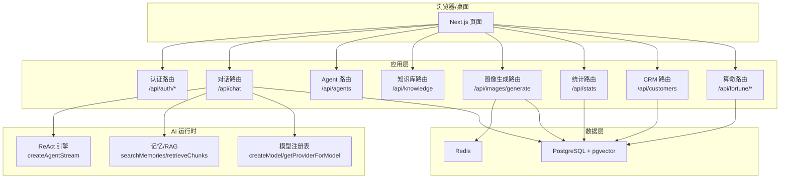
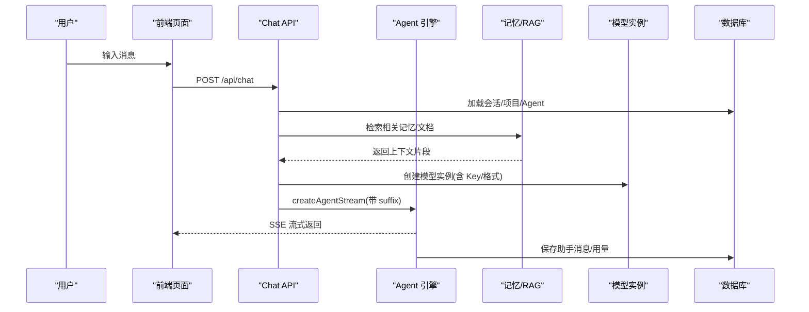
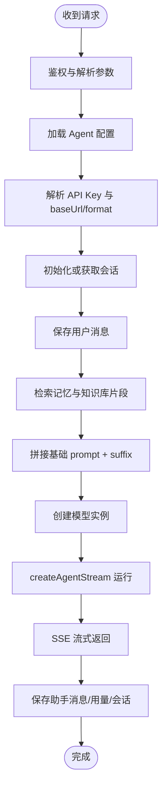
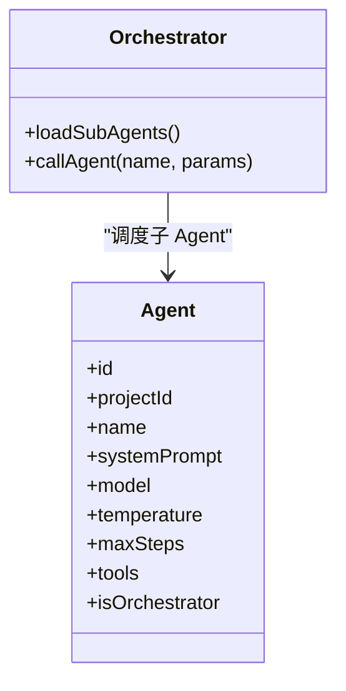
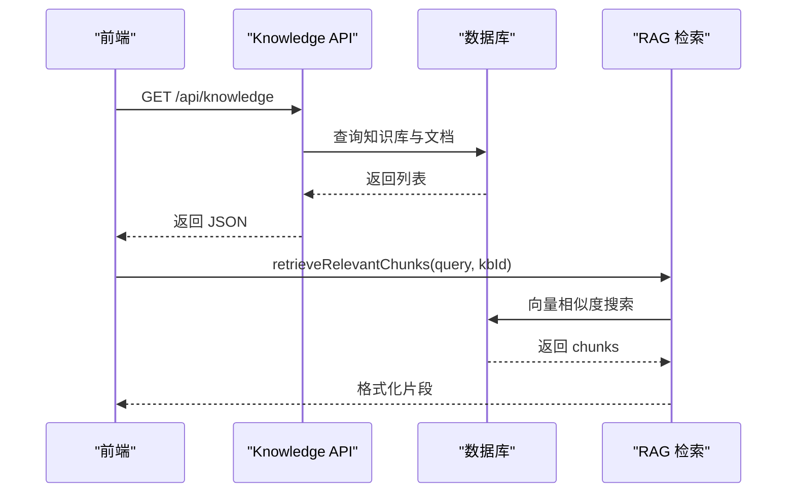
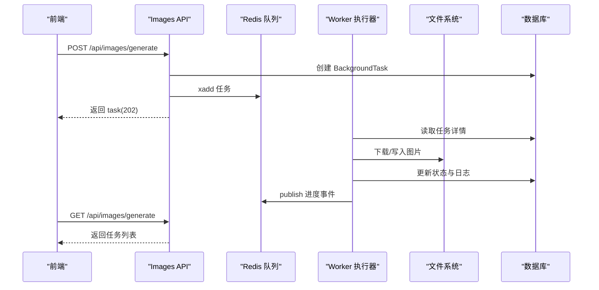
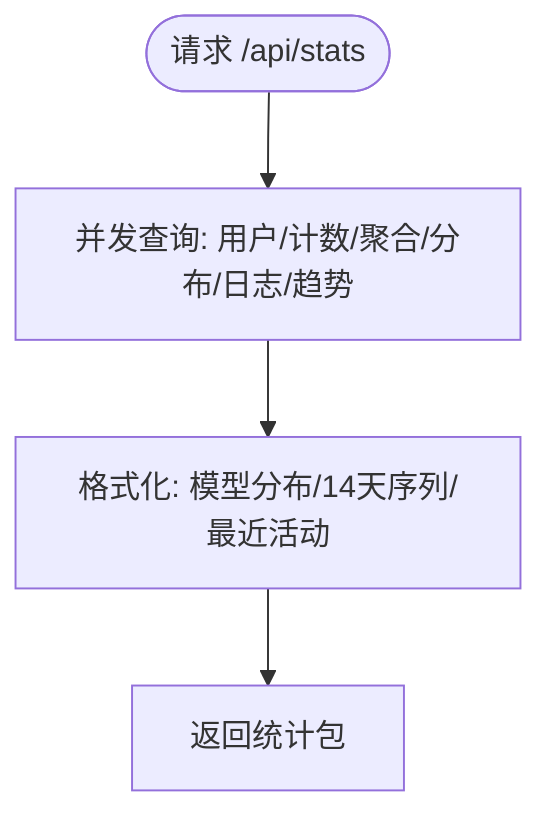
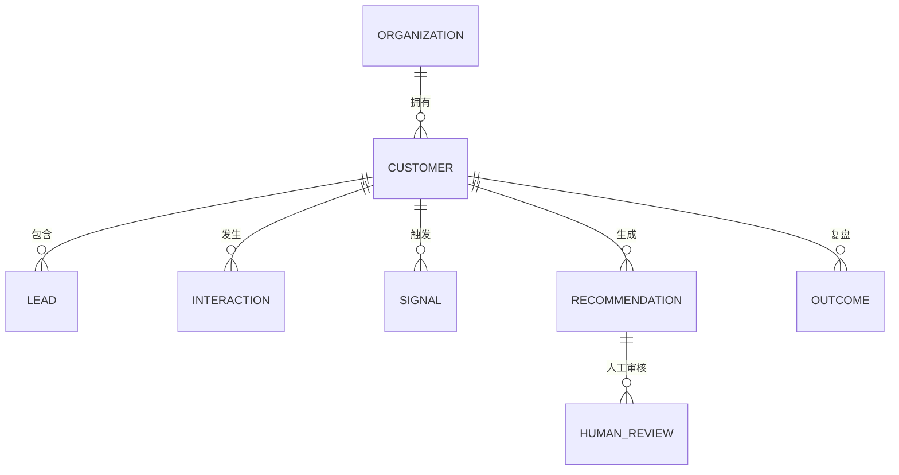
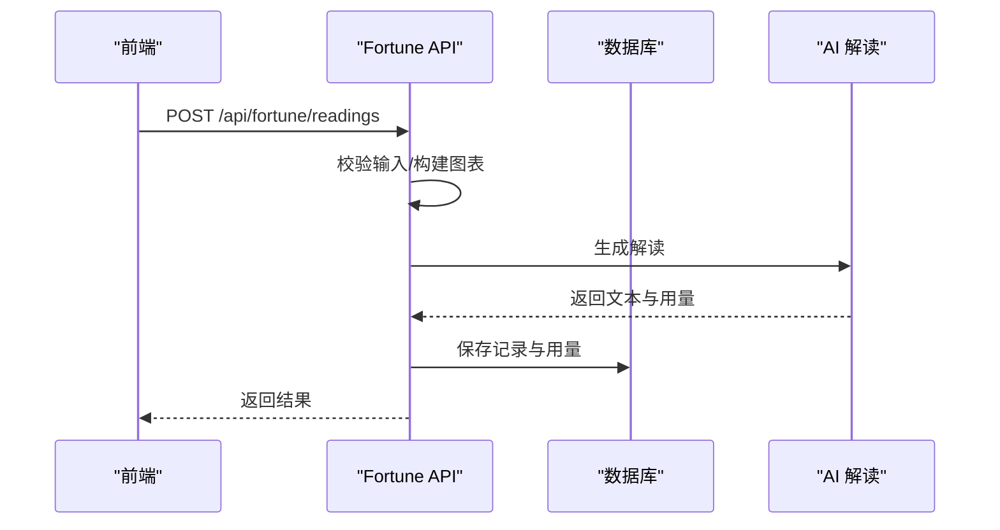
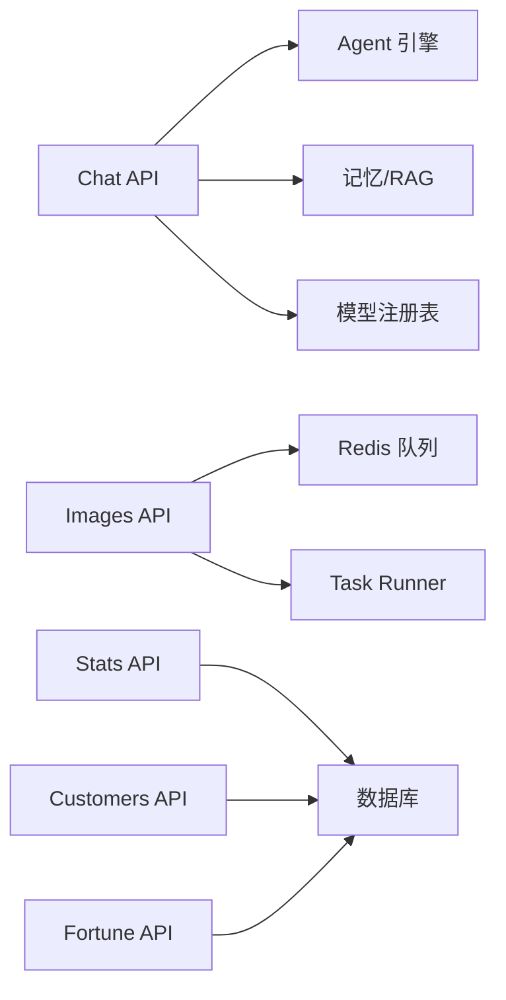

# 核心功能模块

<cite>
**本文引用的文件**   
- [README.md](file://README.md)
- [schema.prisma](file://prisma/schema.prisma)
- [auth.ts](file://src/lib/auth.ts)
- [nextauth route](file://src/app/api/auth/[...nextauth]/route.ts)
- [chat route](file://src/app/api/chat/route.ts)
- [agents route](file://src/app/api/agents/route.ts)
- [knowledge route](file://src/app/api/knowledge/route.ts)
- [images generate route](file://src/app/api/images/generate/route.ts)
- [task-runner](file://src/lib/images/task-runner.ts)
- [stats route](file://src/app/api/stats/route.ts)
- [customers route](file://src/app/api/customers/route.ts)
- [fortune readings route](file://src/app/api/fortune/readings/route.ts)
- [agent index](file://src/lib/agent/index.ts)
- [memory index](file://src/lib/memory/index.ts)
</cite>

## 目录
1. [引言](#引言)
2. [项目结构](#项目结构)
3. [核心组件](#核心组件)
4. [架构总览](#架构总览)
5. [详细组件分析](#详细组件分析)
6. [依赖分析](#依赖分析)
7. [性能考虑](#性能考虑)
8. [故障排查指南](#故障排查指南)
9. [结论](#结论)
10. [附录](#附录)

## 引言
OpenCat 是一个自托管的 AI 工作区，围绕“智能对话、智能体编排、记忆与知识管理、图像生成、数据分析、CRM 客户管理与四柱算命应用”八大核心能力构建。系统以 Next.js 为应用层，PostgreSQL + pgvector 作为数据与向量检索底座，结合 Redis 提供缓存与队列支撑，并通过 Vercel AI SDK 实现多模型流式对话与工具调用。本文件聚焦于各核心模块的业务价值、技术实现、API 接口、使用场景与扩展方式，并给出模块间协作关系与数据流转说明，帮助开发者快速理解与二次开发。

## 项目结构
- 前端页面与路由：位于 src/app，包含认证页、仪表盘、聊天、设置、图像生成、CRM 等页面。
- API 路由：位于 src/app/api，按功能域划分（如 chat、agents、knowledge、images、stats、customers、fortune）。
- 业务库：位于 src/lib，包括 agent、memory、llm、tools、images、crypto、redis 等。
- 数据库模型：位于 prisma/schema.prisma，定义用户、项目、Agent、对话、消息、知识库、任务、用量日志、CRM 实体等。
- 后台 Worker：worker 目录提供 Go 实现的异步任务执行器（图片生成、RAG 入库等），通过 Redis 队列与主服务交互。



图表来源
- [README.md:159-198](file://README.md#L159-L198)
- [schema.prisma:120-140](file://prisma/schema.prisma#L120-L140)

章节来源
- [README.md:271-300](file://README.md#L271-L300)

## 核心组件
- 用户认证系统：基于 NextAuth v5，支持 GitHub OAuth 与邮箱密码登录，JWT Session 策略，Prisma Adapter 持久化账户与会话。
- 智能对话系统：SSE 流式响应，自动注入相关记忆与 RAG 片段到系统提示词；支持多模型、工具调用、子智能体编排。
- 智能体编排引擎：Agent 配置（系统提示词、模型、温度、最大步数、工具集、是否编排者）；编排者可调度子 Agent。
- 记忆与知识管理：长期记忆向量化存储与检索；知识库文档分块、嵌入与相似度搜索；失败回退机制。
- 图像生成工作流：创建后台任务、持久化结果、进度追踪与日志；支持文生图与图生图模式。
- 数据分析仪表板：并发聚合用户用量、Token 配额、费用趋势、模型分布与最近活动流水。
- CRM 客户管理：组织-客户-线索-互动-信号-建议-复盘闭环；支持筛选、AI 建议与人工审核。
- 四柱算命应用：多方法（八字、紫微、周易、塔罗、小六壬）计算、解读与历史记录，用量计入统一统计。

章节来源
- [README.md:78-136](file://README.md#L78-L136)
- [schema.prisma:25-50](file://prisma/schema.prisma#L25-L50)
- [schema.prisma:145-164](file://prisma/schema.prisma#L145-L164)
- [schema.prisma:237-266](file://prisma/schema.prisma#L237-L266)
- [schema.prisma:271-307](file://prisma/schema.prisma#L271-L307)
- [schema.prisma:311-325](file://prisma/schema.prisma#L311-L325)
- [schema.prisma:329-386](file://prisma/schema.prisma#L329-L386)
- [schema.prisma:393-569](file://prisma/schema.prisma#L393-L569)

## 架构总览
OpenCat 采用分层架构：
- 表现层：Next.js App Router 页面与组件。
- 应用层：API 路由负责鉴权、参数校验、领域逻辑编排与错误分类。
- AI 运行时：Vercel AI SDK 驱动 ReAct 循环、工具调用、记忆注入与 RAG 增强。
- 数据层：PostgreSQL 承载结构化数据，pgvector 提供语义检索；Redis 用于缓存与队列。



图表来源
- [chat route:28-456](file://src/app/api/chat/route.ts#L28-L456)
- [agent index:1-7](file://src/lib/agent/index.ts#L1-L7)
- [memory index:1-31](file://src/lib/memory/index.ts#L1-L31)

## 详细组件分析

### 用户认证系统
- 业务价值：提供安全的身份验证与会话管理，支撑后续所有功能的权限控制与数据隔离。
- 技术实现：
  - NextAuth v5 集成 Prisma Adapter，GitHub OAuth 与 Credentials 双提供者。
  - JWT Session 策略，服务端无状态，减少数据库压力。
  - 自定义登录页路由，便于品牌化与扩展。
- API 接口：
  - GET/POST /api/auth/*：由 catch-all 路由转发至 handlers，处理登录、回调、登出等。
- 使用场景：
  - 首次访问重定向到登录；登录后进入工作区仪表盘。
- 扩展建议：
  - 新增第三方 Provider 时，在 providers 数组中添加对应配置。
  - 如需数据库 Session，可切换 session.strategy 为 database。

```mermaid
classDiagram
class AuthConfig {
+adapter : PrismaAdapter
+session : { strategy : "jwt" }
+pages.signIn : "/login"
+providers : [GitHub, Credentials]
}
class Handlers {
+GET()
+POST()
}
AuthConfig --> Handlers : "导出 handlers"
```

图表来源
- [auth.ts:18-100](file://src/lib/auth.ts#L18-L100)
- [nextauth route:1-15](file://src/app/api/auth/[...nextauth]/route.ts#L1-L15)

章节来源
- [auth.ts:18-100](file://src/lib/auth.ts#L18-L100)
- [nextauth route:1-15](file://src/app/api/auth/[...nextauth]/route.ts#L1-L15)

### 智能对话系统
- 业务价值：提供多模型、流式、带记忆与知识增强的对话体验，是工作区的核心入口。
- 技术实现：
  - 请求鉴权与解析，选择或创建会话，持久化用户消息。
  - 动态加载 Agent 配置，解析 API Key（精确匹配 provider → custom → 环境变量）。
  - 检索相关记忆与知识库片段，拼接为系统提示词后缀。
  - 使用 createAgentStream 启动 ReAct 循环，支持工具与子智能体。
  - 流结束时保存助手消息、更新会话、记录用量与成本。
- API 接口：
  - POST /api/chat：接收 messages、conversationId、modelId、agentId、enableTools、toolNames、knowledgeBaseId。
- 使用场景：
  - 个人助理问答、代码辅助、数据分析、RAG 问答等。
- 扩展建议：
  - 新增内置工具后，在默认工具列表或 Agent 工具集中启用。
  - 自定义模型时，确保在 Settings 中配置对应 Key 与 format。



图表来源
- [chat route:28-456](file://src/app/api/chat/route.ts#L28-L456)

章节来源
- [chat route:28-456](file://src/app/api/chat/route.ts#L28-L456)

### 智能体编排引擎
- 业务价值：将不同角色与能力的 Agent 组合，形成可编排的工作流，提升复杂任务处理能力。
- 技术实现：
  - Agent 配置包含 systemPrompt、model、temperature、maxSteps、tools、isOrchestrator。
  - 编排者 Agent 可在运行时加载同项目下的子 Agent，并通过 call_agent 工具进行委托。
  - 子 Agent 独立解析其模型 Key，支持多模型协同。
- API 接口：
  - GET /api/agents：列出当前用户的 Agent（可按 projectId 过滤）。
  - POST /api/agents：创建新 Agent（Zod 校验）。
- 使用场景：
  - 研究助手+代码助手+数据分析助手的多阶段协作。
- 扩展建议：
  - 新增 Agent 时明确 isOrchestrator 与 tools 列表，合理设置 maxSteps。
  - 子 Agent 的 model 与 Key 需正确配置，避免运行时找不到 Key。



图表来源
- [agents route:65-151](file://src/app/api/agents/route.ts#L65-L151)
- [schema.prisma:145-164](file://prisma/schema.prisma#L145-L164)

章节来源
- [agents route:65-151](file://src/app/api/agents/route.ts#L65-L151)
- [schema.prisma:145-164](file://prisma/schema.prisma#L145-L164)

### 记忆与知识管理
- 业务价值：让对话具备长期记忆与外部知识增强，提高回答的相关性与个性化。
- 技术实现：
  - 记忆：按用户维度存储，支持类别与重要性权重；向量检索注入到系统提示词。
  - 知识库：文档分块、嵌入、pgvector 相似度搜索；失败回退保证可用性。
  - 模块导出：embedding、store、rag 三大子模块。
- API 接口：
  - GET /api/knowledge：列出知识库及文档信息。
  - POST /api/knowledge：创建知识库（自动关联 Default 项目）。
  - DELETE /api/knowledge：级联删除知识库及其文档与分块。
- 使用场景：
  - 企业私有文档问答、产品手册检索、历史偏好沉淀。
- 扩展建议：
  - 调整 chunk 大小与 limit 平衡召回质量与延迟。
  - 自定义 embedding 模型与 base URL，适配不同供应商。



图表来源
- [knowledge route:13-107](file://src/app/api/knowledge/route.ts#L13-L107)
- [memory index:1-31](file://src/lib/memory/index.ts#L1-L31)

章节来源
- [knowledge route:13-107](file://src/app/api/knowledge/route.ts#L13-L107)
- [memory index:1-31](file://src/lib/memory/index.ts#L1-L31)

### 图像生成工作流
- 业务价值：提供稳定的异步图像生成能力，支持进度追踪与结果预览，适合批量与长耗时任务。
- 技术实现：
  - 创建后台任务（BackgroundTask），持久化任务详情与日志。
  - 通过 Redis 队列派发任务，Worker 执行后写回结果与状态。
  - 支持 text-to-image 与 image-to-image，参考图上传与本地持久化。
  - 失败路径统一记录错误与日志，便于排查。
- API 接口：
  - POST /api/images/generate：创建任务并立即返回 task 对象（202）。
  - GET /api/images/generate：列出当前用户的图像生成任务（脱敏 details）。
- 使用场景：
  - 营销素材生成、设计草图、内容配图。
- 扩展建议：
  - 增加更多尺寸与风格参数；优化图片压缩与存储策略。
  - 引入重试与熔断机制，提升稳定性。



图表来源
- [images generate route:55-251](file://src/app/api/images/generate/route.ts#L55-L251)
- [task-runner:204-486](file://src/lib/images/task-runner.ts#L204-L486)

章节来源
- [images generate route:55-251](file://src/app/api/images/generate/route.ts#L55-L251)
- [task-runner:204-486](file://src/lib/images/task-runner.ts#L204-L486)

### 数据分析仪表板
- 业务价值：提供 Token 配额、费用趋势、模型分布与最近活动流水，帮助用户掌控用量与成本。
- 技术实现：
  - 并发并行查询用户基本信息、计数、用量聚合、模型分布、近期日志与 14 天趋势。
  - 填充零值日期，防止折线图断点。
  - 兼容旧 CRM 看板字段，保障界面稳定。
- API 接口：
  - GET /api/stats：返回 overview、dailyRoiTrend、modelDistribution、recentActivity 等。
- 使用场景：
  - 个人用量监控、团队成本分摊、模型选型评估。
- 扩展建议：
  - 增加按项目/Agent 维度的拆分统计。
  - 引入预算阈值告警与自动化限流。



图表来源
- [stats route:20-193](file://src/app/api/stats/route.ts#L20-L193)

章节来源
- [stats route:20-193](file://src/app/api/stats/route.ts#L20-L193)

### CRM 客户管理
- 业务价值：覆盖从线索到成交/流失的全链路，结合 AI 建议与人工审核，提升销售效率与 ROI。
- 技术实现：
  - 组织-客户-线索-互动-信号-建议-复盘的数据闭环。
  - 支持按阶段、行业、关键词筛选；默认附带未处理信号与最新 AI 建议。
  - 创建客户时自动初始化组织（若不存在）。
- API 接口：
  - GET /api/customers：筛选与分页（示例含 stage、industry、search）。
  - POST /api/customers：创建客户（Zod 校验）。
- 使用场景：
  - B2B 销售管理、商机推进、风险预警与复盘。
- 扩展建议：
  - 增加更多信号规则与 SLA 指标；对接邮件/日历系统。
  - 引入审批流与审计日志。



图表来源
- [schema.prisma:393-569](file://prisma/schema.prisma#L393-L569)

章节来源
- [customers route:23-167](file://src/app/api/customers/route.ts#L23-L167)
- [schema.prisma:393-569](file://prisma/schema.prisma#L393-L569)

### 四柱算命应用
- 业务价值：提供多种传统测算方法（八字、紫微、周易、塔罗、小六壬），并结合 AI 解读，满足娱乐与文化需求。
- 技术实现：
  - 输入校验（时间、地点、性别等），根据 method 构建对应图表。
  - 调用 AI 生成解读文本，持久化历史记录与用量。
  - 支持查询历史记录，返回摘要与方法识别。
- API 接口：
  - GET /api/fortune/readings：列出最近 50 条记录（含摘要与方法）。
  - POST /api/fortune/readings：创建一次测算并返回图表与解读。
- 使用场景：
  - 个人兴趣探索、文化内容创作、社交分享。
- 扩展建议：
  - 增加更多地域时区与真太阳时选项。
  - 提供分享链接与隐私范围控制。



图表来源
- [fortune readings route:89-196](file://src/app/api/fortune/readings/route.ts#L89-L196)
- [method.ts:14-38](file://src/lib/fortune/method.ts#L14-L38)

章节来源
- [fortune readings route:37-196](file://src/app/api/fortune/readings/route.ts#L37-L196)
- [method.ts:14-38](file://src/lib/fortune/method.ts#L14-L38)

## 依赖分析
- 组件耦合与内聚：
  - Chat API 强依赖 Agent 引擎、Memory/RAG 与 LLM 注册表，职责清晰且内聚。
  - Image Generation 通过 Redis 解耦主服务与 Worker，降低阻塞。
  - Stats 与 CRM 主要依赖数据库聚合与筛选，逻辑相对独立。
- 直接/间接依赖：
  - Chat → Agent Engine → Tools → DB
  - Chat → Memory → DB(pgvector)
  - Images → Redis → Worker → DB/FS
- 外部依赖与集成点：
  - NextAuth、Vercel AI SDK、Prisma、PostgreSQL/pgvector、Redis。
- 接口契约：
  - API 路由统一返回 JSON，错误码与消息规范一致。
  - 任务类型与详情结构在 task-runner 中定义，前后端共享序列化。



图表来源
- [chat route:28-456](file://src/app/api/chat/route.ts#L28-L456)
- [images generate route:55-251](file://src/app/api/images/generate/route.ts#L55-L251)
- [task-runner:204-486](file://src/lib/images/task-runner.ts#L204-L486)
- [stats route:20-193](file://src/app/api/stats/route.ts#L20-L193)
- [customers route:23-167](file://src/app/api/customers/route.ts#L23-L167)
- [fortune readings route:89-196](file://src/app/api/fortune/readings/route.ts#L89-L196)

章节来源
- [chat route:28-456](file://src/app/api/chat/route.ts#L28-L456)
- [images generate route:55-251](file://src/app/api/images/generate/route.ts#L55-L251)
- [task-runner:204-486](file://src/lib/images/task-runner.ts#L204-L486)
- [stats route:20-193](file://src/app/api/stats/route.ts#L20-L193)
- [customers route:23-167](file://src/app/api/customers/route.ts#L23-L167)
- [fortune readings route:89-196](file://src/app/api/fortune/readings/route.ts#L89-L196)

## 性能考虑
- 并发查询：Stats 使用 Promise.all 并行拉取多项指标，显著降低端到端延迟。
- 流式响应：Chat 使用 SSE 流式返回，提升用户体验与首字节时间。
- 异步任务：Image Generation 通过 Redis 队列与 Worker 解耦，避免长时间占用请求线程。
- 索引与分页：数据库模型对常用查询字段建立索引（如 userId、createdAt、stage），限制返回数量（如最近 50 条）。
- 缓存与降级：RAG 与记忆检索失败时回退，保证可用性。

[本节为通用指导，不直接分析具体文件]

## 故障排查指南
- 认证问题：
  - 检查 NextAuth 配置与环境变量（AUTH_GITHUB_ID/SECRET、AUTH_SECRET、AUTH_URL）。
  - 确认 JWT Session 策略与 pages.signIn 路由。
- 密钥与模型：
  - 确认 ApiKey 加密配置（ENCRYPTION_KEY）与 provider 匹配；自定义模型需在 Key 下挂载。
- 数据库错误：
  - 使用 classifyDatabaseError 统一返回错误码与状态码，查看后端日志定位。
- 图像生成失败：
  - 检查 Redis 队列是否正常、Worker 是否运行；查看任务 logs 与 details 中的 error 字段。
- 记忆/RAG 异常：
  - 确认 pgvector 扩展与 embedding 模型可用；关注检索失败的日志与回退行为。

章节来源
- [auth.ts:18-100](file://src/lib/auth.ts#L18-L100)
- [chat route:28-63](file://src/app/api/chat/route.ts#L28-L63)
- [images generate route:164-189](file://src/app/api/images/generate/route.ts#L164-L189)
- [task-runner:474-485](file://src/lib/images/task-runner.ts#L474-L485)

## 结论
OpenCat 的核心模块围绕“对话—编排—记忆—知识—任务—统计—CRM—算命”展开，既满足个人生产力场景，也兼顾团队协作与企业级需求。通过清晰的 API 边界、可扩展的 Agent 与工具体系、以及稳健的异步任务与统计能力，开发者可以快速定制与扩展功能。建议在扩展时遵循现有鉴权与错误分类规范，保持数据隔离与用量追踪的一致性。

[本节为总结性内容，不直接分析具体文件]

## 附录
- 最佳实践建议：
  - 为新功能添加统一的错误分类与日志标签，便于排障。
  - 对高并发接口采用并发查询与分页限制，避免数据库压力过大。
  - 对长耗时任务使用队列与进度推送，提升用户体验。
  - 在 API 路由中使用 Zod 进行输入校验，确保数据一致性。
- 扩展指引：
  - 新增工具：在工具注册表中定义 schema 与实现，并在 Agent 工具集中启用。
  - 新增模型：在 Settings 中配置 Key、baseUrl 与 format，或在环境变量中提供。
  - 新增报表维度：在 Stats API 中增加分组与聚合逻辑，并向前端暴露新字段。

[本节为通用指导，不直接分析具体文件]