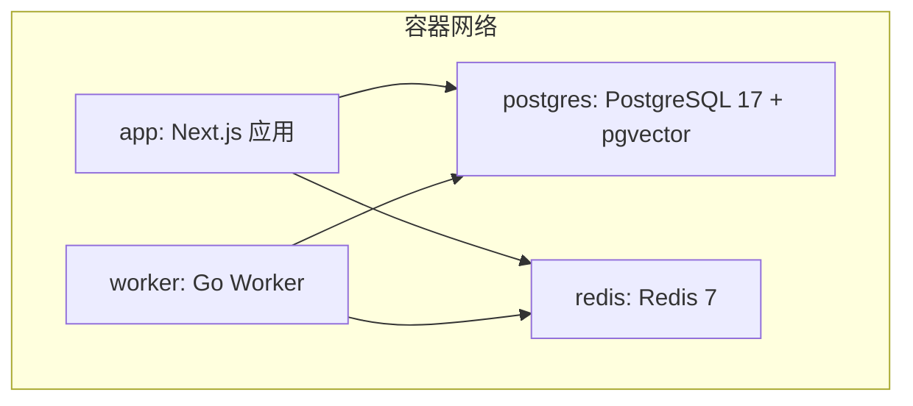
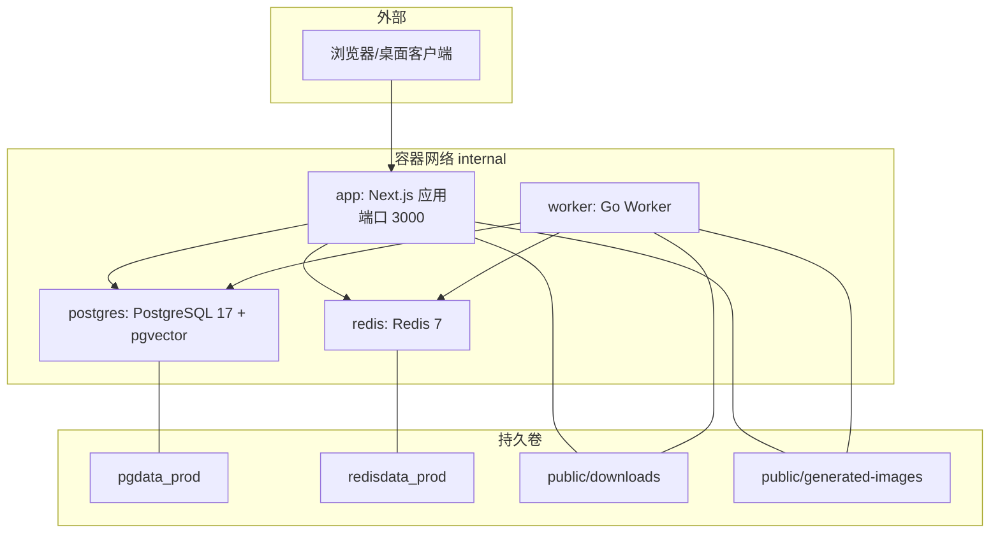
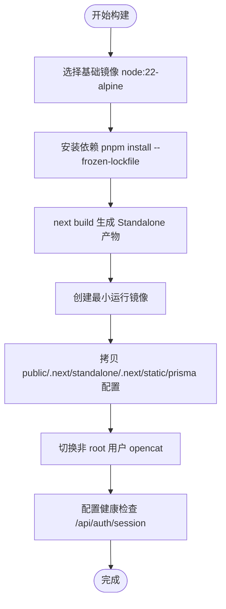
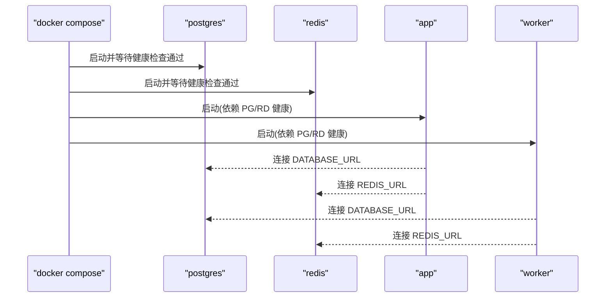
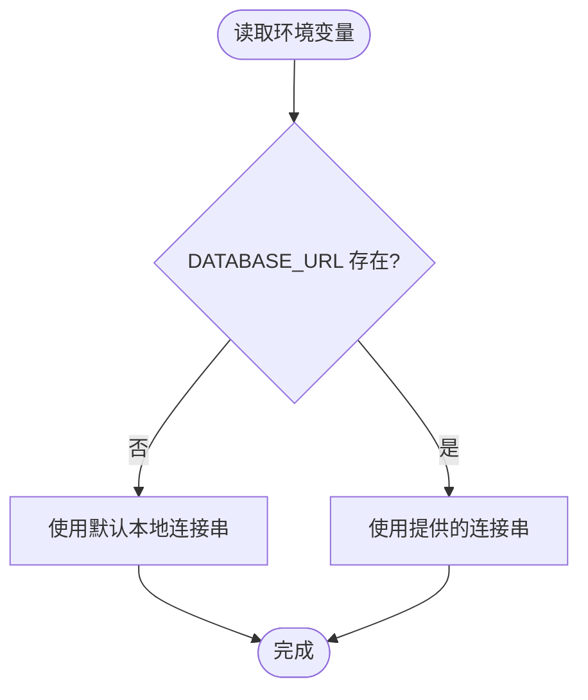
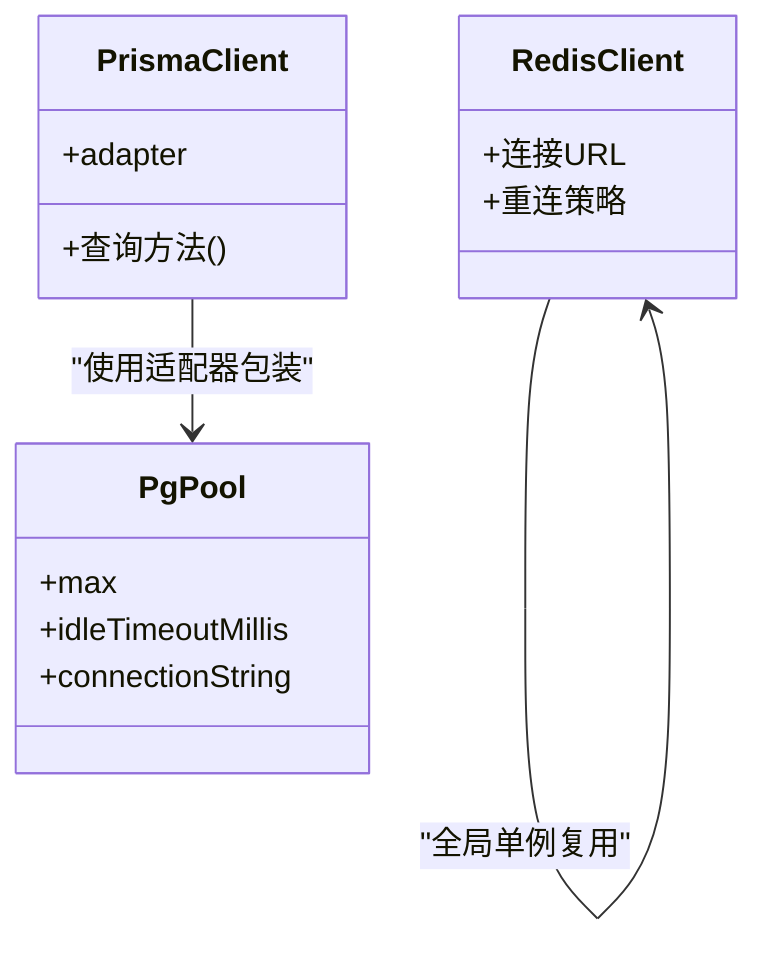
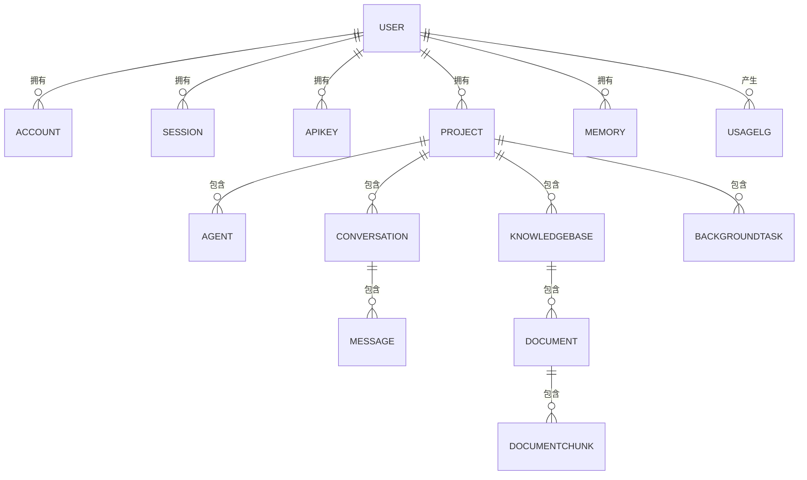
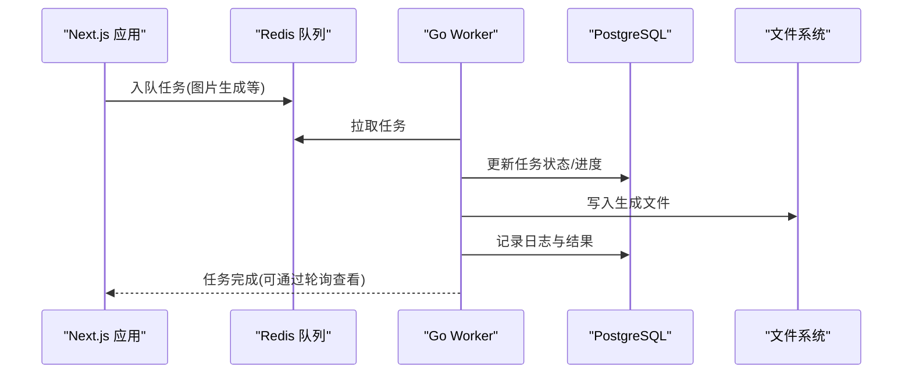
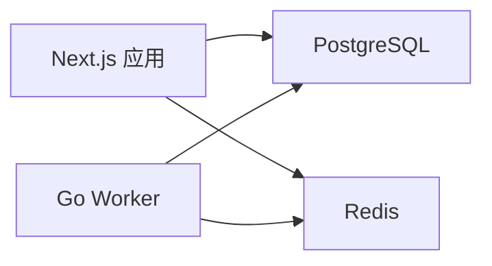

# 部署与运维

<cite>
**本文引用的文件**   
- [Dockerfile](file://Dockerfile)
- [worker/Dockerfile](file://worker/Dockerfile)
- [docker-compose.yml](file://docker-compose.yml)
- [docker-compose.prod.yml](file://docker-compose.prod.yml)
- [.env.example](file://.env.example)
- [src/lib/redis.ts](file://src/lib/redis.ts)
- [src/server/db/index.ts](file://src/server/db/index.ts)
- [prisma/schema.prisma](file://prisma/schema.prisma)
- [worker/internal/config/config.go](file://worker/internal/config/config.go)
- [worker/go.mod](file://worker/go.mod)
- [README.md](file://README.md)
</cite>

## 目录
1. [简介](#简介)
2. [项目结构](#项目结构)
3. [核心组件](#核心组件)
4. [架构总览](#架构总览)
5. [详细组件分析](#详细组件分析)
6. [依赖关系分析](#依赖关系分析)
7. [性能考量](#性能考量)
8. [故障排查指南](#故障排查指南)
9. [结论](#结论)
10. [附录](#附录)

## 简介
本指南面向生产环境的 OpenCat 部署与运维，覆盖容器化构建、多阶段编译优化、镜像体积优化、生产编排（PostgreSQL、Redis、Next.js 应用、Go Worker）、环境变量与密钥管理、监控告警、日志收集、备份恢复、灾难恢复、扩容策略以及 CI/CD 流水线与自动化测试集成建议。文档内容严格基于仓库现有实现与配置进行说明，并提供可视化图示帮助理解。

## 项目结构
OpenCat 采用前后端一体化 Next.js 应用 + Go Worker 后台任务服务的组合：
- Next.js 应用负责 Web 界面、API 路由、认证、AI 运行时与数据访问
- Go Worker 负责长耗时异步任务（如图片生成、RAG 文档处理等）
- PostgreSQL 17 + pgvector 提供业务数据与向量检索
- Redis 作为缓存与队列基础设施

**图表来源**
- [docker-compose.prod.yml:1-112](file://docker-compose.prod.yml#L1-L112)

**章节来源**
- [README.md:159-180](file://README.md#L159-L180)
- [docker-compose.prod.yml:1-112](file://docker-compose.prod.yml#L1-L112)

## 核心组件
- Next.js 应用镜像构建与运行
  - 多阶段构建：基础镜像 -> 依赖安装 -> 应用构建 -> 最小化运行镜像
  - 使用 Standalone 输出模式，仅复制必要产物，显著减小镜像体积
  - 非 root 用户运行，暴露端口 3000，内置健康检查
- Go Worker 服务镜像构建与运行
  - 静态编译二进制，去除符号表，最终镜像极小
  - 通过环境变量加载配置，支持并发度、超时、日志级别、下载目录等
- 数据库与缓存
  - PostgreSQL 17 + pgvector 用于结构化数据与向量检索
  - Redis 7 用于缓存与未来队列能力
- 数据模型
  - Prisma Schema 定义用户、会话、API Key、项目、Agent、对话、工具、记忆、知识库、背景任务、用量日志等业务域

**章节来源**
- [Dockerfile:1-59](file://Dockerfile#L1-L59)
- [worker/Dockerfile:1-39](file://worker/Dockerfile#L1-L39)
- [docker-compose.prod.yml:1-112](file://docker-compose.prod.yml#L1-L112)
- [prisma/schema.prisma:1-595](file://prisma/schema.prisma#L1-L595)

## 架构总览
下图展示了生产环境的服务编排与数据流：应用与 Worker 均通过内部网络访问数据库与缓存，并共享持久卷以保存生成的文件。

**图表来源**
- [docker-compose.prod.yml:1-112](file://docker-compose.prod.yml#L1-L112)

**章节来源**
- [docker-compose.prod.yml:1-112](file://docker-compose.prod.yml#L1-L112)

## 详细组件分析

### 容器化与镜像优化
- Next.js 应用镜像
  - 多阶段构建：在 deps 阶段安装依赖，在 builder 阶段执行 next build 生成 Standalone 产物，在 runner 阶段仅拷贝运行所需文件
  - 安全加固：创建系统用户 opencat 并以该用户运行
  - 健康检查：通过 /api/auth/session 探测应用可用性
- Go Worker 镜像
  - 构建阶段：golang:1.22-alpine 静态编译 Linux 可执行，禁用 CGO，剥离符号表
  - 运行阶段：alpine:3.19，安装时区与根证书，设置中国时区，入口为编译后的二进制
- 镜像体积优化要点
  - 使用 Alpine 基础镜像
  - 只拷贝必要文件（Standalone 产物、静态资源、Prisma 配置）
  - 静态编译与剥离符号表
  - 避免将源码与开发依赖带入运行镜像

**图表来源**
- [Dockerfile:1-59](file://Dockerfile#L1-L59)

**章节来源**
- [Dockerfile:1-59](file://Dockerfile#L1-L59)
- [worker/Dockerfile:1-39](file://worker/Dockerfile#L1-L39)

### 生产编排与数据持久化
- 服务清单
  - postgres：pgvector/pgvector:pg17，仅内部网络访问，持久化到 pgdata_prod
  - redis：redis:7-alpine，仅内部网络访问，持久化到 redisdata_prod
  - app：Next.js 应用，映射 3000 端口，挂载 downloads 与 generated-images 目录
  - worker：Go Worker，挂载相同目录以便读写生成文件
- 启动顺序与健康检查
  - app 与 worker 依赖 postgres 与 redis 健康检查通过后启动
- 网络隔离
  - 所有服务加入 internal 桥接网络，避免直接对外暴露数据库与缓存端口

**图表来源**
- [docker-compose.prod.yml:1-112](file://docker-compose.prod.yml#L1-L112)

**章节来源**
- [docker-compose.prod.yml:1-112](file://docker-compose.prod.yml#L1-L112)

### 环境变量管理与密钥安全
- 关键环境变量
  - DATABASE_URL：PostgreSQL 连接串（应用与 Worker 共用）
  - REDIS_URL：Redis 连接串
  - AUTH_SECRET：NextAuth 签名密钥
  - AUTH_URL：认证回调地址
  - ENCRYPTION_KEY：用于加密用户 API Key 的对称密钥
  - OPENAI_API_KEY / ANTHROPIC_API_KEY：平台级 LLM 密钥（可选）
  - WORKER_CONCURRENCY / WORKER_TASK_TIMEOUT / LOG_LEVEL / DOWNLOADS_DIR：Worker 运行参数
- 最佳实践
  - 使用 .env.production 或外部密钥管理服务注入敏感值
  - 不在镜像中硬编码任何密钥
  - 定期轮换 AUTH_SECRET 与 ENCRYPTION_KEY
  - 限制数据库与 Redis 的网络访问范围（仅 internal 网络）

**图表来源**
- [src/server/db/index.ts:1-48](file://src/server/db/index.ts#L1-L48)
- [src/lib/redis.ts:1-20](file://src/lib/redis.ts#L1-L20)
- [worker/internal/config/config.go:1-64](file://worker/internal/config/config.go#L1-L64)
- [.env.example:1-32](file://.env.example#L1-L32)

**章节来源**
- [.env.example:1-32](file://.env.example#L1-L32)
- [src/server/db/index.ts:1-48](file://src/server/db/index.ts#L1-L48)
- [src/lib/redis.ts:1-20](file://src/lib/redis.ts#L1-L20)
- [worker/internal/config/config.go:1-64](file://worker/internal/config/config.go#L1-L64)

### 数据库与缓存连接
- 数据库连接
  - 使用 Prisma 7 + adapter-pg，通过全局单例与 pg.Pool 管理连接池，防止热重载导致连接泄漏
  - 最大连接数与空闲超时可在 pool 配置中调整
- Redis 连接
  - 全局单例复用实例，避免 Next.js 热重载造成连接暴涨
  - 未配置 REDIS_URL 时回退到本地默认地址

**图表来源**
- [src/server/db/index.ts:1-48](file://src/server/db/index.ts#L1-L48)
- [src/lib/redis.ts:1-20](file://src/lib/redis.ts#L1-L20)

**章节来源**
- [src/server/db/index.ts:1-48](file://src/server/db/index.ts#L1-L48)
- [src/lib/redis.ts:1-20](file://src/lib/redis.ts#L1-L20)

### 数据模型概览
- 核心实体包括用户、会话、API Key、项目、Agent、对话、消息、工具、记忆、知识库、文档分块、用量日志、组织、客户、线索、交互、信号、推荐、人工审核、结果、背景任务等
- 向量字段使用 Unsupported("vector(...)") 占位，配合 pgvector 扩展实现语义检索

**图表来源**
- [prisma/schema.prisma:1-595](file://prisma/schema.prisma#L1-L595)

**章节来源**
- [prisma/schema.prisma:1-595](file://prisma/schema.prisma#L1-L595)

### Go Worker 配置与任务执行
- 配置加载
  - 从环境变量读取数据库、Redis、加密密钥、并发度、任务超时、日志级别、下载目录等
  - 未显式指定下载目录时自动探测相对路径
- 任务执行
  - 支持图片生成等长耗时任务，通过 HTTP 调用外部模型 API，并将结果落盘与记录状态
- 依赖
  - 使用 go-redis 与 pgx/v5 分别连接 Redis 与 PostgreSQL

**图表来源**
- [worker/internal/config/config.go:1-64](file://worker/internal/config/config.go#L1-L64)
- [worker/go.mod:1-19](file://worker/go.mod#L1-L19)

**章节来源**
- [worker/internal/config/config.go:1-64](file://worker/internal/config/config.go#L1-L64)
- [worker/go.mod:1-19](file://worker/go.mod#L1-L19)

## 依赖关系分析
- 应用层依赖
  - Next.js 应用依赖 PostgreSQL 与 Redis
  - Go Worker 同样依赖 PostgreSQL 与 Redis
- 构建期依赖
  - Node 应用依赖 pnpm 与 Next.js 构建工具链
  - Go Worker 依赖 golang 工具链与第三方库（go-redis、pgx）

**图表来源**
- [docker-compose.prod.yml:1-112](file://docker-compose.prod.yml#L1-L112)

**章节来源**
- [docker-compose.prod.yml:1-112](file://docker-compose.prod.yml#L1-L112)

## 性能考量
- 连接池与并发
  - 调整 pg.Pool 的最大连接数与空闲超时，匹配数据库容量与负载
  - 根据 Worker 负载调整 WORKER_CONCURRENCY 与 WORKER_TASK_TIMEOUT
- 镜像与启动时间
  - 使用 Standalone 输出与最小化运行镜像，缩短冷启动时间
  - 预构建依赖与缓存层，加速 CI/CD 构建
- 存储与 I/O
  - 将 downloads 与 generated-images 目录挂载到高性能卷，避免容器内磁盘瓶颈
- 网络与安全
  - 数据库与缓存仅内部网络访问，减少攻击面
  - 使用健康检查确保服务就绪后再接受流量

[本节为通用指导，不直接分析具体文件]

## 故障排查指南
- 应用无法启动
  - 检查 /api/auth/session 健康检查是否返回成功
  - 确认 DATABASE_URL 与 REDIS_URL 是否正确指向容器内部地址
- 数据库连接失败
  - 验证 POSTGRES_USER、POSTGRES_PASSWORD、POSTGRES_DB 环境变量
  - 检查 pg_isready 健康检查是否通过
- Redis 不可用
  - 检查 redis-cli ping 健康检查
  - 确认 REDIS_URL 与网络连通性
- Worker 任务失败
  - 查看 Worker 日志级别与输出
  - 检查下载目录权限与空间
  - 核对加密密钥 ENCRYPTION_KEY 是否与存储一致

**章节来源**
- [Dockerfile:54-57](file://Dockerfile#L54-L57)
- [docker-compose.prod.yml:27-34](file://docker-compose.prod.yml#L27-L34)
- [docker-compose.prod.yml:42-49](file://docker-compose.prod.yml#L42-L49)
- [worker/internal/config/config.go:1-64](file://worker/internal/config/config.go#L1-L64)

## 结论
OpenCat 的生产部署方案以容器化为基石，结合多阶段构建与最小化运行镜像，实现了高可用与低开销的运行环境。通过 docker-compose.prod.yml 统一编排应用、Worker、数据库与缓存，配合环境变量与密钥管理、健康检查与持久卷，形成完整的可运维体系。建议在后续引入更完善的监控、日志与备份恢复机制，进一步提升系统的可观测性与韧性。

[本节为总结性内容，不直接分析具体文件]

## 附录

### 快速部署步骤（生产）
- 准备环境变量文件 .env.production，填写数据库、Redis、认证与加密密钥等
- 执行编排命令启动服务
- 验证健康检查与页面访问

**章节来源**
- [docker-compose.prod.yml:1-112](file://docker-compose.prod.yml#L1-L112)
- [.env.example:1-32](file://.env.example#L1-L32)

### 监控与告警建议
- 指标采集
  - 应用：HTTP 请求量、错误率、响应延迟、内存/CPU 使用率
  - 数据库：连接数、慢查询、锁等待、索引命中率
  - Redis：命中率、内存使用、键数量、阻塞命令
  - Worker：任务吞吐、失败率、平均耗时、队列长度
- 告警规则
  - 应用健康检查失败
  - 数据库连接池耗尽或慢查询阈值
  - Redis 内存接近上限或命中率骤降
  - Worker 任务积压与失败率升高

[本节为通用指导，不直接分析具体文件]

### 日志收集策略
- 应用与 Worker 输出结构化 JSON 日志
- 使用容器日志驱动或集中式日志系统（如 ELK/Loki）收集
- 按服务与模块划分索引，便于检索与分析

[本节为通用指导，不直接分析具体文件]

### 备份与恢复
- 数据库备份
  - 定期逻辑备份（pg_dump）或物理备份（WAL 归档）
  - 保留多版本快照，支持时间点恢复
- 文件备份
  - 对 public/downloads 与 public/generated-images 目录进行增量备份
- 恢复演练
  - 定期进行恢复演练，验证备份有效性与恢复流程

[本节为通用指导，不直接分析具体文件]

### 灾难恢复计划
- 目标
  - 明确 RTO（恢复时间目标）与 RPO（恢复点目标）
- 步骤
  - 故障检测与切换
  - 数据恢复与一致性校验
  - 服务重启与流量切换
- 演练与复盘
  - 定期演练，记录问题并改进流程

[本节为通用指导，不直接分析具体文件]

### 扩容策略
- 水平扩容
  - 增加 app 与 worker 副本数，配合负载均衡器分发流量
- 垂直扩容
  - 提升数据库与 Redis 实例规格，调整连接池与内存参数
- 弹性伸缩
  - 基于 CPU/内存/队列长度等指标触发扩缩容

[本节为通用指导，不直接分析具体文件]

### CI/CD 流水线与自动化测试
- 构建阶段
  - 缓存依赖与构建产物，加速流水线
  - 多阶段构建产出最小镜像并推送至镜像仓库
- 测试阶段
  - 单元测试与集成测试（数据库与 Redis 测试环境）
  - 安全扫描与镜像漏洞扫描
- 发布阶段
  - 灰度发布与回滚策略
  - 健康检查与滚动更新

[本节为通用指导，不直接分析具体文件]