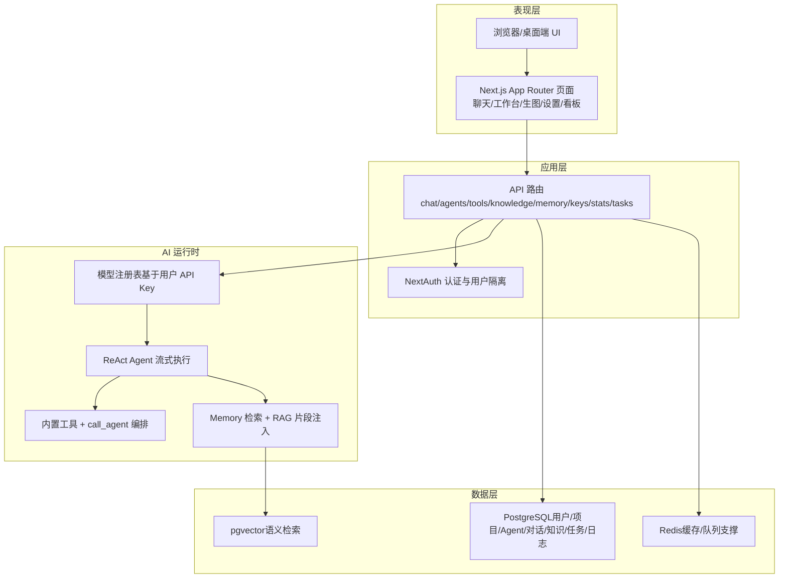
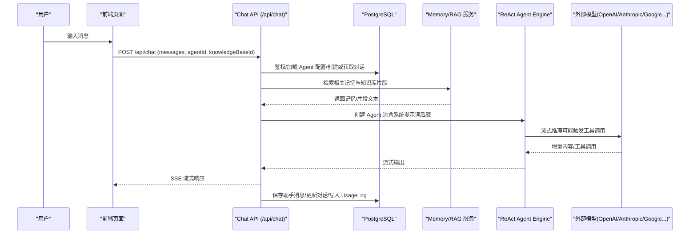
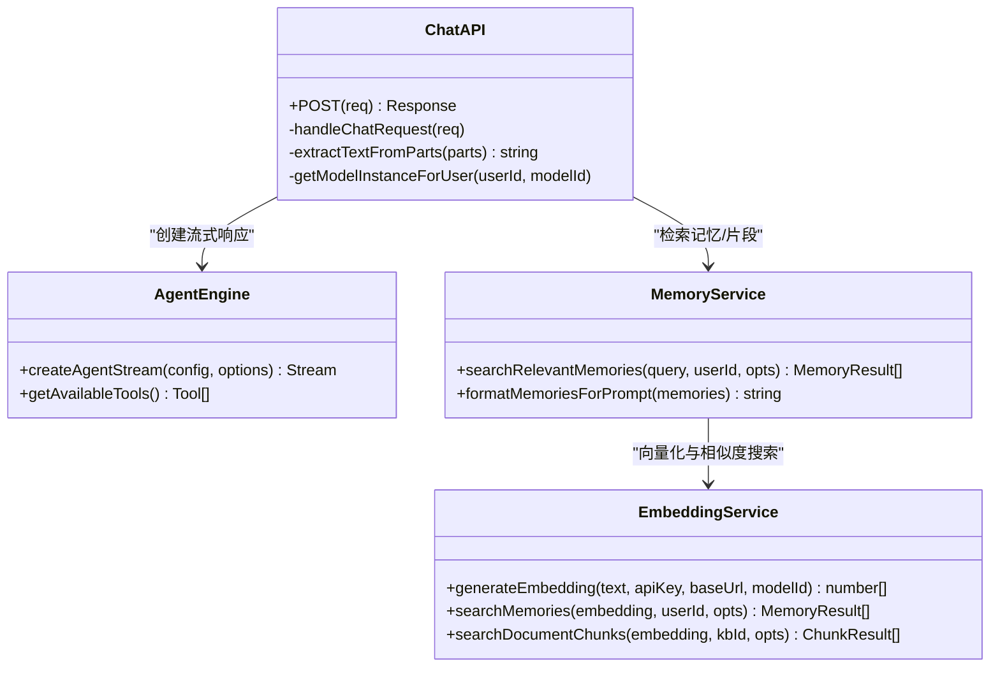
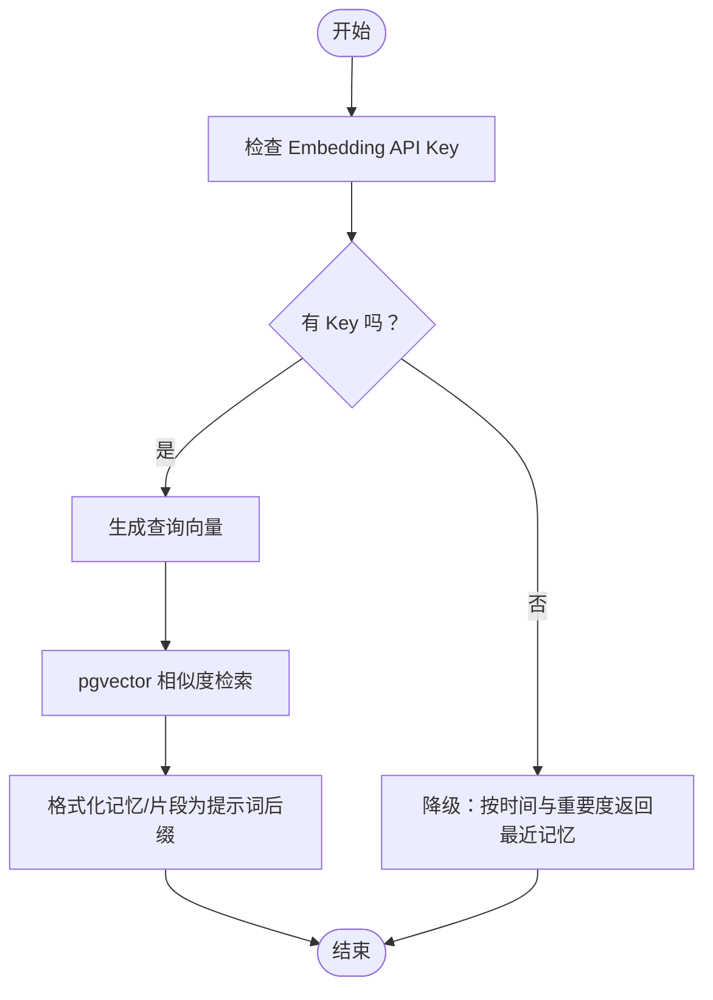
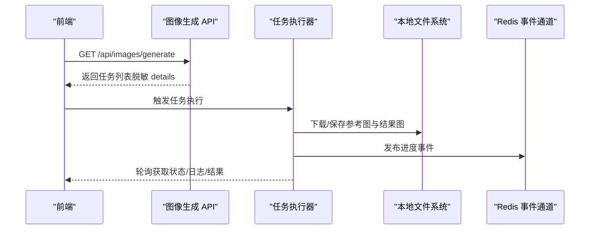
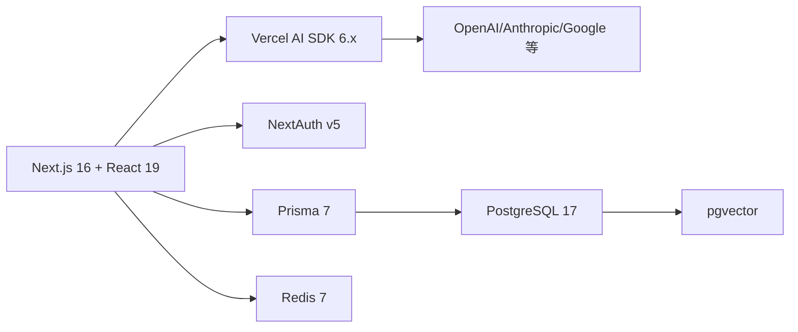

# 项目概述

<cite>
**本文引用的文件**   
- [README.md](file://README.md)
- [README_CN.md](file://README_CN.md)
- [package.json](file://package.json)
- [schema.prisma](file://prisma/schema.prisma)
- [chat/route.ts](file://src/app/api/chat/route.ts)
- [agent/index.ts](file://src/lib/agent/index.ts)
- [react-engine.ts](file://src/lib/agent/react-engine.ts)
- [memory/index.ts](file://src/lib/memory/index.ts)
- [embedding.ts](file://src/lib/memory/embedding.ts)
- [store.ts](file://src/lib/memory/store.ts)
- [tools/index.ts](file://src/lib/tools/index.ts)
- [images/generate/route.ts](file://src/app/api/images/generate/route.ts)
- [task-runner.ts](file://src/lib/images/task-runner.ts)
- [stats/route.ts](file://src/app/api/stats/route.ts)
- [dashboard/page.tsx](file://src/app/(dashboard)/dashboard/page.tsx)
</cite>

## 目录
1. [简介](#简介)
2. [项目结构](#项目结构)
3. [核心组件](#核心组件)
4. [架构总览](#架构总览)
5. [详细组件分析](#详细组件分析)
6. [依赖分析](#依赖分析)
7. [性能考量](#性能考量)
8. [故障排查指南](#故障排查指南)
9. [结论](#结论)
10. [附录](#附录)

## 简介
OpenCat 是一个自托管的 AI 工作空间，面向 Agent、知识库、工具与长任务，提供多模型对话、ReAct 智能体、记忆系统与 RAG、图像生成任务以及使用分析等能力。其设计理念强调透明、可定制、无魔法包装器：Agent 循环、工具系统、记忆检索与文档处理链路均在应用内实现，便于理解、扩展和重构。

核心价值主张
- 自托管与可控：用户完全掌控数据与运行环境，避免被平台锁定。
- 透明与可定制：关键逻辑不隐藏于黑盒封装，代码即文档，易于二次开发。
- 一体化工作台：将对话、Agent、知识、工具、任务与分析整合在同一产品界面中。

技术栈概览
- 前端框架：Next.js 16 + React 19
- 语言与类型：TypeScript 5
- 认证：NextAuth v5
- AI 运行时：Vercel AI SDK 6.x
- 数据库：PostgreSQL 17 + pgvector（向量检索）
- ORM：Prisma 7
- 缓存/队列支撑：Redis 7
- 桌面端：Tauri 2
- 状态管理：Zustand；校验：Zod 4；包管理：pnpm 10

差异化优势
- 真正的持久化流式对话：SSE + PostgreSQL 持久化消息历史。
- 用户级模型注册：可用模型来自用户自行配置的 API Key。
- ReAct 编排：支持子 Agent 调度与工具调用闭环。
- Memory + RAG：语义记忆注入与知识库片段增强。
- 异步任务：图像生成等长耗时任务的进度追踪与结果预览。
- 运营分析：Token 配额、成本趋势、模型分布与活动流水。

章节来源
- [README.md:45-74](file://README.md#L45-L74)
- [README_CN.md:45-74](file://README_CN.md#L45-L74)
- [package.json:17-46](file://package.json#L17-L46)

## 项目结构
整体采用 Next.js App Router 组织页面与 API 路由，业务逻辑按领域分层到 lib 目录，数据模型由 Prisma 统一管理。

图表来源
- [README.md:159-197](file://README.md#L159-L197)
- [README_CN.md:159-197](file://README_CN.md#L159-L197)

章节来源
- [README.md:271-300](file://README.md#L271-L300)
- [README_CN.md:271-300](file://README_CN.md#L271-L300)

## 核心组件
- 对话与 Agent
  - SSE 流式对话，消息持久化至 PostgreSQL。
  - 每个 Agent 独立配置 prompt、模型、温度、工具集与最大步数。
  - 编排型 Agent 可通过 call_agent 工具调度子 Agent。
  - 基于 Vercel AI SDK 的工具感知 Agent 运行时。
- Memory 与知识库
  - 长期记忆记录，支持分类与重要度；回答前自动检索并注入上下文。
  - 知识库管理、文档导入、文本分块、Embedding、pgvector 相似度检索。
  - Embedding 不可用时的降级策略。
- 工具系统
  - 内置计算器、时间、HTTP、记忆操作、文档导出、金融查询与 Agent 间调用等。
- 图像生成
  - 文生图/图生图，异步任务轮询，状态、进度、日志与结果预览可见。
- 分析看板
  - Token 配额与消耗追踪、API 总成本聚合、14 天趋势图、模型用量分布与最近调用流水。

章节来源
- [README.md:78-136](file://README.md#L78-L136)
- [README_CN.md:78-136](file://README_CN.md#L78-L136)

## 架构总览
从请求到响应的端到端流程如下：

图表来源
- [chat/route.ts:28-456](file://src/app/api/chat/route.ts#L28-L456)
- [react-engine.ts:67-122](file://src/lib/agent/react-engine.ts#L67-L122)
- [embedding.ts:304-408](file://src/lib/memory/embedding.ts#L304-L408)
- [store.ts:132-166](file://src/lib/memory/store.ts#L132-L166)

## 详细组件分析

### 对话与 Agent 引擎
- Chat API 负责鉴权、解析请求、加载 Agent 配置、选择模型与 API Key、创建或获取对话、保存用户消息。
- 在生成回复前，检索相关记忆与知识库片段，拼接为系统提示词后缀传入 Agent 引擎。
- Agent 引擎基于 Vercel AI SDK 的 streamText 构建流式响应，动态装配工具集，并在 Orchestrator 模式下注册 call_agent 工具以调度子 Agent。
- 流结束后持久化助手消息、更新对话元信息并写入 UsageLog。

图表来源
- [chat/route.ts:28-456](file://src/app/api/chat/route.ts#L28-L456)
- [react-engine.ts:67-122](file://src/lib/agent/react-engine.ts#L67-L122)
- [memory/index.ts:1-31](file://src/lib/memory/index.ts#L1-L31)
- [embedding.ts:220-261](file://src/lib/memory/embedding.ts#L220-L261)
- [embedding.ts:304-408](file://src/lib/memory/embedding.ts#L304-L408)
- [store.ts:132-166](file://src/lib/memory/store.ts#L132-L166)

章节来源
- [chat/route.ts:28-456](file://src/app/api/chat/route.ts#L28-L456)
- [react-engine.ts:67-122](file://src/lib/agent/react-engine.ts#L67-L122)
- [agent/index.ts:1-7](file://src/lib/agent/index.ts#L1-L7)

### Memory 与 RAG
- Embedding 服务支持环境变量与用户 Key 的多级配置，兼容 OpenAI 格式的各类 Embedding 接口，并提供批量嵌入与余弦相似度检索。
- Memory Store 负责记忆的保存与检索，当 Embedding 不可用时回退为按时间与重要度排序的最近记忆。
- RAG 通过文档分块与向量检索，将最相关的片段注入到系统提示词，增强回答准确性。

图表来源
- [embedding.ts:123-174](file://src/lib/memory/embedding.ts#L123-L174)
- [embedding.ts:304-408](file://src/lib/memory/embedding.ts#L304-L408)
- [store.ts:65-120](file://src/lib/memory/store.ts#L65-L120)
- [store.ts:132-166](file://src/lib/memory/store.ts#L132-L166)

章节来源
- [embedding.ts:55-107](file://src/lib/memory/embedding.ts#L55-L107)
- [embedding.ts:220-261](file://src/lib/memory/embedding.ts#L220-L261)
- [embedding.ts:304-408](file://src/lib/memory/embedding.ts#L304-L408)
- [store.ts:65-120](file://src/lib/memory/store.ts#L65-L120)
- [store.ts:132-166](file://src/lib/memory/store.ts#L132-L166)
- [memory/index.ts:1-31](file://src/lib/memory/index.ts#L1-L31)

### 工具系统
- 工具注册中心统一导出工具定义与执行上下文，支持内置工具与动态工具（如 call_agent）。
- Agent 引擎根据 toolNames 动态装配工具集，并在 Orchestrator 模式下注入子 Agent 调度能力。

章节来源
- [tools/index.ts:1-16](file://src/lib/tools/index.ts#L1-L16)
- [react-engine.ts:85-107](file://src/lib/agent/react-engine.ts#L85-L107)

### 图像生成任务
- 图像生成 API 负责鉴权、任务列表查询与序列化展示。
- 任务执行器负责拉取任务、调用图像生成 Provider、持久化图片资源、发布进度事件与失败处理。

图表来源
- [images/generate/route.ts:184-233](file://src/app/api/images/generate/route.ts#L184-L233)
- [task-runner.ts:105-120](file://src/lib/images/task-runner.ts#L105-L120)
- [task-runner.ts:144-182](file://src/lib/images/task-runner.ts#L144-L182)
- [task-runner.ts:319-485](file://src/lib/images/task-runner.ts#L319-L485)

章节来源
- [images/generate/route.ts:184-233](file://src/app/api/images/generate/route.ts#L184-L233)
- [task-runner.ts:105-120](file://src/lib/images/task-runner.ts#L105-L120)
- [task-runner.ts:144-182](file://src/lib/images/task-runner.ts#L144-L182)
- [task-runner.ts:319-485](file://src/lib/images/task-runner.ts#L319-L485)

### 使用分析与看板
- Stats API 聚合 token 配额、总成本、14 天趋势、模型用量分布与最近活动流水。
- 看板页面负责渲染指标、折线图与环形图，并支持刷新与错误重试。

章节来源
- [stats/route.ts:116-192](file://src/app/api/stats/route.ts#L116-L192)
- [dashboard/page.tsx:35-178](file://src/app/(dashboard)/dashboard/page.tsx#L35-L178)

## 依赖分析
- 前端与运行时
  - Next.js 16 + React 19 提供 SSR/SSG 与现代化组件生态。
  - Vercel AI SDK 6.x 统一流式输出、Tool Calling 与模型适配。
- 数据与存储
  - Prisma 7 作为 ORM，PostgreSQL 17 承载主数据，pgvector 提供向量检索。
  - Redis 7 用于缓存与未来队列/异步处理的基础设施预留。
- 认证与安全
  - NextAuth v5 提供登录注册与 OAuth 集成。
  - API Key 加密存储（AES-256-GCM），解密后按需注入模型实例。

图表来源
- [package.json:17-46](file://package.json#L17-L46)
- [README.md:139-156](file://README.md#L139-L156)
- [README_CN.md:139-156](file://README_CN.md#L139-L156)

章节来源
- [package.json:17-46](file://package.json#L17-L46)
- [README.md:139-156](file://README.md#L139-L156)
- [README_CN.md:139-156](file://README_CN.md#L139-L156)

## 性能考量
- 流式响应：SSE 降低首字节延迟，提升交互体验。
- 向量检索：pgvector 原生算子加速余弦相似度计算，结合最小相似度阈值过滤低质量结果。
- 批量嵌入：RAG 文档分块后批量生成向量，减少网络往返与 API 调用次数。
- 降级策略：Embedding 不可用时回退为按时间与重要度排序的最近记忆，保证可用性。
- 资源持久化：图像生成结果落盘并通过公共路径访问，避免重复生成与内存占用。

[本节为通用指导，无需源码引用]

## 故障排查指南
- 未配置加密密钥
  - 现象：返回 ENCRYPTION_CONFIG_ERROR。
  - 处理：设置 ENCRYPTION_KEY 为 64 位十六进制字符串后重启应用。
- 缺少模型 API Key
  - 现象：返回未找到对应 provider 的 Key 的错误。
  - 处理：在设置页添加 API Key，或在环境变量中配置默认 Key。
- 数据库连接异常
  - 现象：数据库错误分类返回特定 code 与 message。
  - 处理：检查 DATABASE_URL、端口与权限，确认 pgvector 扩展已启用。
- 图像生成失败
  - 现象：任务状态为 failed，details 中包含错误信息。
  - 处理：检查 Provider 返回码与消息，确认图片资源可下载与持久化路径可写。

章节来源
- [chat/route.ts:41-62](file://src/app/api/chat/route.ts#L41-L62)
- [chat/route.ts:205-210](file://src/app/api/chat/route.ts#L205-L210)
- [task-runner.ts:474-485](file://src/lib/images/task-runner.ts#L474-L485)

## 结论
OpenCat 以“透明、可定制、无魔法包装器”为核心设计原则，将多模型对话、ReAct 智能体、记忆与 RAG、图像生成与使用分析整合在一个自托管的工作空间中。借助 Next.js + Vercel AI SDK + PostgreSQL/pgvector 的技术组合，既享受成熟生态带来的效率，又保留对关键链路的完全控制力，适合个人开发者与企业团队进行深度定制与持续演进。

[本节为总结性内容，无需源码引用]

## 附录
- 快速开始与环境变量
  - 安装依赖、启动 Docker 服务、配置环境变量、生成 Prisma Client 并同步数据库、运行开发服务器。
- 数据模型概览
  - 用户与认证、API Key、项目、Agent、对话与消息、工具、记忆、知识库与文档分块、后台任务、用量日志等。

章节来源
- [README.md:200-268](file://README.md#L200-L268)
- [README_CN.md:200-268](file://README_CN.md#L200-268)
- [schema.prisma:25-595](file://prisma/schema.prisma#L25-L595)